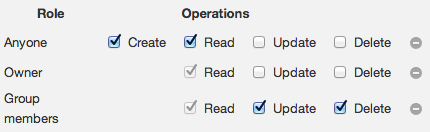

> [[Home]] ▸ Contributors ▸ [[Test Plan|Contributors ~ Test Plan]]

Repeat what follows with Oracle, MySQL, SQL Server, and DB2 with the following settings:

```xml
<property
    as="xs:string"
    name="oxf.fr.persistence.provider.oracle.*.*"
    value="oracle"/>
<property
    as="xs:string"
    name="oxf.fr.persistence.provider.mysql.*.*"
    value="mysql"/>
<property
    as="xs:string"
    name="oxf.fr.persistence.provider.sqlserver.*.*"
    value="sqlserver"/>
<property
    as="xs:string"
    name="oxf.fr.persistence.provider.db2.*.*"
    value="db2"/>
<property 
    as="xs:string"  
    name="oxf.fr.authentication.container.roles" 
    value="a b"/>
<property 
    as="xs:string"  
    name="oxf.http.proxy.host"                   
    value="localhost"/>
<property 
    as="xs:integer" 
    name="oxf.http.proxy.port"                   
    value="8888"/>
```

Setup permissions e.g. in `tomcat-users.xml`:

```xml
<user username="a1" password="a1" roles="a"/>
<user username="a2" password="a2" roles="a"/>
<user username="b1" password="b1" roles="b"/>
```

Authorize on:

    http://localhost:8080/47pe/auth

### Autosave with permissions

1. In FB, create form `$provider/autosave`.
    - Create a field *first name*, marked as shown on summary page.
    - Enable permissions as shown below, save, deploy.  
        
2. Logged in as user `b1` in group `b`:
    - `$provider/autosave/new`, type *Ned*, save, change to *Ned2*, tab out, after 6s go to the summary page, check it shows *Ned2* as draft
3. Logged in as user `a1` in group `a`:
    - Can see data of other users, but in readonly mode (since everyone can read)
        - Load `$provider/autosave/summary`
        - Check *Ned* shows, but has the readonly "label"
        - Check *Ned2* shows, but has the readonly "label"
        - Check that clicking on *Ned* and *Ned2* brings up the data in readonly mode
        - Edit the URL to have `edit` instead of `view`, check a 403 is returned
    - Drafts for saved
        - Load `$provider/autosave/new`
            - Check we don't get a prompt to edit the draft created by b1 (since we only have read access to it).
            - Type *Homer*, hit save, edit into *Homer2*, after 6s go to summary page, check it shows *Homer* and *Homer2* as draft
        - `$provider/autosave/summary`, click on *Homer2*, check the draft comes up
        - `$provider/autosave/summary`, click on *Homer*, check prompt comes up, try both options and see that *Homer*/*Homer2* comes up
        - editing one of the form data (*Homer* or *Homer2*), hit save, back on the summary check the draft was removed
    - Drafts for new
        - `$provider/autosave/new`, type *Bart*, after 6s go to summary page, check it shows *Bart* as draft
        - `$provider/autosave/new`, check prompt, and try both options
        - `$provider/autosave/new`, on prompt start from scratch, type *Lisa*, after 6s go to summary, check it shows *Bart* and *Lisa* as draft
        - `$provider/autosave/new`, check prompt, try both options, in particular the one showing the drafts for new
    - Summary
        - Edit *Home3*, change to *Homer4*, after 6s go back to summary page.
        - Delete *Homer3*, check *Homer4* is deleted as well
        - Check *Lisa*, then view, check in view mode without prompt
        - Delete *Bart*, check *Lisa* not deleted
4. With anonymous user:
    - `$provider/autosave/summary` only shows saved data, not drafts
    - change form definition to remove the read permission form anyone
    - `$provider/autosave/summary` returns 403 (since anonymous users don't have the read permission)
    - `$provider/autosave/new`, type *Homer*, tab out, after 6s check that no autosave was done (e.g. with Charles that no PUT was made to the persistence layer)
5. Permissions of drafts in summary page
    - Log in as user `a1` in group `a`.
    - `$provider/autosave/summary`, delete everything (to clean things up).
    - As user `a1` in group `a`, go to `$provider/autosave/new`, type *Homer*, hit save, edit into *Homer2*, after 6s go to `$provider/autosave/summary`, check it shows *Homer* and *Homer2* as draft.
    - As user `a2` in group `a`, go to `$provider/autosave/summary`, check it shows *Homer* and *Homer2* as draft.
    - As user `b1` in group `b`, go to `$provider/autosave/summary`, check it shows neither *Homer* nor *Homer2*.

### Autosave without permissions

This tests for [#1858](https://github.com/orbeon/orbeon-forms/issues/1858)

1. User is authenticated
1. Create form without permissions
1. Go to /new, wait for autosave
1. Go to /new again
1. Dialog must propose loading draft
1. Save
1. Make change
1. Wait for autosave
1. Go back to /edit
1. Dialog must propose loading draft