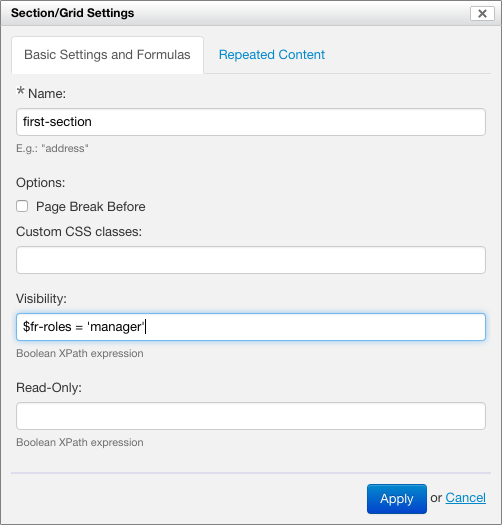

> [[Home]] ▸ [[Form Builder|Form Builder]]

## Related pages

- [[Introduction|Form Builder ~ Introduction]]
- [[Summary Page|Form Builder ~ Summary Page]]
- [[The Form Editor|Form Builder ~ The Form Editor]]
- [[Toolbox|Form Builder ~ Toolbox]]
    - [[Repeated Grids|Form Builder ~ Repeated Grids]]
    - [[Metadata|Form Builder ~ Toolbox ~ Metadata]]
- [[Form Area|Form Builder ~ Form Area]]
- [[Validation|Form Builder ~ Validation]]
- [[Control Settings|Form Builder ~ Control Settings]]
- [[Section Settings|Form Builder ~ Section Settings]]
- [[Section Templates|Form Builder ~ Section Templates]]
- [[Creating Localized Forms|Form Builder ~ Creating Localized Forms]]
- Formulas
    - [[Examples|Form Builder ~ Formulas ~ Examples]]
- [[Itemset Editor|Form Builder ~ Itemset Editor]]
- [[Lifecycle of a Form|Form Builder ~ Lifecycle of a Form]]
- [[PDF Production|Form Builder ~ PDF Production]]
    - [[PDF Templates|Form Builder ~ PDF Production ~ PDF Templates]]

## Formulas and XPath

Formulas in Orbeon Forms are expressed using *XPath*, a standard _expression language_ for XML. It does not allow you to _modify_ XML data, but it allows you to _query_ XML data and compute values.

In general you don't need to know about XPath in Form Builder, with the exception of some properties in the Control Settings and Section Settings dialogs. XPath expressions are considered an advanced feature of Form Builder, which might require some programming knowledge.

*NOTE: Incorrect XPath expressions may cause the form to behave improperly, so caution must be applied.*

## Where do formulas appear?

In the Control Details dialog, XPath expressions are used to specify the following aspects of a control.

### Control Settings dialog

#### Validations and alerts

* **Constraint:** Boolean expression specifying whether the control is valid.
    * If this field is left blank, then the validity of the control depends on the data type and the "Required" option.
    * Otherwise, the control is valid if in addition to all the other constraint being met, the result of the Boolean expression is `true()`.

#### Formulas

* **Visibility:** Boolean expression specifying whether the control is visible.
    * If this field is left blank, then the control is always visible, unless the section is not visible.
    * Otherwise, it is visible only if the result of the Boolean expression is `true()`.
* **Read-Only:** Boolean expression specifying whether the control is read-only, that is not editable.
    * If this field is left blank, then the control is editable unless the section is read-only.
    * Otherwise, the field is editable only if the result of the Boolean expression is `false()`.
* **Initial value:** string expression returning the initial value of the control when the form first shows.
    * Default: the value set into the field at design time (usually a blank value).
* **Calculated Value:** string expression specifying a calculated value of the control which updates while the form user interacts with the form.
    * Default: the default value of the control, or the value entered by the form user.

### Section/Grid Settings dialog

In the Section/Grid Settings dialog, XPath expressions are used to specify the following aspects of a section or grid:

* **Visibility:** Boolean expression specifying whether the section is visible or not.
    * If this field is left blank, then the section is always visible.
    * Otherwise, it is visible only if the result of the Boolean expression is true().
* **Read-Only:** Boolean expression specifying whether the section is shown as read-only or not.
    * If this field is left blank, then the section content is always editable.
    * Otherwise, the section content is editable only if the result of the Boolean expression is false().

### Actions

TODO

## Referring to control values

XPath expressions may refer to the value of other controls in the page, using variables named after the name of the controls to use.

## Examples

See [[examples of formulas|Form Builder ~ Formulas ~ Examples]].

## See also

- [[Examples of formulas|Form Builder ~ Formulas ~ Examples]]
- [[Form Builder Validation|Form Builder ~ Validation]]
- [Better formulas with XPath type annotations](http://blog.orbeon.com/2013/01/better-formulas-with-xpath-type.html)
- [Formulas for summing values, done right](http://blog.orbeon.com/2013/08/formulas-for-summing-values-done-right.html)
- [Control required values with formulas in Orbeon Forms 4.7](http://blog.orbeon.com/2014/09/control-required-values-with-formulas.html)
- [[XForms Validation|XForms ~ Validation]]