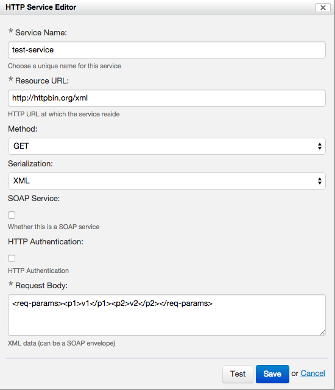
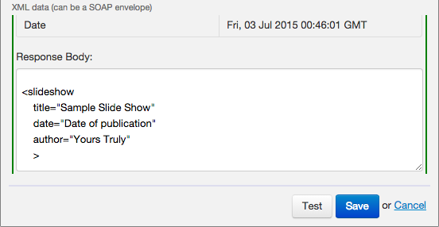

> [[Home]] ▸ [[Form Builder|Form Builder]]

## Configuration

The HTTP Service Editor allows you to create simple REST services. The idea is that a form can call a service, typically passing XML back and forth. The HTTP Service Editor follows closely the semantics of an XForms submission.

To create a new HTTP service, click the Add icon under "HTTP Services". The HTTP Service Editor opens. The following screenshot shows an example of filled-out service:

This is the meaning of the fields:

- **Service Name.** This is the name of the service, as seen by Form Builder. Must start with a letter, and may not contain spaces.
- **Resource URL** – HTTP or HTTPS URL to which the service must be called.
- **Method** – The HTTP method to use: GET, POST, PUT or DELETE.
- **Serialization** – Controls how the request body is sent for POST or PUT.
    - **XML** – Sends the request body as XML (`application/xml`)
    - **HTML Form** – Sends the request body as HTML form data (`application/x-www-form-urlencoded`)
- **SOAP Service** – Whether this is a SOAP service
- **SOAP Action** – If selected, the value of the `SOAPAction` header.
- **HTTP Authentication** – Whether to use HTTP authentication.
    - **Username** – Username to use.
    - **Password** - Password to use.
- **Request Body** – The XML document to send to the service.

## Testing a service

The Test button allows you to test the service. Before doing this, you might want to set data in the request body. Form Builder executes the service, and then provides information about the response returned, including:

- Whether an error occurred (green or red highlight)
- URL called
- Response status code
- Response headers
- Response body

This helps you to troubleshoot the service call.

## Saving the service

Once your service is defined, the Save buttons saves it to the form. You can come back to it and modify it later by clicking on the Edit icon next to the service name. You can also delete the service using the trashcan icon.

