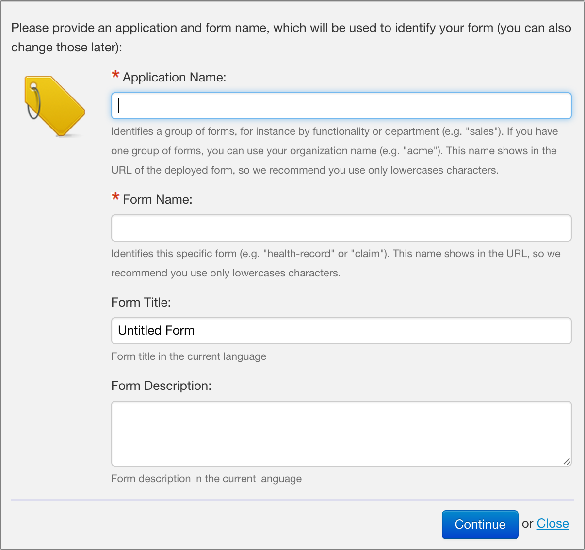

## Form Builder URLs

### URL formats

The following URL patterns are followed:

- Summary page:  
    `/fr/orbeon/builder/summary`
- New empty form definition:  
    `/fr/orbeon/builder/new`
- Edit existing form definition:  
    `/fr/orbeon/builder/edit/[FORM_ID]`

_NOTE: All paths above are relative to the deployment context, e.g the actual URLs start with http://localhost:8080/orbeon/fr/..._

### Bypassing the New Form dialog

[SINCE Orbeon Forms 4.10]

When navigating to `/fr/orbeon/builder/new`, Form Builder usually presents the user with the New Form dialog, which asks for at least an app and form name.



It is possible to bypass that dialog by providing the following URL parameters:

- `fr-app`: requested app name
- `fr-form`: requested form name
- `fr-title`: requested form title
- `fr-description`: requested form description

The dialog is actually bypassed only if the values passed are valid, specifically:

- `fr-app`
  - must be non-blank and only contain ASCII letters, digits, "-" or "_"
  - if Form Builder permission are enabled, the app name must be allowed by those permissions (see [[Form Builder Permissions|Form Runner ~ Access Control ~ Editing Forms#form-builder-permissions]])
- `fr-form`
  - must be non-blank and only contain ASCII letters, digits, "-" or "_"

In case the app and/or form name are missing or invalid, Form Builder presents the user with the New Form dialog. For example, with the following path:

```
/fr/orbeon/builder/new?fr-app=acme&fr-form=o/rder&fr-title=This+is+a+wonderful+form!
```


## See also

- [[Form Runner Integration|Form Runner ~ Integration]]
- [[Form Builder Permissions|Form Runner ~ Access Control ~ Editing Forms#form-builder-permissions]]
