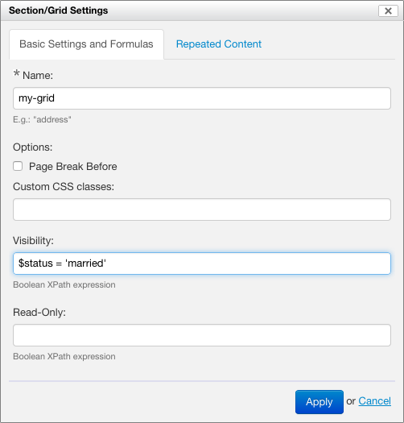

> [[Home]] ▸ Form Builder

## Introduction

Form Builder supports grids with repeated rows. You can repeat a single row (which is the most common case), or multiple rows.

## Creating a repeated grid

You insert a new repeated grid with the "New Repeated Grid" toolbox button.

Once the grid is inserted, you can add (using the grid arrow icons which appear on mouseover) and remove (using the trash icon which appears on mouseover) columns and rows, and add controls to grid cells as you would in a regular non-repeated grid.

With only one row, the control labels are used as column headers and are not repeated within the grid.

If you add multiple rows with the arrow icons, the entire group of rows is repeated. Control labels do not appear as column headers, but appear alongside the controls in the grid.

## How things look at runtime

At runtime, notice how in the first grid a single row is repeated, and in the second grid the two rows are repeated.

## Grid settings

Once a grid is inserted, you can edit its properties with the "Grid Settings" icon.

The "Visibility" and "Read-Only" formulas control whether the entire grid (including it's headers if any) is visible at all or whether its content is entirely readonly. 

*NOTE: Since Orbeon Forms 4.8, these settings properly apply to the entire grid. Previously, the grid's repeat headers did not hide properly for example when the grid was hidden. See issue [#635](https://github.com/orbeon/orbeon-forms/issues/635).*

The repeat settings control whether to use a custom iteration name (not recommended in most cases), and the minimum/maximum number of repeat iterations allowed.

## See also

- Inserting and reordering grid rows: [blog post](http://blog.orbeon.com/2013/11/inserting-and-reordering-grid-rows.html)
- Repeated sections: [blog post](http://blog.orbeon.com/2014/01/repeated-sections.html)