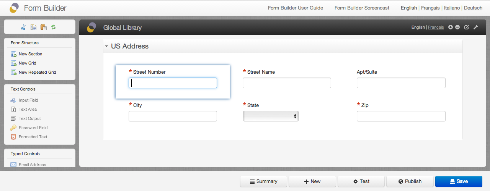
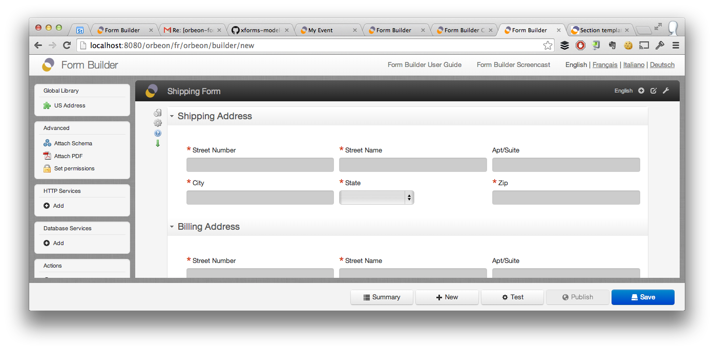
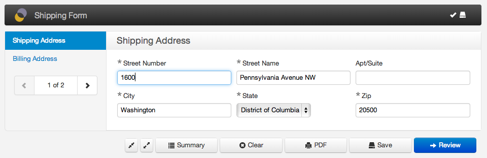

> [[Home]] ▸ [[Form Builder|Form Builder]]

## Introduction

Form Builder supports defining reusable sections called section templates. Here is how they work:

- You create sections in a special form with name `library`.
- You publish this form.
- For each section in that form, Form Builder creates a reusable section component.
- The component is made available in the Form Builder toolbox under "Library" groups.
- The title of the section is used as the title of the component in the toolbox.

For example, you can create a generic "US Address" section and reuse it in multiple forms:

Sections can contain:

- nested grids, with or without repeats
- nested subsections, with or without repeats
- services and actions (see below)

When creating a form, the toolbox shows the available sections templates:

- Global templates, created in `orbeon/library` form.
- Application templates, created in the current application's `library` form.

When you click on a given section template, the section is inserted into the form after the currently selected section. You can then select a new title for the section. It is possible to include a section template more than once.

The section appears with read-only fields (which means that you cannot change properties of the controls once inserted):

When deploying the form, section templates appear like regular editable sections:

## Services and actions

Actions involving controls in a given section are automatically included with the section template, along with the services called by the actions.

*NOTE: If an action involves controls in more than one section, the action will not properly work at runtime.*

## Updating section templates

When you open Form Builder, the latest version of the controls and section templates is retrieved from the database and shown in the toolbox.

If you make changes to section templates by modifying and publishing a library form, you can refresh the toolbox in your form to reflect the latest changes using the "Reload Toolbox" icon at the top of the toolbox. After reloading :

- The list of controls and section templates in the toolbox updates.
- Section templates used in your form also update to their latest version.

Note that when you publish your form, the section templates *currently* loaded in Form Builder at the time of publishing are included with the published form. This means that changes to section templates after the deployment of a form do not affect the deployed form. If you need to update a deployed form with a new version of controls, you must re-publish the form.
