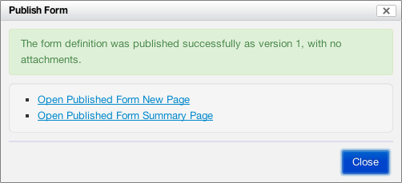

## Default values

For the latest configuration, see [properties-form-builder.xml](https://github.com/orbeon/orbeon-forms/blob/master/src/resources-packaged/config/properties-form-builder.xml).

## Toolbox 

### Groups of controls

You configure the contents of the toolbox by configuring properties in this format:

```xml
<property as="xs:string"  name="oxf.fb.toolbox.group.$GROUPNAME.uri.*.*">
    $URLS
</property>
```

In that property, the value of `$GROUPNAME` determines a grouping of the controls in the toolbox. The controls are defined by a list of XBL file URLs specified by `$URLS`. For example:

```xml
<property as="xs:string" name="oxf.fb.toolbox.group.text.uri.*.*">
    oxf:/forms/orbeon/builder/xbl/text-controls.xbl
    oxf:/xbl/orbeon/tinymce/tinymce.xbl
    oxf:/xbl/orbeon/explanation/explanation.xbl
</property>
```

*NOTE: With Orbeon Forms 4.5 and earlier, values must be placed in the `value` attribute.*

```xml
<property
    as="xs:string"
    name="oxf.fb.toolbox.group.text.uri.*.*"
    value="oxf:/forms/orbeon/builder/xbl/text-controls.xbl
           oxf:/xbl/orbeon/tinymce/tinymce.xbl
           oxf:/xbl/orbeon/explanation/explanation.xbl"/>
```

To properly show up in the toolbox, XBL files need to include the appropriate [component metadata](http://wiki.orbeon.com/forms/doc/user-guide/form-builder-user-guide/toolbox-component-metadata).

### Other toolbox features

In addition to controls, the toolbox has other features which you can enable or disable with the following properties:

```xml
<property as="xs:boolean" name="oxf.fb.menu.schema"            value="true"/>
<property as="xs:boolean" name="oxf.fb.menu.pdf"               value="true"/>
<property as="xs:boolean" name="oxf.fb.menu.edit-source"       value="true"/>
<property as="xs:boolean" name="oxf.fb.menu.permissions"       value="true"/>
```

[SINCE: Orbeon Forms 4.6] The following properties are also supported:

```xml
<property as="xs:boolean" name="oxf.fb.menu.services.http"     value="true"/>
<property as="xs:boolean" name="oxf.fb.menu.services.database" value="true"/>
<property as="xs:boolean" name="oxf.fb.menu.actions"           value="true"/>
```

## Publish dialog actions

[SINCE: Orbeon Forms 4.6]

By default the Publish dialog proposes, upon successful publication of a form definition, shortcuts to navigate to the published form's New or Summary pages.



This property allows specifying which of these actions are available:

```xml
<property
    as="xs:string"
    name="oxf.fb.publish.buttons"
    value="new summary"/>
```

## Metadata

```xml
<property
    as="xs:boolean"
    name="oxf.fb.metadata.logo"
    value="true"/>
```

Whether to allow uploading a custom logo image. If set to false, this is not allowed and the default logo, if any, is used.

## Maximum number of columns 

```xml
<property
    as="xs:integer"
    name="oxf.fb.grid.max-columns"
    value="4"/>
```

[SINCE 2011-05-20 / Orbeon Forms 4.0] Use this property to change the default maximum number of grid columns form authors can create. The more columns there are, the more narrow each column is, and when columns become too narrow, some less "elastic" controls might not have enough space to render properly. You want to set this property to a "reasonable" value to reduce the chance of form authors ending up with columns that are too narrow to accommodate certain controls.

## Closing sections

```xml
<property
    as="xs:integer"
    name="oxf.fb.section.close"
    value="100"/>
```

Closing sections in Form Builder can improve responsiveness. This property sets the number of controls after which Form Builder will close all sections except the first one when loading a form. Below that number of controls, all sections are open by default.

## Form Builder Summary page

```xml
<property as="xs:string"  name="oxf.fr.summary.buttons.orbeon.builder">
    home delete duplicate new
</property>
```

This controls which buttons appear on the Form Builder Summary page.

## Available languages

```xml
<property
    as="xs:string"
    name="oxf.fr.available-languages.orbeon.builder"
    value="en fr es it de"/>
```

This controls which Form Builder user interface languages appear in the language selector.

## Access control 

If you'd like to have multiple classes of Form Builder users where some case edit, say, form in the `hr` app, while other can edit forms in the `sales` app, see [Access control for editing forms](http://wiki.orbeon.com/forms/doc/developer-guide/form-runner/access-control#TOC-Access-control-for-editing-forms).
