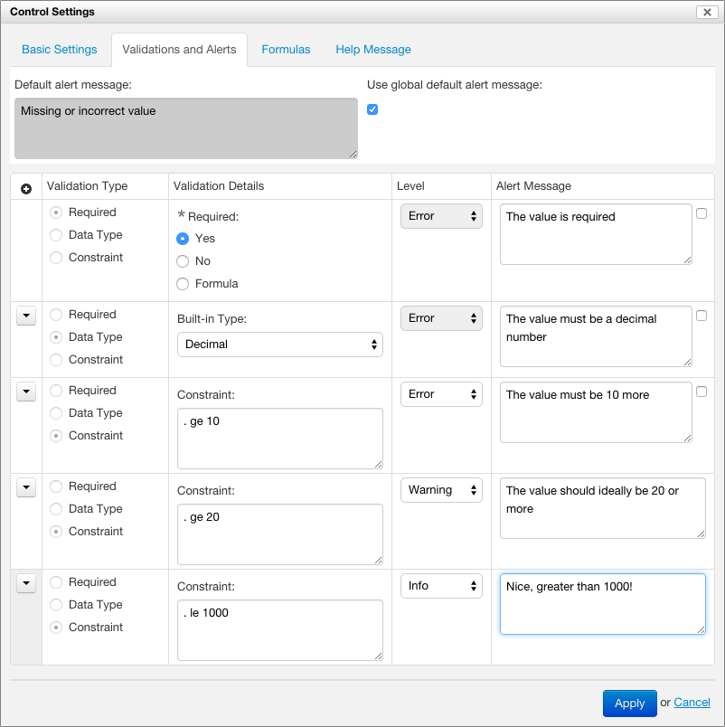

## Introduction

An important part of designing a form is to prevent incorrect data from being captured. For example:

- an applicant's first and last names might be required
- an applicant's age must be a positive number and might have to be greater than a minimum
- an id number might have to follow a specific syntax

If such conditions are not met, the user must see an *error* and cannot submit the form until they are corrected.

In addition, some values might be correct, but the user should be encouraged to pay special attention to them. In such cases, the user should see a *warning* or *informational message* before submitting the form.

Form Builder supports this kind of validations via the Validations and Alerts tab of the Control Settings dialog. You open the dialog with the Control Settings icon to the right of each control.

*NOTE: Prior to Orbeon Forms 4.3, the dialog was called Validation Properties.*

## Validation types

The value associated with a control can be validated with 3 different validation types:

1. *Required*. This indicates whether the value can be empty or not.
2. *Data Type*. For example `string`, `decimal`, `date`, or `time`.
3. *Constraint*. A custom formula, expressed in XPath, which determines whether the value is valid or not for a certain validation level.

## Required validation

This simple validation has only two possibilities:

- *Yes*: a value is required
    - *NOTE: Blank spaces count as a value!*
- *No*: a value is not required

When the value is required, an asterisk appears next to the control to signify to the user that the value is required.

At runtime, if the value is required but not empty, the value is marked as invalid.

## Data type validation

The list of data types includes:

- common types such as a plain `string`, `decimal`, `date`, `time`, `boolean`, or `email`
- XML Schema types (only if an XML Schema with simple types was attache to the form)

At runtime, if the value is required and does not match the specified datatype, the value is marked as invalid.

*NOTE: When selecting certain controls from the toolbox, such as "Email", "Date", "Time", and "Date and Time", the appropriate data type is already selected by Form Builder. Changing the type to a different type might change the appearance of the control to match the type selected.*

If an XML Schema containing simple types is available, those are listed in a Schema Type menu.

Either a built-in data type or an XML Schema data type can be selected. If you select an XML Schema data type, the built-in data type is automatically reset. Similarly, if you select a built-in data type, the XML Schema data type is reset.

At runtime, if the value is required and does not match the specified datatype, the value is marked as invalid. For example, if the value must be an `integer`, the value "John" is invalid.

*NOTE: If the control is of type `string`, doesn't have a constraint and is not required, then any value entered is valid.*

When an XML Schema data type is selected:

- If *Required* is set to *Yes*, the control is still made required, and an asterisk appears.
- If *Required* is set to *No*, the value must still match the definition of the XML Schema type to be valid. If the XML Schema type requires a non-empty value, setting *Required* to *No* does not make the value optional.

## Constraint validation

Since Orbeon Forms 4.3:

- There can be more than one constraint applied to a given control.
- You add constraints with the `+` icon.
- Each constraint can have a *level* associated with it and a custom alert message.

TODO

The following expression, which would apply to a birthday date field, checks that the user is 18 year old or older:

    . <= (current-date() - xs:yearMonthDuration("P18Y"))

## Control validity

A control value (entered by the user, constant, or calculated) is either *valid* or *invalid*. It is invalid if any of the following conditions is met:

- It is required but remains empty.
- It does not match the selected data type.
- There is an unmet *error* constraint.

## Validation levels

If a control is valid, it can have a *warning* level. This is the case if there is at least one unmet *warning* constraint.

If a control doesn't have a warning level, it can have an *info* level. This is the case if there is at least one unmet *info* constraint.

A warning or info level does not make the control value invalid and it is still possible to submit form data.

*NOTE: As of Orbeon Forms 4.3, it is not possible to associate a validation level to the required or data type validations: they always use the error level.*

## Validation at runtime

If the value is invalid at runtime, the control is highlighted and an error message is displayed. The message is selected as follows:

- If required or data type validation has failed:
    - The default alert message for the control is used if available, or a global default Form Runner message is used otherwise.
- If an error constraint is unmet:
    - If no specific alert message is specified for the validation, the default alert message for the control is used if available, or a global default Form Runner message is used otherwise.
    - If a specific alert message is specified, then it is used.

*NOTE: As of Orbeon Forms 4.3, it is not possible to associate specific alert message to the required or data type validations: they always use the default or global alert message.*

The error message appears:

- under the control value
- in the Error Summary

## Localization of messages

TODO
