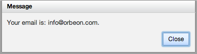

> [[Home]] ▸ [[Form Runner|Form Runner]]

[SINCE Orbeon Forms 4.4]

*NOTE: This is an advanced feature which requires XForms knowledge.*

It can be useful to be able to define custom model logic, either for a particular form or shared among a number of forms. The `oxf.fr.detail.model.custom` property allows you to do just that:

```xml
<property
  as="xs:anyURI"
  name="oxf.fr.detail.model.custom.*.*"
  value="oxf:/forms/acme/whizz.xml"/>
```

The value of the property is a URL which points to a file containing the custom logic. The format of the file is that of an XForms model. The custom content is included in your form's main model, which is identified by `fr-form-model`. This means that you have access to your form data in instance `fr-form-instance`, for example.

Here is a very simple example:

```xml
<xf:model xmlns:xf="http://www.w3.org/2002/xforms">
    <xf:message event="foobar">Your email is: <xf:output value="instance()//email"/>.</xf:message>
</xf:model>
```

Here we define custom XForms that reacts to an event called `foobar` and displays a message to the user.

We can create a [[custom button|Form-Runner-~-Buttons-and-Processes]] that dispatches that event with the following properties:

```xml
<!-- Place custom button on all `acme` forms -->
<property
  as="xs:string"
  name="oxf.fr.detail.buttons.acme.*"
  value="whizz"/>

<!-- Label for the button -->
<property
  as="xs:string"
  name="oxf.fr.resource.acme.*.en.detail.buttons.whizz"
  value="Whizz"/>

<!-- React to button activation by dispatching the event -->
<property
  as="xs:string"
  name="oxf.fr.detail.process.whizz.acme.*"
  value='xf:dispatch("foobar")'/>

<!-- Specify the custom model content -->
<property
  as="xs:anyURI"
  name="oxf.fr.detail.model.custom.acme.*"
  value='oxf:/forms/acme/whizz.xml'/>
```

The result:


