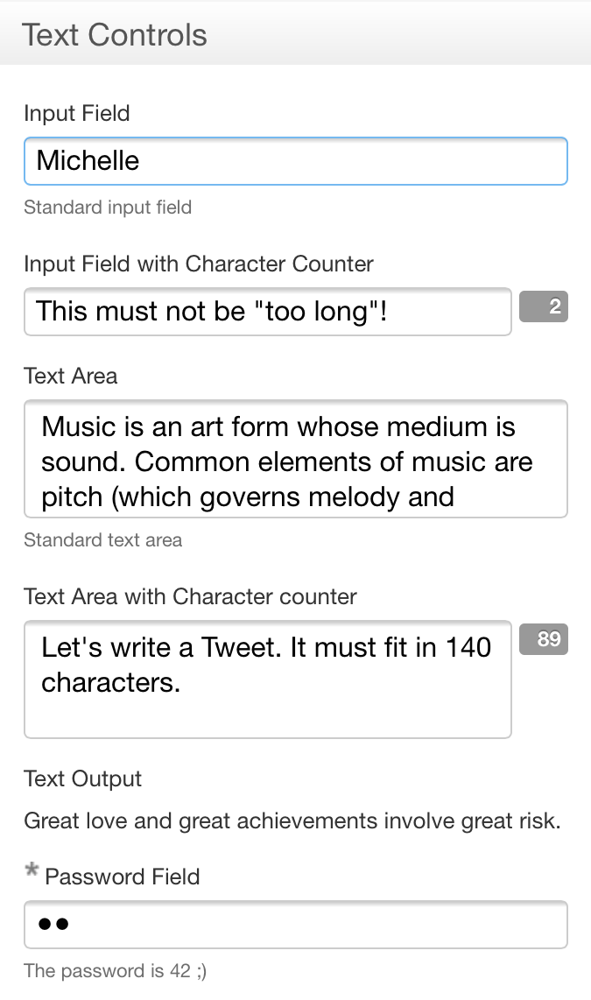

Starting with version 4.10, Orbeon Forms supports [responsive design][1] for forms you create with Form Builder. One significant implication is that when your forms are shown on a narrow screen, for instance on a mobile phone, fields that are reflowed to show on the same "column", whereas they some will shown next to each other on a wider display. For instance, where on a desktop or tablet fields show as:

On a mobile phone, they will show as:

[1]: https://en.wikipedia.org/wiki/Responsive_web_design