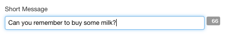

> [[Home]] ▸ [[Form Runner|Form Runner]] ▸ [[XBL Components|Form Runner ~ XBL Components]]

## Availability

[SINCE Orbeon Forms 4.10]

## What it does

The `fr:character-counter` component encapsulates an existing text control and adds a character counter next to it.



It supports the following controls:

- `xf:input`
- `xf:textarea`
- `xf:secret`
- `fr:tinymce`

## Basic usage

The component is generally activated using the `appearance` attribute:

```xml
<fr:input bind="message-bind" appearance="character-counter">
    <xf:label>Message</xf:label>
</fr:wizard>
```

The component automatically encapsulates the specified control, here `xf:input`.

The component displays its counter in  different ways:

- if no `max-length` validation is present on the bound node
  - the counter value is the current number of characters
  - a CSS class `fr-charcounter-current` is present on the counter
- if a `max-length` validation is present on the bound node
  - if the current length is smaller than `max-length`
    - the counter value is the number of remaining characters allowed 
    - a CSS class `fr-charcounter-remaining` is present on the counter
  - if the current length is larger than `max-length`
    - the counter value is the number of extra characters allowed
    - a CSS class `fr-charcounter-over` is present on the counter

By default, `fr-charcounter-over` places a minus sign in front of the number of characters over the limit.

## Form Builder support

The CSS bindings allow Form Builder to propose the "Character Counter" appearance to the user automatically. See [How the new Form Builder Appearance Selector Works](http://blog.orbeon.com/2015/06/how-new-form-builder-appearance.html) for details.

## See also

- [How the new Form Builder Appearance Selector Works](http://blog.orbeon.com/2015/06/how-new-form-builder-appearance.html)
