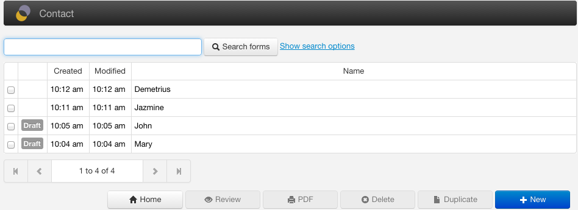
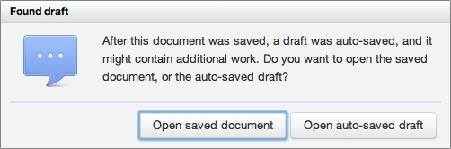
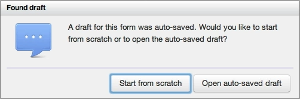
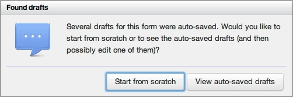

## Support

- [SINCE Orbeon Forms 4.3] This feature is supported with MySQL and DB2 only.
- [SINCE Orbeon Forms 4.4] Oracle support is supported.
- eXist is not yet supported as of Orbeon Forms 4.4.

See also the [blog post](http://blog.orbeon.com/2013/10/autosave.html).

## How autosave works

When autosave is enabled and you are an authenticated user, form data is automatically saved as *drafts* in the background as you enter and modify form data. This reduces the chance that you will lose data if something goes wrong and you haven't explicitly saved the data.

### Summary page

The summary page shows the drafts, on separate lines and clearly marked as such. From the summary page, users can click on a draft to open it, or select it to then delete it, assuming they have the permission to do so.



### Edit page

If users edit a form for which there is a draft, they will be asked whether they want to open the saved data, or start from the autosaved draft.



### New page

If users started filling out a new form, but didn't save the data, if starting to fill out a new form later, they will be asked whether they wish to start from scratch, or from one of the drafts saved earlier. In this case, the prompt will be different whether there is just one draft for new data, or multiple drafts available, as in the latter case, users will need to select which draft they want to use.





## Configuration

### With Orbeon Forms 4.3

With Orbeon Forms 4.3 specifically, you need to:

- If using MySQL, pupdate your database by running this  DDL](https://github.com/orbeon/orbeon-forms/blob/master/src/resources/apps/fr/persistence/relational/ddl/mysql-4_3-to-4_4.sql). (The tables for DB2 on 4.3 already contain the required changes out-of-the-box.)
- Set the following properties:

```xml
<property as="xs:boolean" name="oxf.fr.support-owner-group" value="true"/>
<property as="xs:boolean" name="oxf.fr.support-autosave"    value="true"/>
```

### With Orbeon Forms 4.4 and newer

You don't need to do anything special to use this feature.

### Properties

```xml
<property
  as="xs:integer"
  name="oxf.fr.detail.autosave-delay.*.*"
  value="5000"/>
```

[SINCE Orbeon Forms 4.4]

If the value of `oxf.fr.detail.autosave-delay` is 0 or negative, autosaving is disabled.

The following property enables or disable autosave for a given persistence provider, as autosave requires support from the persistence provider.

```xml
<property
  as="xs:boolean"
  name="oxf.fr.persistence.*.autosave"
  value="false"/>
```

For example, as of Orbeon Forms 4.4, the `exist` provider does not support autosave yet. But the `oracle` provider does:

```xml
<property
  as="xs:boolean"
  name="oxf.fr.persistence.oracle.autosave"
  value="true"/>
```

By default, the `oracle`, `mysql` and `db2` providers support autosave.
