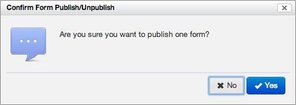
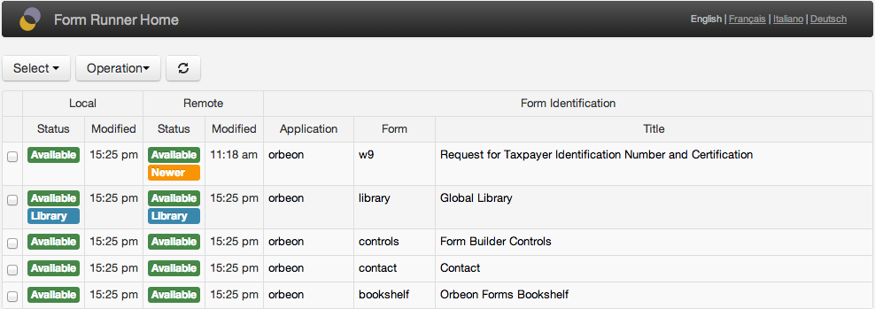

[SINCE 2011-07-22 / ORBEON FORMS 4.0]

## Introduction

The Form Runner Home page is a start page for accessing forms deployed in Form Runner.

You access the Form Runner Home page by adding `fr/` to the path on which you deployed Orbeon Forms. If you deployed Orbeon Forms on `http://www.example.com/orbeon/`, then you can access the From Runner home page at `http://www.example.com/orbeon/fr/`.

## User and admin views

[SINCE Orbeon Forms 4.3]

If the user doesn't have any permissions set via `form-builder-permissions.xml`, as [documented here](http://wiki.orbeon.com/forms/doc/developer-guide/form-runner/access-control#TOC-Form-Runner-Home-page), a simple user view is presented:


If the user has permissions set in `form-builder-permissions.xml`, a view with admin privileges is presented:


The list of forms listed depends on the roles set in `form-builder-permissions.xml`. For example, with:

```xml
<role name="*" app="*" form="*"/>
```

the user can perform any admin operation on any form. But with:

```xml
<role name="orbeon-user" app="acme" form="*"/>
```

the user can perform admin operations on `acme` forms only.

## User view

In this view:

- Each line shows only forms that are *published and available*.
- For each form, the app name, form name and title in the current language are shown.
- You can navigate to the form's Summary, New or View page, depending on permissions, by clicking on a line.
- Forms are sorted by last modification time.
- Libraries are never shown in this view.

*NOTE: Only deployed forms are visible. Forms that have been created with Form Builder and which have been just saved but never deployed are not visible.*

## Admin view

When the user has access to admin operations, new information is shown:

- whether the form is available or unavailable ("unpublished")
- whether the form is a library form

Unavailable forms remain on the server, but any user access to an unavailable form behaves as if the form had never been published.

The user can select forms in two ways:

- by using the checkboxes next to the form
- by using the Select menu to automatically select all forms matching a certain condition


The operations listed in the Operations menu are then available depending on the current selection:


The main operations available are:

- Publish local forms: make an unavailable form available again
- Unpublish local forms: make a published form unavailable


## Remote server operations

[SINCE Orbeon Forms 4.4] This is an Orbeon Forms PE feature.

### Introduction

This feature allows you to configure access to a remote server and to publish, unpublish, and transfer forms between the local and remote server.

### Configuration on the local server

In order to configure a remote server, you need to setup a property.

With Orbeon Forms 4.7 and newer, use the `oxf.fr.home.remote-servers` property, which allows configuring multiple remote servers:

```xml
<property as="xs:string" name="oxf.fr.home.remote-servers">
  [
    { "label": "Staging",    "url": "http://staging.example.org:8080/orbeon" },
    { "label": "Production", "url": "http://prod.example.org:9090/orbeon" }
  ]
</property>
```


The format is a JSON array containing any number of JSON objects. Each object must have a non-empty `label` property indicating the label to display to the user when selecting a remote server, and a non-empty `url` property indicating the location of the remote server.

With Orbeon Forms 4.4 to 4.6, use the `oxf.fr.production-server-uri` property:

```xml
<property
  as="xs:anyURI"
  name="oxf.fr.production-server-uri"
  value="http://remote.server:8080/orbeon/"/>
```

*NOTE: As of Orbeon Forms 4.7, the `oxf.fr.production-server-uri` is deprecated. With Orbeon Forms 4.7 and newer, if the `oxf.fr.production-server-uri` is set and not empty, it takes precedence over the new `oxf.fr.home.remote-servers` property, for backward compatibility.*

### Configuration on the remote server

You also need to authorize the remote server to accept incoming connections for services. One way of doing this is to use the Orbeon Forms delegating `orbeon-auth.war`, documented [here](http://wiki.orbeon.com/forms/doc/developer-guide/page-flow-controller/authorization#TOC-A-simple-authorization-service).

You deploy this WAR file alongside `orbeon.war` on the remote server, and you add this property to the remote server's `properties-local.xml`:

```xml
<property
  as="xs:anyURI"
  processor-name="oxf:page-flow"
  name="authorizer"
  value="/orbeon-auth"/>
```

This tells the remote server to use the `orbeon-auth` webapp to authenticate requests for services or pages which are not public.

By default, `orbeon-auth` requires that all external requests to Form Runner services are authenticated with `BASIC` authentication and have the `orbeon-service` role. It blocks any other request.

If you are using Tomcat, you can then configure a user with role `orbeon-service`. For example, in `tomcat-users.xml`:

```xml
<role rolename="orbeon-service"/>
<user username="orbeon-admin" password="changeme" roles="orbeon-service"/>
```

Then, on the local server, you would use username `orbeon-admin` and password `changeme` when prompted.

With this configuration, the local Orbeon Forms connects to services on the remote Orbeon Forms, which calls up `orbeon-auth` to authenticate the connection. `orbeon-auth` requires that the username/password provided authenticate as a valid Tomcat user with the `orbeon-service` role. If that's successful, then the service proceeds, otherwise it fails.

### Remote operations

When the remote server is configured as above, the first time you go to the Form Runner Home page you are prompted for credentials:


Once the credentials are correct, the Home page retrieves the remote server's list of deployed forms and metadata, which appears in a new *Remote* column group. You then have access to new operations:

- Publish remote form: make an unavailable form available again on the remote server
- Unpublish remote form: make a previously published form unavailable on the remote server
- Push to remote: copy a form definition and its attachments from the local to the remote server
- Pull from remote: copy a form definition and its attachments from the remote to the local server


You are always prompted to confirm the operation to perform:



In addition, if the latest modification time of the form definitions differ, a *Newer* label appears:



## Orbeon Forms 4.0 to 4.2

For each form definition the current user has access to, the following links are shown if allowed:

- Link to the summary page: shown if the current user can perform either one of the read, update, or delete operations on the form. 
- Link to the new page: shown if the current user can perform the create operation on the form.


## See also

- [Form Runner Access Control](http://wiki.orbeon.com/forms/doc/developer-guide/form-runner/access-control)
