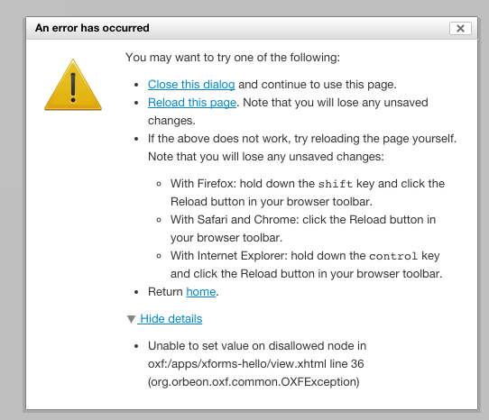

See also:

- [[XForms Error Handling Detailed Behavior|XForms ~ Error Handling ~ Detailed Behavior]]

## Rationale

A number of things can go wrong with an XForms page. In particular, XPath expressions and actions can raise errors when evaluating.

According to the XForms 1.1 specification, certain runtime errors, including errors in XPath expressions, must stop the XForms engine, and Orbeon Forms used to implement that behavior. However in many cases this is not desirable, as this prevents the user from attempting to recover from those errors. A user might be able, for example, to save data after an error, but not if the XForms engine has already stopped functioning.

In addition, many errors, such as XPath calculations in forms, happen as a matter of course. For example, if you write a formula in Form Builder:

```ruby
$a div $b
```

and the value for `$b`, provided by the user in a field, is `0`, there is an error. But this is not a bug in the form: it is expected, and the calculation simply doesn't produce a result.

So Orbeon Forms 4.0 and newer implements an improved behavior for certain runtime errors, which are made recoverable (that is, non-fatal). This behavior is described below and part of this behavior is expected to be included in XForms 2.0.

## XForms errors during page load

[Since Orbeon Forms 4.9]

The following errors are fatal during page load and cause the page to display a fatal error:

- __Static XPath errors:__ These are typically XPath errors which have syntax errors, which reveal bugs in a form or in Orbeon Forms.
- __Other static XForms errors__: For example, duplicate `id` attributes on elements.

On the other hand, the following errors do not cause the page to fail loading:

- __Dynamic XPath errors:__ This includes divisions by zero and other errors which can happen while an XPath expression executes.
- __Errors writing values into the data model__: For example, a `calculate` expression attempting to write to a non-leaf XML element or a an XML document element.
- __XForms actions errors__: In addition to failed `xf:setvalue` actions, unexpected errors when running an XForms action.

_NOTE: Like before, non-XForms errors typically are fatal during page load. These include errors in XML pipelines, XSLT transformations outside of XForms, and other unexpected Java exceptions in Orbeon Forms._

## XForms errors after page load

After a form has loaded, static XPath errors do not cause the form to stop working and are recoverable.

## Handling of recoverable errors

When `xxf:expose-xpath-types="true"`, errors caused by incorrect access to typed values are just logged at `debug` level.

All other recoverable errors dispatch one of the following XForms events:

- `xxforms-xpath-error`
- `xxforms-binding-error`
- `xxforms-action-error`

The default action for these events is to log the error at `debug` level.

*NOTE: Until Orbeon Forms 4.8, these errors were logged at `warning` level.*

Custom event handlers can be used to provide specific error handling for these errors, as described in [[XForms Error Handling Detailed Behavior|XForms ~ Error Handling ~ Detailed Behavior]].

## Configuration properties

### Error dialog

The error dialog is used for:

- client-side JavaScript errors, which may be fatal
- recoverable server errors (when enabled via `show-recoverable-errors`)

By default, the error dialog is enabled. You can disable it entirely by setting the following property to `false`:

```xml
<property
  as="xs:boolean"
  name="oxf.xforms.show-error-dialog"
  value="false"/>
```

If you disable the default error dialog, you might want to provide an alternative way of reporting the issue to the user. You can do this in JavaScript by registering an event listener on [ORBEON.xforms.Events.errorEvent][3].



### Recoverable errors

[SINCE 2011-11-04]

The following property allows you to enable or disable showing recoverable server errors to the user via the error dialog, and to determine a maximum number of errors to show the user. This is intended as a *development* feature, not a production feature.

```xml
<property
  as="xs:integer"
  name="oxf.xforms.show-recoverable-errors"
  value="10"/>
```

If the value is `0`, no errors are shown the user. If the value is `1` or greater, the value is the maximum number of errors to show the user.

Default:

* `prod` mode: `0`
* `dev` mode: `0`

_NOTE: From Orbeon Forms 4.0 to 4.8, the default for `dev` was `10`. Because few people use the `dev` mode and because having a different behavior in development vs. production can be confusing, the default has been changed to `0` in both cases._

### Fatal errors during form initialization

[From Orbeon Forms 4.6 to Orbeon Forms 4.8]

The following property controls whether errors occurring during form initialization are considered fatal or not. If `true`, they are fatal and an error shows when loading the page.

```xml
<property
  as="xs:boolean"
  name="oxf.xforms.fatal-errors-during-initialization"
  value="true"/>
```

Default: `true`.

## Noscript mode

In noscript mode, an error panel is also shown for recoverable errors:


The differences with the Ajax mode are:

* the panel cannot be immediately closed (as no JavaScript is required)
* the panel appears at the top of the page instead of as an overlay
* the detail of the errors is immediately shown

## Historical

### Orbeon Forms 4.0 to 4.8

Errors occurring during the page initialization are not recoverable. They throw an exception and interrupt XForms processing. The idea was that there is not much to recover from, as the user has just landed on the page. The user could attempt to recover from such errors with the browser back button.

Dynamic XPath errors on MIPs are recoverable with an explicit handler for the `xxforms-xpath-error` event.

Errors are logged at `warning` level and then shown to the user in a dialog. The user can then close the dialog and try to continue working with the page. There is no guarantee that further actions on the form will work, but at least the user can try.

[From Orbeon Forms 4.6 to 4.8]

Fatal errors during initialization can be disabled via the `oxf.xforms.fatal-errors-during-initialization` property.

### Until Orbeon Forms 3.9

Once an error occurs when the user is interacting with the form, the XForms engine displays an error dialog to the user but doesn't allow recovering from that error. The form is basically non-functional after that.

* Most runtime errors are fatal and stop XForms processing.
* In particular, `xforms-compute-exception` and `xforms-binding-exception` can be dispatched and are fatal.
* The user sees an error dialog on the client but typically cannot recover from errors.

[3]: http://wiki.orbeon.com/forms/doc/developer-guide/xforms-extensions#TOC-Custom-Events
[4]: http://wiki.orbeon.com/forms/_/rsrc/1320697168699/welcome/xforms-error-handling/noscript-panel.png