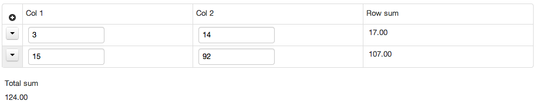

> [[Home]] ▸ [[XForms]]

## Overview

`<xf:bind>` elements with a `name` attribute automatically declare a corresponding XPath variable, as if using `<xf:var>`. This is an extension of the XForms specification.

*NOTE 1: Variables declared this way can only be used on binds within the XForms model where they are declared. Unlike top-level model variables, they are not visible in the view (see issue [#309](https://github.com/orbeon/orbeon-forms/issues/309)).*

*NOTE 2: Up until Orbeon Forms 4.4, issue [#152](https://github.com/orbeon/orbeon-forms/issues/152) prevented properly referring to named binds within bind iterations. This issue is fixed with Orbeon Forms 4.5.*

## Variable resolution

### With Orbeon Forms 4.5 and newer

Variable resolution attempts to find the "closest" associated target bind objects. In the following example, generated by Form Builder, there are variables associated with binds `my-section-bind`, `my-repeat-bind`, `col1-bind`, `col2-bind`, `rowsum`, and `totalsum`:

```xml
<xf:bind id="fr-form-binds" ref="instance('fr-form-instance')">
    <xf:bind id="my-section-bind" name="my-section" ref="my-section">
        <xf:bind id="my-repeat-bind" ref="my-repeat" name="my-repeat">
            <xf:bind id="col1-bind" ref="col1" name="col1" type="xf:decimal"/>
            <xf:bind id="col2-bind" ref="col2" name="col2" type="xf:decimal"/>
            <xf:bind id="rowsum-bind" ref="rowsum" name="rowsum"
                     calculate="sum(($col1, $col2)[string() castable as xs:decimal], 0.0)"
                     type="xf:decimal"/>
        </xf:bind>
        <xf:bind id="totalsum-bind" name="totalsum" ref="totalsum"
                 calculate="sum($rowsum[string() castable as xs:decimal], 0.0)"
                 type="xf:decimal"/>
    </xf:bind>
</xf:bind>
```

This allows `calculate` expressions to refer to these variables:

- `rowsum-bind` refers, for each iteration of `my-repeat-bind`, to the `$col1` and `$col2` belonging to that *same* iteration.
- `totalsum-bind`, on the other hand, refers to the $rowsum` in *all* iterations.

The result shows the expected sums:



More specifically, given the following:

- an expression on a given bind called below the *context bind*
- a target bind referred to by means of a variable name in that expression

The following algorithm is followed:

1. If the variable name refers to the context bind itself or one of its ancestors, the single node corresponding to the current bind iteration is returned.
2. Otherwise, if the context bind and the target bind share a common ancestor, all branches starting from the common iteration of that common ancestor bind are followed to all possible target bind objects, and all nodes associated with those target bind objects are returned.
3. Otherwise, if the context bind and the target bind do not share a common ancestor, all nodes associated with all target bind objects are returned.

### With Orbeon Forms 4.4 and earlier

If a bind referenced by a variable is within an unambiguous context, that is the context in which that bind evaluates is a single node, then the values of the bind's node-set is returned by the variable, otherwise the empty sequence is returned.

This means that target bind objects within more than one bind iteration cannot be accessed.

## See also

- [[XForms Binds|XForms ~ Binds]]