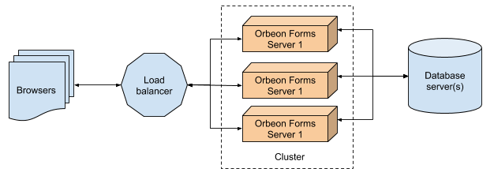

# Clustering and High Availability

## Rationale

In certain environments calling for high availability, or when one server running Orbeon Forms isn't enough to handle the load, you will want to deploy Orbeon Forms on multiple servers. Those servers are often called *cluster*.

## Guidelines

When deploying Orbeon Forms in a cluster, you'll want to make sure that:

1. Only caches and session information is maintained at the level of each Orbeon Forms instance, and critical information is stored on a separate server, or servers, typically a database server. If using Form Runner, you'll want to set it up to [point to a separate relational database](/form-runner/persistence/relational-db.md) or separate eXist database, running on another server, or servers.

2. You setup your load balancer to use **sticky sessions**. Whether you're using a hardware or software load balancer, it will decide for each HTTP request coming in, which server in the cluster should handle it. Using sticky sessions ensures that all the requests for each specific session are sent to the same Orbeon Forms instance, which is essential since Orbeon Forms keeps track of session information on the server. For instance, see how to [setup sticky session with AWS Elastic Load Balancing](http://docs.aws.amazon.com/elasticloadbalancing/latest/classic/elb-sticky-sessions.html).

## Replication

You can configure more advanced clusters using replication. See [Replication](../../installation/replication.md).
