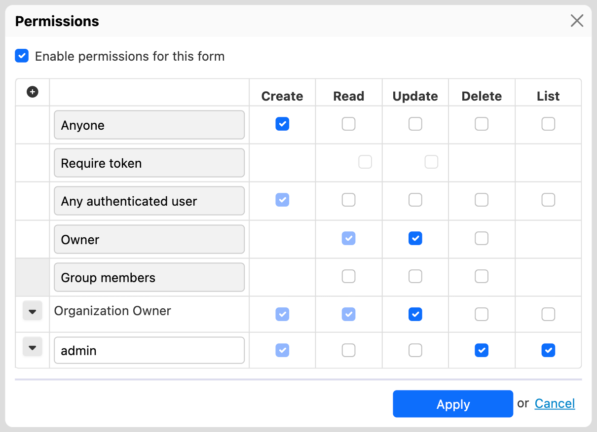

# Form Builder configuration properties


## Default values

For the latest default values of Form Builder properties, see [properties-form-builder.xml](https://github.com/orbeon/orbeon-forms/blob/master/src/main/resources/config/properties-form-builder.xml).

## Toolbox 

### Groups of controls

You configure the contents of the toolbox by configuring properties in this format:

```xml
<property as="xs:string"  name="oxf.fb.toolbox.group.$GROUPNAME.uri.*.*">
    $URLS
</property>
```

In that property, the value of `$GROUPNAME` determines a grouping of the controls in the toolbox. The controls are defined by a list of XBL file URLs specified by `$URLS`. For example:

```xml
<property as="xs:string" name="oxf.fb.toolbox.group.text.uri.*.*">
    oxf:/forms/orbeon/builder/xbl/text-controls.xbl
    oxf:/xbl/orbeon/tinymce/tinymce.xbl
    oxf:/xbl/orbeon/explanation/explanation.xbl
</property>
```

*NOTE: With Orbeon Forms 4.5 and earlier, values must be placed in the `value` attribute.*

```xml
<property
    as="xs:string"
    name="oxf.fb.toolbox.group.text.uri.*.*"
    value="oxf:/forms/orbeon/builder/xbl/text-controls.xbl
           oxf:/xbl/orbeon/tinymce/tinymce.xbl
           oxf:/xbl/orbeon/explanation/explanation.xbl"/>
```

To properly show up in the toolbox, XBL files need to include the appropriate [component metadata](../../form-builder/metadata.md).

### Other toolbox features

In addition to controls, the toolbox has other features which you can enable or disable with the following properties:

```xml
<property as="xs:boolean" name="oxf.fb.menu.schema"            value="true"/>
<property as="xs:boolean" name="oxf.fb.menu.pdf"               value="true"/>
<property as="xs:boolean" name="oxf.fb.menu.edit-source"       value="true"/>
<property as="xs:boolean" name="oxf.fb.menu.permissions"       value="true"/>
```

[SINCE Orbeon Forms 4.6] The following properties are also supported:

```xml
<property as="xs:boolean" name="oxf.fb.menu.services.http"     value="true"/>
<property as="xs:boolean" name="oxf.fb.menu.services.database" value="true"/>
<property as="xs:boolean" name="oxf.fb.menu.actions"           value="true"/>
```

## Publish dialog actions

[SINCE Orbeon Forms 4.6]

By default the Publish dialog proposes, upon successful publication of a form definition, shortcuts to navigate to the published form's New or Summary pages.


This property allows specifying which of these actions are available:

```xml
<property
    as="xs:string"
    name="oxf.fb.publish.buttons"
    value="new summary"/>
```

## Maximum number of columns 

```xml
<property
    as="xs:integer"
    name="oxf.fb.grid.max-columns"
    value="4"/>
```

Use this property to change the default maximum number of grid columns form authors can create. The more columns there are, the more narrow each column is, and when columns become too narrow, some less "elastic" controls might not have enough space to render properly. You want to set this property to a "reasonable" value to reduce the chance of form authors ending up with columns that are too narrow to accommodate certain controls.

## Closing sections

```xml
<property
    as="xs:integer"
    name="oxf.fb.section.close"
    value="100"/>
```

Closing sections in Form Builder can improve responsiveness. This property sets the number of controls after which Form Builder will close all sections except the first one when loading a form. Below that number of controls, all sections are open by default.

## Action buttons in Form Builder

### Action buttons on the Form Builder summary page

This controls which buttons appear on the Form Builder summary page.

```xml
<property as="xs:string"  name="oxf.fr.summary.buttons.orbeon.builder">
    home delete duplicate new
</property>
```

### Action buttons on the Form Builder detail page

This controls which buttons appear on the Form Builder detail page.

```xml
<property as="xs:string"  name="oxf.fr.detail.buttons.orbeon.builder">
    summary new test publish save
</property>
```

## Available languages

```xml
<property
    as="xs:string"
    name="oxf.fr.available-languages.orbeon.builder"
    value="en fr es it de"/>
```

This controls which Form Builder user interface languages appear in the language selector.

## Permissions dialog

The permissions dialog allows form authors, amongst other things, to assign permissions to users having a specific roles. In that dialog, form authors can type in a text field the name of the role(s) they want to assign those permissions to. If you're systematically using certain roles, want to save form authors from having to type them, and prevent possible mistakes in the process, you can use the following property to list the role names you want the Form Builder permissions dialog to always show in that dialog:

```xml
<property as="xs:string" name="oxf.fb.permissions.role.always-show">
    ["Organization Owner"]
</property>
```

The value of this property is an array of strings in the JSON format. For instance, the following screenshot shows the dialog with the above property set (see the line for "Organization owner"), and where the form author added a line for an "admin" role.



## Access control 

If you'd like to have multiple classes of Form Builder users where some can edit, say, forms in the `hr` app, while others can edit forms in the `sales` app, see [Access control for editing forms](../../form-runner/access-control/editing-forms.md#form-builder-permissions).

## Explanatory Text TinyMCE configuration

[SINCE Orbeon Forms 2018.1]

To enable form authors to edit text with formatting shown by the Explanatory Text control, Form Builder uses the TinyMCE component. You can [configure the TinyMCE](https://www.tinymce.com/docs/configure/) by providing your own config as JSON as the value of the `oxf.fb.tinymce.config` property, as in the example below.

```xml
<property as="xs:string"  name="oxf.fb.tinymce.config">
    {
        "mode":	      "exact",
        "language":   "en",
        "statusbar":  false,
        "menubar":    false,
        "plugins":    "lists link",
        "toolbar":    "bold italic | bullist numlist outdent indent | fontselect fontsizeselect",
        "encoding":   "xml"
    }
</property>
```
