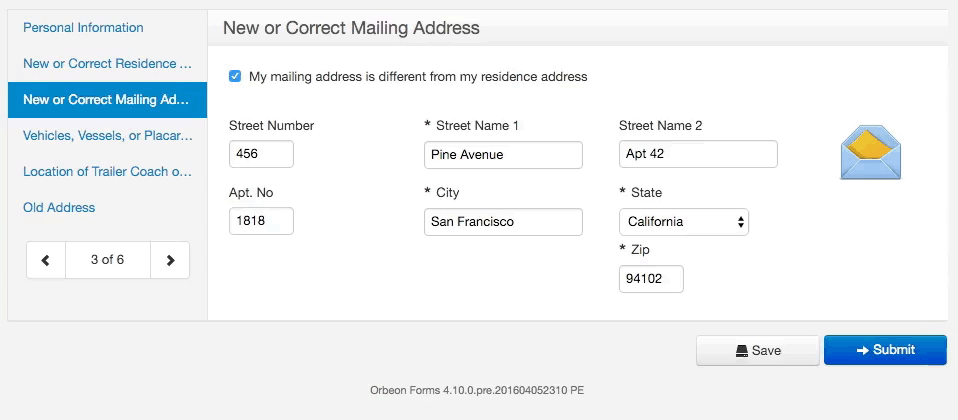

# Detail page configuration properties

<!-- toc -->

## Adding your own CSS files

[SINCE Orbeon Forms 2017.1]

In addition to `oxf.fr.css.custom.uri`, you can also use the following property, which apply only to the Detail page:

```xml
<property
    as="xs:string"
    name="oxf.fr.detail.css.custom.uri.*.*"
    value="/forms/acme/assets/acme-detail.css"/>
```

See also [Adding your own CSS](form-runner.md#adding-your-own-css).

## Adding your own JavaScript files

[SINCE Orbeon Forms 2017.1]

In addition to `oxf.fr.js.custom.uri`, you can also use the following property, which apply only to the Detail page:

```xml
<property
    as="xs:string"
    name="oxf.fr.detail.js.custom.uri.*.*"
    value="/forms/acme/assets/acme-detail.js"/>
```

See also [Adding your own CSS](form-runner.md#adding-your-own-javascript).

## Show table of contents

```xml
<property
    as="xs:integer"
    name="oxf.fr.detail.toc.*.*"
    value="0"/>

```

If the number of table of contents entries are greater than this value, then show the Table of Contents at the top of the form. Can be omitted or set to -1 to never show the TOC.

## Position of error summary

```xml
<property
    as="xs:string"
    name="oxf.fr.detail.error-summary.*.*"
    value="bottom"/>
```

Where to place the error summary: `top`, `bottom`, `both`, or `none`.

## Buttons on the Detail Page

```xml
<property
    as="xs:string"
    name="oxf.fr.detail.buttons.*.*"
    value="close clear print pdf save submit"/>
```

The property configures which buttons are included on the Detail Page, and in what order they are shown. For more information, see [Buttons and Processes](../../form-runner/advanced/buttons-and-processes/README.md).

## Hiding and disabling buttons

[SINCE Orbeon Forms 2016.2]

The following properties, where you replace `BUTTON` by a specific button name, control whether a particular button is visible or disabled:

```xml
oxf.fr.detail.button.BUTTON.visible.*.*
```

```xml
oxf.fr.detail.button.BUTTON.enabled.*.*
```

The value of these properties is an XPath expression. For example the following properties hide, show, and disable buttons depending on whether the wizard shows its table of contents or its body:

```xml
<property as="xs:string"  name="oxf.fr.detail.button.wizard-next.visible.*.*">
    fr:is-wizard-body-shown()
</property>

<property as="xs:string"  name="oxf.fr.detail.button.wizard-prev.visible.*.*">
    fr:is-wizard-body-shown()
</property>

<property as="xs:string"  name="oxf.fr.detail.button.wizard-toc.visible.*.*">
    fr:is-wizard-body-shown()
</property>

<property as="xs:string"  name="oxf.fr.detail.button.save-final.enabled.*.*">
    fr:is-wizard-toc-shown()
</property>
```

## Loading indicator for buttons

[SINCE Orbeon Forms 2016.1]

The property `oxf.fr.detail.loading-indicator.BUTTON.*.*`, where you replace `BUTTON` by a specific button name, allows you to configure which loading indicator, if any, is to be used for that button. The value of the property can be either:

- Empty, which is the default, and means "no loading indicator".
- `modal`, greys out the background, shows a spinner in the center of the screen, and prevents any user input as long as the action triggered by the button is being processed.
- `inline`, shows a spinner inside the button itself.

In general, we would expect this property to be used as follows:

- `modal` for buttons performing actions for which allowing users to change the value of fields after the button is pressed wouldn't make any sense, would be confusing, or outright dangerous. This would for instance be the case for *submit* or *publish* buttons.
- `inline` for buttons performing actions that are expected to take a little bit of time, like a *save* operation.
- Empty for any other button.

In all cases, should an action take any noticeable amount of time, Orbeon Forms will always show a loading bar at the top of the page, so users know one of their actions is being processed.

By default, as shown in the below video:

- The `modal` loading indicator used for the `submit` button.
- The `inline` loading indicator for the *save* buttons (`save-draft` and `save-final`).



## Controlling the appearance of control labels

[SINCE Orbeon Forms 2016.2]
 
By default, with Form Runner, control labels appear *inline* above the control. The following property allows overriding this behavior:
 
 ```xml
<property
    as="xs:string"
    name="oxf.xforms.label.appearance.*.*"
    value="full"/>
```

Allowed values:

- `full`: labels show inline above the control (the default)
- `full minimal`: labels show inline above the control, but for text, date, and time input fields only, labels show as an HTML *placeholder* within the field when the field is empty

*LIMITATION: The `minimal` appearance is not supported on combined "Date and Time" fields and on text fields with "Character Counter" appearance.* 

*NOTE: Only one `minimal` appearance can be used between `oxf.xforms.label.appearance` and `oxf.xforms.hint.appearance`. If both include `minimal`, the label wins.*

For more about placeholders, see [Use HTML5 placeholders, in XForms](http://blog.orbeon.com/2012/01/use-html5-placeholders-in-xforms.html).

## Controlling the appearance of control hints

[SINCE Orbeon Forms 2016.2]
 
By default, with Form Runner, control hints appear *inline* under the control. The following property allows overriding this behavior:
 
 ```xml
<property
    as="xs:string"
    name="oxf.xforms.hint.appearance.*.*"
    value="full"/>
```

Allowed values:

- `full`: hints show inline below the control (the default)
- `full minimal`: hints show inline below the control, but for text, date, and time input fields only, hints show as an HTML *placeholder* within the field when the field is empty
- `tooltip`: hints show as tooltips upon mouseover
- `tooltip minimal`: hints show as tooltips upon mouseover, but for input fields only, hints show as an HTML *placeholder* within the field when the field is empty

Here is how hints appear depending on the type of control they are associated with:


*LIMITATION: The `minimal` appearance is not supported on combined "Date and Time" fields and on text fields with "Character Counter" appearance.* 

*NOTE: Only one `minimal` appearance can be used between `oxf.xforms.label.appearance` and `oxf.xforms.hint.appearance`. If both include `minimal`, the label wins.*

For more about placeholders, see [Use HTML5 placeholders, in XForms](http://blog.orbeon.com/2012/01/use-html5-placeholders-in-xforms.html).

## Display hints inline

[DEPRECATED as of Orbeon Forms 2016.2]

This property set whether the control hints are shown inline, rather than as tool-tips. The default is `true`.

```xml
<property
    as="xs:boolean"
    name="oxf.fr.detail.hints.inline.*.*"
    value="true"/>
```

As of Orbeon Forms 2016.2, this property is deprecated. Use `oxf.fr.detail.hint.appearance` instead. For backward compatibility, when this property is present, it overrides `oxf.xforms.hint.appearance` and sets it to:

- `full` if set to `true`
- `tooltip` if set to `false`

## Order of LHHA elements

[SINCE Orbeon Forms 2016.2]

This property sets the respective order, in the generated HTML markup, of label/help/hint/alert and the control element. It is not recommended to change the default value of this property.

```xml
<property 
    as="xs:string" 
    name="oxf.fr.detail.lhha-order.*.*"                               
    value="help label control alert hint"/>
```

## Initial keyboard focus

[SINCE Orbeon Forms 4.9]

This property controls whether Form Runner attempts to set focus on the first control upon form load. The default is `true`.

```xml
<property
    as="xs:boolean"
    name="oxf.fr.detail.initial-focus.*.*"
    value="true"/>
```

In some cases, such as [embedding](../../form-runner/link-embed/java-api.md), it can be desirable to disable this by setting the property to `false`.

## Focusable controls

[SINCE Orbeon Forms 2016.3]

The following properties determine which control types are focusable in in the following scenarios:

- initial focus (if enabled by  `oxf.fr.detail.initial-focus`)
- switching sections in the table of contents
- switching sections in the wizard table of contents or navigation
- clearing the form data with the "Clear" button
- moving, inserting, or deleting iterations in repeated grids and sections

```xml
<property
    as="xs:string"
    name="oxf.fr.detail.focus.includes.*.*"
    value=""/>
    
<property
    as="xs:string"
    name="oxf.fr.detail.focus.excludes.*.*"
    value="xf:trigger"/>
```

Until Orbeon Forms 2016.2, only Text Fields (`<xf:input>`) were focusable in these cases. Since Orbeon Forms 2016.3, the default is to allow focus on any input control, including text fields, text areas, dropdown menus, and more. However, buttons are explicitly excluded.
  
The values of these properties follow the [`include` and `exclude` attributes](../../xforms/focus.md#includes-and-excludes) on the `<xf:setfocus>` action.

## Validation mode

[SINCE Orbeon Forms 2016.3]

The following property controls whether validation happens as the user types or explicitly when activating a button:

```xml
<property
    as="xs:string"
    name="oxf.fr.detail.validation-mode.*.*"
    value="explicit"/>
```

Values:

- `incremental`: validate as the user types (default)
- `explicit`: validate upon explicit activation of a button

The main purpose of the `explicit` mode is to mimic old-style forms, where validation traditionally happened upon pressing a "Submit" button.

By default, in `explicit` mode, validation occurs:

- when the `validate` Form Runner action runs
- with the Wizard view, in validated mode, when the user attempts to navigate to the next page or select a page in the wizard's table of contents  

## Captcha

reCAPTCHA support.

SimpleCaptcha support.

If you are creating a public form, you might want to add a captcha to avoid spam. You can do so by enabling the _captcha_ feature, which you do by adding the following property to your `properties-local.xml`:

```xml
<property
    as="xs:string"
    name="oxf.fr.detail.captcha.*.*"
    value="reCAPTCHA"/>
```

You can set this property to either `reCAPTCHA` or `SimpleCaptcha`, depending on the captcha implementation you want to use (also see: [Which captcha is right for you](../../form-runner/component/captcha.md).  Setting it to blank (empty string), won't show a captcha, which is the default. Instead of stars (`*`) in the name of the first property, use specific app/form names for the captcha to only show on certain forms.

If using the reCAPTCHA, also add the following properties to specify your reCAPTCHA public and private keys. You can get those by [signing up for reCAPTCHA][11].

```xml
<property
    as="xs:string"
    name="oxf.xforms.xbl.fr.recaptcha.public-key"
    value="..."/>

<property
    as="xs:string"
    name="oxf.xforms.xbl.fr.recaptcha.private-key"
    value="..."/>
```

With those properties in place, your forms will show a captcha as illustrated by the following screenshot.


[LIMITATION] The Form Runner captcha uses the [captcha XBL components](../../form-runner/component/captcha.md), which doesn't support the noscript mode. Hence,  enabling this feature will have no effect in noscript mode.

## Initial data

When creating a new form (for instance going to the URL `http://localhost:8080/orbeon/fr/orbeon/bookshelf/new`), the initial form data (also known as "form instance" or "form instance data") can come from 3 different places:

1. The initial instance provided in the form can be used.
2. The Base64-encoded XML documented POSTed to the "new form" URI can be used.
3. A service can be called to get the initial instance.

### Initial data posted to the New Form page

The instance provided in the form is used by default and the POSTed XML document is used if there actually is an XML document being POSTed.

The document can be POSTed in two ways:

1. As a direct POST of the XML document
2. As an HTML form POST parameter called fr-form-data

For #2, this behaves as if a browser was submitting an HTML form that looks like the following, with the value of the `fr-form-data` request parameter being the Base64-encoded XML document.:

```xml
<form method="post" action="/path/to/new">
    <input type="hidden" name="fr-form-data" value="Base64-encoded XML"/>
</form>
```

[SINCE Orbeon Forms 4.8]

The format of the instance data follows the Orbeon Forms 4.0.0 format by default. You can change this behavior to POST data in the latest internal format by specifying the `data-format-version=edge` request parameter. This is useful if you obtained the data from, for example, a [`send()` action](../../form-runner/advanced/buttons-and-processes/actions-form-runner.html#send) using `data-format-version = "edge"`.

Use the authorization mechanism for services (see [Authorization of pages and services](../../xml-platform/controller/authorization-of-pages-and-services.md), to enable submitting initial instances to the new page:

* Your external application must provide credentials (e.g. BASIC authorization, a secret token, etc.) when POSTing to Form Runner.
* Your authorizer service must validate those credentials.

[SINCE Orbeon Forms 2017.1]

If `data-format-version=edge` is *not* specified, then the data POSTed is assumed to be in the same format as the form's database provider.

### Initial data from service

With the following properties, you can configure Form Runner to call a service instead of using the default instance provided as part of the form:

```xml
<property
    as="xs:boolean"
    name="oxf.fr.detail.new.service.enable.*.*"
    value="false"/>

<property
    as="xs:string"
    name="oxf.fr.detail.new.service.uri.*.*"
    value="/fr/service/custom/my-app/new"/>
```

Set the first property above to `true` to enable this behavior and have the second property point to your service.

The following property defines a space-separated list of request parameters to be passed to the service. Say the new page was invoke with request parameters `foo=42` and `bar=84`, if you set the value of this property to `foo bar`, these two request parameters will be passed along as request parameters to the service. The request parameters can either get to the new page in a POST or GET request. The service is always called with a GET, consequently request parameters will be passed on the URI.

```xml
<property
    as="xs:string"
    name="oxf.fr.detail.new.service.passing-request-parameters.*.*"
    value=""/>
```

*NOTE: Enabling `oxf.fr.detail.new.service.enable` doesn't change the behavior with regard to POSTed instance: even if you are calling a service to get the initial instance, the POSTed instance will be used when a document is POSTed to the corresponding "new form" page.*

_NOTE: As of Orbeon Forms 2017.1, the `oxf.fr.persistence.*.data-format-version` property does not affect `oxf.fr.detail.new.service.enable` and the data returned by the service must still be in `4.0.0` format in all cases._

## View mode

### Buttons on the view page

You configure which buttons are shown on the view page with the following property:

```xml
<property
    as="xs:string"
    name="oxf.fr.detail.buttons.view.*.*"
    value="back workflow-edit pdf"/>
```

You can use all the buttons available on the Detail Page. In addition, the following buttons apply:

* `workflow-edit`
    * Label: "Edit"
    * Action: Navigate back to the Detail Page in "edit" mode.


### Showing hints in view and PDF modes

[SINCE Orbeon Forms 2017.1]

The following property allows you to show hints in the `view` an `pdf` modes. By default, the value is `false` and the hints do not show. 

```xml
<property 
    as="xs:boolean" 
    name="oxf.fr.detail.static-readonly-hint.*.*"
    value="true"/>
```

## PDF mode

### Custom PDF filename

[SINCE Orbeon Forms 4.9]

The following property dynamically controls the name of the PDF file produced on the Detail Page. By default, if the property value is blank, the PDF filename is a random id assigned to the current form session.

```xml
<property
    as="xs:string"
    name="oxf.fr.detail.pdf.filename.*.*"
    value=""/>
```

The value of the property, if not empty, is an XPath expression which runs in the context of the root element of the XML document containing form data. The trimmed string value of the result of the expression is used to determine the filename.

Example:

```xml
<property
    as="xs:string"
    name="oxf.fr.detail.pdf.filename.*.*"
    value="//customer-id"/>
```

If the form contains a `customer-id` field, the PDF filename will be the value of that field followed by `.pdf`. If the field is blank, the default, random id filename is used, as if the property had not been specified.

### Hyperlinks in automatic mode

[SINCE Orbeon Forms 4.6]

The following property controls whether hyperlinks are enabled in the generated PDF. By default, they are enabled:

```xml
<property
    as="xs:boolean"
    name="oxf.fr.detail.pdf.hyperlinks.*.*"
    value="true"/>
```

When set to `true`:

* HTTP and HTTPS URLs in input field and text areas are automatically hyperlinked.
* Hyperlinks in rich text controls are preserved.
* Hyperlinks in the rest of the form, if any, are preserved.

When set to `false`:

* HTTP and HTTPS URLs in input field and text areas are not hyperlinked, but placeholders are added.
* Hyperlinks in rich text controls are removed and placeholders are left.
* Hyperlinks in the rest of the form, if any, are removed and placeholders are left.
* Placeholders consist of an HTML `<a>` without an `href` attribute. This helps with CSS styling.

For example, the default style for hyperlinks only highlights and underlines `<a>` elements with an `href` attribute:

```css
a[href] {
    text-decoration: underline;
    &:link, &:visited {
        color: @linkColor !important;
    }
}
```

### Barcode

[Orbeon Forms PE] The following property specifies whether a barcode must be included on PDF files produced from a PDF template. Adding a barcode to a PDF produced without a PDF template isn't supported at this point (see [RFE #2190](https://github.com/orbeon/orbeon-forms/issues/2190)).

```xml
<property
    as="xs:boolean"
    name="oxf.fr.detail.pdf.barcode.*.*"
    value="false"/>
```

### Font embedding in automatic mode

These properties allow specifying fonts to embed in PDF files. The `oxf.fr.pdf.font.path` property ends with an identifier for the font (here `vera`). It specifies the path to the font file. Optionally, the oxf.fr.pdf.font.family property ending with the same identifier (here `vera`) allows overriding the font family.

```xml
<property
    as="xs:string"
    name="oxf.fr.pdf.font.path.vera"
    value="/path/to/font.ttf"/>

<property
    as="xs:string"
    name="oxf.fr.pdf.font.family.vera"
    value="Arial"/>
```

To change the main font, you must map to the Helvetica Neue font. For example;

```xml
<property
    as="xs:string"
    name="oxf.fr.pdf.font.path.my-font"
    value="/path/to/font.ttf"/>

<property
    as="xs:string"
    name="oxf.fr.pdf.font.family.my-font"
    value="Helvetica Neue"/>
```

### Font embedding in template mode

In template mode, fonts can be specified to provide glyphs which are not present in the PDF's original font(s). Several fonts can be specified, separated by spaces:

```xml
<property
    as="xs:string"
    name="oxf.fr.pdf.template.font.paths"
    value="/path/to/font1.ttf /path/to/font2.ttf"/>
```

### Disabling the PDF button when form is invalid

[BEFORE Orbeon Forms 4.2]

With version 4.0 and earlier, the PDF button is always disabled if invalid data is present in the form.

[SINCE Orbeon Forms 4.2]

The PDF button is always enabled, allowing users to generate a PDF for the current form, even if some data in the form is invalid. If instead, you wish to disable the PDF button when the form is invalid, set the following property to `true` (it is set to `false` by default):

```xml
<property
    as="xs:boolean"
    name="oxf.fr.detail.pdf.disable-if-invalid.*.*"
    value="false"/>
```
