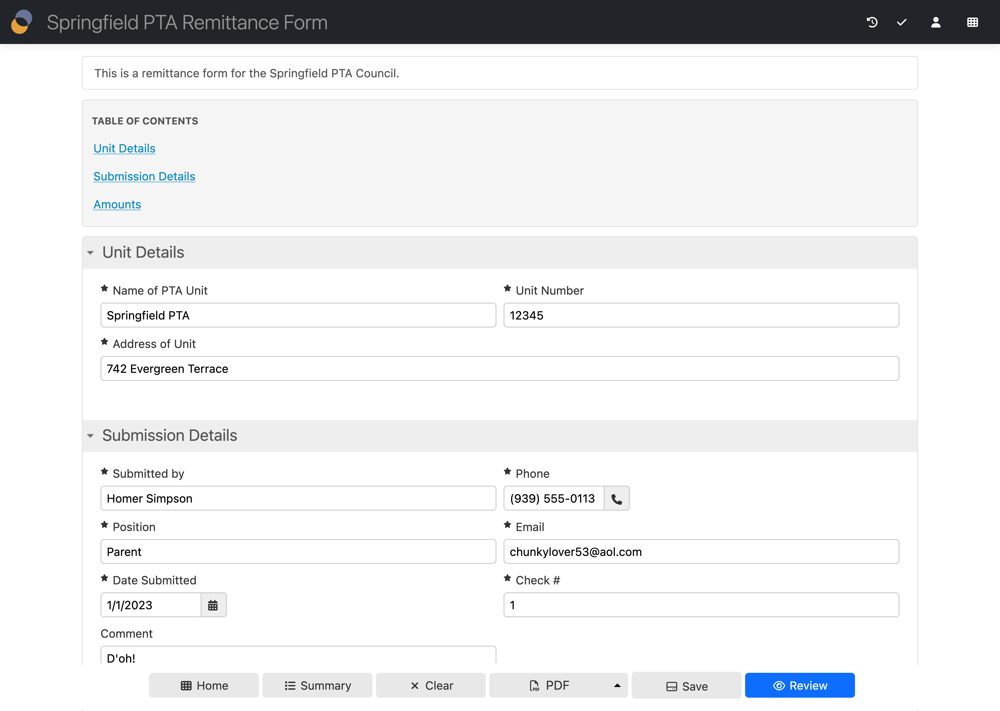
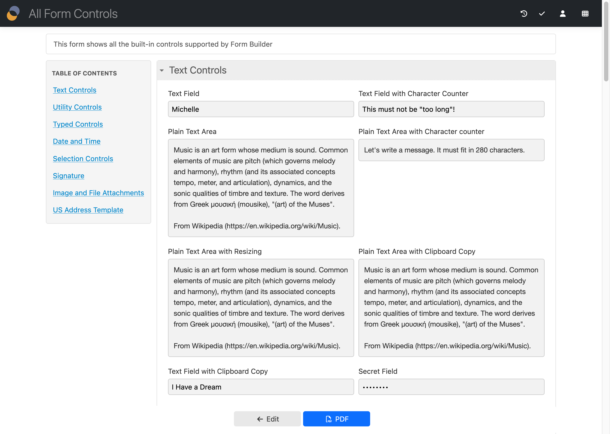

# Table of contents configuration properties

## Introduction

The table of contents is a list of sections in the form. It is shown at the top or left of the form, and allows users to navigate to a particular section.



Note the following:

- The following configuration properties only relate to the use of the table of contents when the Wizard view is not used.
- When using the Wizard view, a table of contents is handled by the Wizard itself and the global Table of Contents discussed here is disabled.
- In View and PDF modes, the Wizard view is never in use.

## Show table of contents

[\[SINCE Orbeon Forms 2023.1\]](/release-notes/orbeon-forms-2023.1.md)

```xml
<property
    as="xs:integer"
    name="oxf.fr.detail.toc.min-sections.*.*"
    value="0"/>
```

If the number of table of contents entries (that is, of form sections) is greater than this value, then show the Table of Contents at the top of the form.

This can be omitted or set to -1 to never show the TOC.

[\[DEPRECATED SINCE Orbeon Forms 2023.1\]](/release-notes/orbeon-forms-2023.1.md)

The following property does the same as `oxf.fr.detail.toc.min-sections` but is deprecated. Use `oxf.fr.detail.toc.min-sections` instead since Orbeon Forms 2023.1.

```xml
<property
    as="xs:integer"
    name="oxf.fr.detail.toc.*.*"
    value="0"/>
```

## Position of the table of contents

[\[SINCE Orbeon Forms 2023.1\]](/release-notes/orbeon-forms-2023.1.md)

```xml
<property
    as="xs:string"
    name="oxf.fr.detail.toc.position.*.*"
    value="top"/>
```

Where to place the table of contents: `top`, `left`, or `none`. The default is `top`. If neither `top` nor `left` is specified, the table of contents is not shown.



In PDF mode, the `left` position is not supported and the table of contents is always shown at the top.


## Modes in which the table of contents is shown

[\[SINCE Orbeon Forms 2023.1\]](/release-notes/orbeon-forms-2023.1.md)

```xml
<property
    as="xs:string"
    name="oxf.fr.detail.toc.modes.*.*"
    value="new edit"/>
```

The table of contents is shown in the specified modes only. The default is `new edit view`. The following modes are available: `new`, `edit`, `view`, `pdf`, `tiff`.

## See also

- Configuration properties
    - [Detail page](form-runner-detail-page.md)
    - [Attachments](form-runner-attachments.md)
    - [Email](form-runner-email.md)
    - [Initial data](form-runner-initial-data.md)
    - [PDF](form-runner-pdf.md)