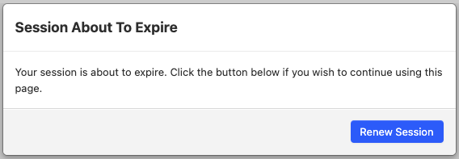

# State Handling

## Audience

The audience for this page is developers or advanced system administrators.

## What is this about?

The Orbeon Forms XForms engine requires keeping server state while the user is interacting with a form. Such state includes the current values of XForms instances, selected repeated elements, and more. With Orbeon Forms, by default XForms state information is stored on the server.

## How does XForms state handling work?

See [Review XForms cache architecture #1718](https://github.com/orbeon/orbeon-forms/issues/1718) for some pointers.

## Configuring state handling

### XForms document and static state caches

A property controls whether the XForms engine should try to optimize state reconstruction by using a cache. This property is typically set to `true`:

```xml
<property
    as="xs:boolean"
    name="oxf.xforms.cache.document"
    value="true">
```

*NOTE: We might get rid of this property in the future as there is no use case for setting it to false.*

If `oxf.xforms.cache.document` is set to `true`, the number of XForms documents that can be held in that document cache at a given time is configured with the following property:

```xml
<property
    as="xs:integer"
    name="oxf.xforms.cache.documents.size"
    value="50">
```

*NOTE: This property is global and cannot be overridden on a page by page basis.*

*NOTE: If a user loads the same XForms page twice, two entries are created in the document cache.*

The static state (or static analysis) of an XForms page is stored in a separate cache, controlled with this property:

```xml
<property
    as="xs:integer"
    name="oxf.xforms.cache.static-state.size"
    value="50">
```

This property should be set to a number equal to or greater than the number of distinct XForms pages you have.

If you have, say, in production, 100 separate form definition, the size should ideally be 100.

It is tempting to make the cache very large, but because it is a strict cache, there is a risk of running out of memory. So you should make the cache just a little bit larger than the number of forms in production.

### XForms state store configuration

When entries are evicted from the XForms document cache or the XForms static state cache, they are migrated to the XForms state store.

The XForms state store is configured via [`oxf:/config/ehcache.xml`](https://github.com/orbeon/orbeon-forms/blob/master/src/main/resources/config/ehcache.xml).

## Session heartbeat

See also the [blog post](https://blog.orbeon.com/2008/01/keeping-your-session-alive_29.html).

If you happen to leave a browser window open on your computer, chances are that you will get back to that window and keep using the application. The last thing you want to happen when you come back is lose your session and therefore your data.

This is not always a correct guess of course: you may just happen to leave a window or tab open without planning to use it again. Conversely you may have a page which is not actually visible, for example in your browser history, yet you will come back to it. This approach wouldn't be good for banking applications either. Still, in many situations, such as filling-out large forms, it sounds like a good idea to keep your session alive for open pages.

To achieve this goal you could make all server sessions longer. However this is harder to configure for the application developer, and this won't discriminate between pages that are actually open on a client and the ones that are not. And while it may be ideal to have infinitely long sessions, unfortunately many applications are not ready for this kind of approach.

So Orbeon Forms supports a "session heartbeat" feature. Here is how this works:

- When this feature is enabled (the default), an open XForms page in a client browser regularly pings the server through Ajax to keep the current server session alive.
- The ping delay is automatically computed based on the server's session timeout. The client pings the server at 80% of the session expiration time after the last interaction with the server.
- We are careful not to hit the XForms engine too much, in fact we do a very limited amount of work on the server for each ping, so they should run fast.
- XForms state information for pages hit with the heartbeat just migrates to the disk store over time if RAM is used by other pages, so keeping even large numbers of pages open should not have any negative impact on server RAM.
- When a user gets back to using the page, state information migrates back from disk to RAM, and the page will be live again.
- Sessions do eventually expire as nobody keeps a browser open forever.

Note that whenever an application keeps sessions alive for a long time, it is a good idea to keep as little data as possible in the session. The Orbeon Forms XForms engine itself uses a global state store and does not use session objects for storage, but do remember to keep your sessions small!

The session heartbeat should help prevent many occurrences of "session expired" error messages. As an Orbeon Forms application developer you don't have to worry about anything: the session heartbeat is enabled by default. You can configure it globally in `properties-local.xml`:

```xml
<property
    as="xs:boolean"
    name="oxf.xforms.session-heartbeat"
    value="true">
```

## Session expiration dialog

[SINCE Orbeon Forms 2023.1]

When the session heartbeat feature is disabled, Orbeon Forms can display a dialog to the user when the session is about to expire. This dialog can be enabled with the following property:

```xml
<property
    as="xs:boolean"
    name="oxf.fr.detail.session-expiration-dialog.enabled.*.*"
    value="true"/>
```

The user can then manually renew the session if needed.



It is possible to configure when this dialog is shown using the following property, which is a percentage of the session expiration time, with a default value of 80%:

```xml
<property
    as="xs:integer"
    name="oxf.xforms.session-expiration.trigger"
    value="80"/>
```

For example, if the session expiration time is one hour, the dialog will be shown 48 minutes after the last interaction with the server.

If the user doesn't renew the session, the session will expire and the user will see the following dialog:


This dialog is also shown if the user logs out from another page/tab from the same session.

If the session heartbeat feature is enabled, the dialog won't be shown, independently of the value of `oxf.fr.detail.session-expiration-dialog.enabled.*.*`. In that case, the `oxf.xforms.session-expiration.trigger` property determines when the session heartbeat is sent to the server.

## Browser navigation (back and forward) handling

[DEPRECATED SINCE Orbeon Forms 2021.1]

### Deprecation

The way web browsers should handle history, in particular "back" and "forward", is subject to interpretation. However, one consistent such interpretation is that going "back" or "forward" in the browser history should take the user to something as close as possible as what the user saw last, whether for web "pages" or web "apps".

As of late 2021, the way web browsers handle history confirms this interpretation. In particular, the so-called ["bfcache"](https://web.dev/bfcache/) helps restore the state of pages and applications as they were last seen by the user.  

One of the purpose of the `xxf:revisit-handling="reload"` setting described below was to prevent the possibility that a user could navigate back, see again data that was entered into a form, and resubmit it. Forcing a reload of the page upon browser back alleviated that issue, as the form would then be cleared. However, this also goes against the more accepted philosophy of navigation in history described above.

Since Orbeon Forms 2020.1, we recommend instead using workflow features to help with this. When saving or submitting form data:

1. Set the workflow stage to a value such as `saved` or `submitted`.
2. In the form definition, set the global "Read-only" formula to mark the form as read only when it is in `saved` or `submitted` stage.
 
This means that even if the user navigate to a confirmation page upon submission, and then navigates back to the form, the form will be shown (and if necessary restored) in a readonly mode. This achieves the intent without breaking the philosophy of navigation.

See [workflow features](/release-notes/orbeon-forms-2020.1.md#workflow) from the Orbeon Forms 2020.1 release notes for more details.

### How it works

When visiting an XForms page by using your browser's Back and Forward buttons, or other browser-history mechanisms, Orbeon Forms by default restores the appearance of that page as it was when you left it. (Browsers don't automatically handle this behavior with Ajax applications!) This behavior best matches the usual user experience obtained when navigating regular web pages.

In certain situations, it can be useful instead to ask the XForms page to reload entirely. You control this by using the `xxf:revisit-handling` attribute on the first XForms model of the page you want to reload. This attribute supports two values: `restore` (the default) and `reload`. Example:

```xml
<xf:model xxf:revisit-handling="reload">
```

*NOTE: It is recommended to use the `reload` value carefully, as reloading pages upon browser navigation often does not match the expectation of the user.*
