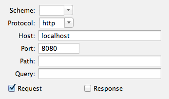
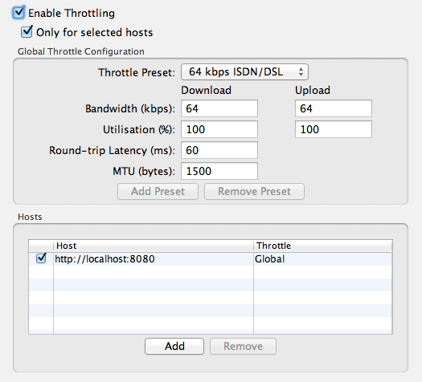

# Test Plan

For each release of Orbeon Forms, we follow this test plan, which tests functionality in addition to the ~800 automatic unit tests which run with every build of Orbeon Forms. In the future, we want to [automate most of this](https://github.com/orbeon/orbeon-forms/issues/227).

<!-- toc -->

## Misc

### Distribution [4.10 DONE]

- README.md is up to date
  - links not broken (use Marked to save HTML, then check w/ Integrity)
  - latest release year
  - version number is correct
  - links to release notes (include link to new version even if blog post not up yet)
- file layout is correct in zip and wars
- check WAR files have reasonable sizes (sizes as of 4.8)
  - orbeon-auth.war (< 10 KB)
  - orbeon-embedding.war (1-2 MB)
  - proxy-portlet.war (1-2 MB)
  - orbeon.war (65 MB)
- check CE zip doesn't have
  - orbeon-embedding.war
  - proxy-portlet.war
- dropping the WAR file (with license included or in ~/.orbeon/license.xml) into Tomcat and Liferay works - out of the box
- make sure the PE license is not included

### Landing Page [4.10 DONE]

- version number is correct in logs when starting
- home page
  - layout of FR examples
  - layout of XForms examples
- XForms examples
  - load, look reasonable, and work

### PE Features Availability [4.10 DONE]

check that all PE features are available in PE, but not in CE:

- features which are checked
    - distribution: `orbeon-embedding.war` and `proxy-portlet.war` are not present
    - FB: no "Add Language" button
    - FB: check with CE that a PE dialog shows for
        - Services
        - Actions
        - Attach PDF
        - Attach Schema
        - Permissions
    - FR: PDF Template button doesn't show for DMV-14 and W-9
    - FR: TIFF button doesn't show even if configured [SINCE 4.11]
    - FR: Import page returns 404
    - FR: No remote server support in Form Runner home page
        - in `form-builder-permissions.xml` add `<role name="orbeon-user" app="*" form="*"/>`
        - in `properties-local.xml`

            ```xml
            <property
                as="xs:string"
                name="oxf.fr.authentication.container.roles"
                value="orbeon-user"/>

            <property as="xs:string"  name="oxf.fr.home.remote-servers">
                [
                    { "label": "Public Demo Server", "url": "http://demo.orbeon.com/orbeon" },
                    { "label": "Local Liferay", "url": "http://localhost:9090/orbeon" }
                ]
            </property>
             ```
        - in `web.xml` uncomment authentication section
        - access [http://localhost:8080/orbeon/fr/](http://localhost:8080/orbeon/fr/)
        - login with user with the `orbeon-user` role
        - check doesn't ask user for remote servers and only loads local form definitions
- features which are not checked yet but should be
    - Proxy portlet
    - Embedding
    - Oracle/DB2/SQL Server
    - Noscript mode
        - [#1043](https://github.com/orbeon/orbeon-forms/issues/1043)
        - [#1407](https://github.com/orbeon/orbeon-forms/issues/1407)
    - XML Schema generation
    - Captcha ([#1927](https://github.com/orbeon/orbeon-forms/issues/1927))
        - in `properties-local.xml` add
            - `<property as="xs:string" name="oxf.fr.detail.captcha.*.*" value="reCAPTCHA"/>`
            - the properties for the private/public key
        - access [http://localhost:8080/orbeon/fr/orbeon/bookshelf/new](http://localhost:8080/orbeon/fr/orbeon/bookshelf/new)
        - check the captcha isn't shown
- Check other features listed on the [web site](http://www.orbeon.com/download)

## Persistence

###  Basic Persistence [4.10 DONE]

Do at least for eXist and DB2, as automated tests already test most of this, and the code running for DB2 is almost identical to the code running for other relational databases. But if possible do for the other relational databases as well.

- Setup: in `properties-local.xml`, add:
    ```xml
    <property
        as="xs:string"
        name="oxf.fr.persistence.provider.exist.*.*"
        value="exist"/>
    <property
        as="xs:string"
        name="oxf.fr.persistence.provider.db2.*.*"
        value="db2"/>
    <property
        as="xs:string"
        processor-name="oxf:page-flow"
        name="service-public-methods"
        value="GET HEAD"/>
    ```
- Create forms: same form in all apps: `exist/a`, `db2/a`
    - add static image
    - use Duplicate button in FB Summary
    - then change app name
- Pages
    - FB: create form, publish
    - FR: check it shows on http://localhost:8080/orbeon/fr/
    - FR: create new form, review, back to edit ([#1643](https://github.com/orbeon/orbeon-forms/issues/1643))
    - FR: enter data, save
    - FR: check it shows in the summary page
- Attachments
    - FB: attach static image to form
    - FB: add file attachment field
    - FB: save and publish
        - DB2: be aware of [#1409](https://github.com/orbeon/orbeon-forms/issues/1409)
    - FR: deployed form loads image
    - FR: attach file, save, edit
- Search
    - FB: check summary/search field, save and deploy
    - FR: create new form data, see in summary
    - FR: search free-text and structured
    - FR: delete data in summary page works
- Duplicate
    - FR: Summary: Duplicate button works
        - data for latest form
        - older data
- Home page, with all persistence layers active
    - go to /fr/
    - check that form definitions from all persistence layers show

### Versioning [4.10 DONE]

- Setup
    - Database: try with db2 at least.
    - Properties
        ```xml
        <property
            as="xs:boolean"
            name="oxf.fr.email.attach-pdf.db2.versioning"
            value="true"/>
        
        <property
            as="xs:boolean"
            name="oxf.fr.email.attach-tiff.db2.versioning"
            value="true"/>
        
        <property as="xs:string" name="oxf.fr.detail.buttons.db2.versioning">
            pdf tiff email save send
        </property>
        
        <property as="xs:string" name="oxf.fr.detail.process.send.db2.versioning">
            send(
                uri     = '/fr/service/custom/orbeon/echo', 
                replace = 'all', 
                content = 'pdf-url'
            )
        </property>
        
        <property
            as="xs:string"
            name="oxf.fr.email.to.db2.versioning"
            value=""/>
        ```

        Also have other email properties setup.

- Steps
    - create form db2/versioning
        -fields
            - 1 email field with "Email Recipient", say e.g. `erik at bruchez dot org`
            - 1 email field without "Email Recipient"
            - 1 static Image with image statically attached
            - 1 Image Attachment with image statically attached
            - 1 PDF template with image (e.g. `personal-information$last-name` from DVM-14)
        - publish as version 1
        - go to new page
            - image and image attachment show
            - check PDF template works
            - check TIFF works
            - check save works
            - check email works and sent to correct address
                - has image attachment but not static image
                - has PDF with image attachment
                - has TIFF
                - has XML
            - check send produces PDF path
                - load path in browser shows PDF with image attachment
        - review and back to edit works
        - save
    - edit the form definition
        - remove "Email Recipient" from 1st email field and clear it
        - add "Email Recipient" to 2nd email field and add e.g. `ebruchez at orbeon dot com`
        - change static Image
        - change static Image Attachment
        - publish as version 2
        - go to new page
            - check PDF template works
            - check TIFF works
            - check save works
            - check email works and sent to correct address
                - has image attachment but not static image
                - has PDF with image attachment
                - has TIFF
                - has XML
            - check send produces PDF path
                - load path in browser shows PDF with image attachment
        - review and back to edit works
        - save
        - go to new page with `?form-version=1`
            - check all the steps work like before v2 was created
            - relevant issues:
                [#2363](https://github.com/orbeon/orbeon-forms/issues/2363),
                [#1911](https://github.com/orbeon/orbeon-forms/issues/1911),
                [#2371](https://github.com/orbeon/orbeon-forms/issues/2371),
                [#2372](https://github.com/orbeon/orbeon-forms/issues/2372),
                [#2367](https://github.com/orbeon/orbeon-forms/issues/2367),
                [#2330](https://github.com/orbeon/orbeon-forms/issues/2330)
    - XML Schema production
        - `/fr/service/(oracle|mysql|sqlserver|db2)/a/schema`
            - schema with B is produced
        - `/fr/service/(oracle|mysql|sqlserver|db2)/a/schema?form-version=1`
            - *NOTE: Adjust version numbers depending on which versions were published.*
            - schema with A is produced
    - go to the summary page, click on first row (created last)
        - check field B/value b and attachment show
        - check PDF
    - go to the summary page, click on second row (created first)
        - check field A/value a and attachment show
        - check PDF
    - Form Builder Publish dialog options (new in 4.6)
        - with persistence layer which supports versioning (mysql)
            - if mysql/a form has never been published
                - no options and no messages are shown
                - latest version shows "-"
                - publish message says version 1 was created
            - if mysql/a form has been published
                - latest version shows correct number
                - option to create new version or overwrite (check version numbers)
                - switch option shows different message
                - publish message says which version was created/updated
        - with persistence layer which doesn't support versioning (exist)
            - latest version line doesn't show
            - if no exist/a form has been published
                - no options and no messages are shown
            - if exist/a form has been published
                - no options are shown
                - message about overwrite
            - publish message says version 1 was updated
        
### Data Capture Permissions [4.10 DONE]

- Setup
    - Repeat what follows with eXist, Oracle, MySQL, PostgreSQL, SQL Server, DB2 with the following settings:
    ```xml
    <property
        as="xs:string"
        name="oxf.fr.persistence.provider.exist.*.*"
        value="exist"/>
    <property
        as="xs:string"
        name="oxf.fr.persistence.provider.oracle.*.*"
        value="oracle"/>
    <property
        as="xs:string"
        name="oxf.fr.persistence.provider.mysql.*.*"
        value="mysql"/>
    <property
        as="xs:string"
        name="oxf.fr.persistence.provider.postgresql.*.*"
        value="postgresql"/>
    <property
        as="xs:string"
        name="oxf.fr.persistence.provider.sqlserver.*.*"
        value="sqlserver"/>
    <property
        as="xs:string"
        name="oxf.fr.persistence.provider.db2.*.*"
        value="db2"/>
    <property
        as="xs:string"
        name="oxf.fr.authentication.method"
        value="container"/><!-- change to header for header-based auth -->
    <property
        as="xs:string"
        name="oxf.fr.authentication.container.roles"
        value="orbeon-user orbeon-sales orbeon-admin clerk admin"/>
    ```
    - repeat with eXist, Oracle, MySQL, PostgreSQL, SQL Server, DB2
    - restore `form-builder-permissions.xml` to default
    - for container auth
        - in `web.xml`
            - uncomment security section towards the end
            - change first `<url-pattern>` from `/fr/*` to `/auth` (it doesn't matter that page doesn't exist, it's just a path to force authentication)
        - in `tomcat-users.xml`, setup users:
            - `<user username="clerk" password="clerk" roles="orbeon-user,clerk"/>`
            - `<user username="admin" password="admin" roles="orbeon-user,admin"/>`
    - for headers-based  auth
        - `<property as="xs:string"  name="oxf.fr.authentication.method" value="header"/>`
        - set rewriting rules with Charles (⌘⇧W)
            - for user clerk ([gist](https://gist.github.com/ebruchez/10079296))
            - for user admin ([gist]()https://gist.github.com/ebruchez/10079254)
        - to switch between users in below steps
            - enable rewrite for clerk or admin headers, or disable rewrite
            - remove JSESSIONID when switching users
- Tests
    - in Form Builder
        - create new form `exist/permissions`, `oracle/permissions`, `mysql/permissions`, `postgresql/permissions`, `sqlserver/permissions`, `db2/permissions` (create 1 form then use Duplicate button)
        - save and publish
        - enable permissions for form and configure like on [doc page](../../form-runner/access-control/deployed-forms.md#example)
    - make sure permissions are followed
        - anonymous user
            - home page: link goes to new page (not summary)
            - summary page: unauthorized (fixed regression with [#1201](https://github.com/orbeon/orbeon-forms/issues/1201))
            - detail page: only `new` accepted, `edit`, `view`, `pdf` are unauthorized
            - enter and save data on `new`
            - check URL doesn't change to `edit`
        - logged in user
            - check permissions as clerk/clerk
                - remove `JSESSIONID` (i.e. with Dev Tools)
                - switch user
                - home page: link goes to the summary page
                - summary page
                    - sees data previously entered by anonymous user, cannot delete
                    - click on existing data created by anonymous user shows read-only view
                    - replace `view` with `edit` in URL shows 404
                    - PDF works
                    - click on new button opens new page
                - new/edit
                    - save data works
                    - user is owner so can edit his own data
                    - cannot delete from Summary because no `delete` permission
            - check permissions as admin/admin
                - remove `JSESSIONID` (i.e. with Dev Tools)
                - switch user
                - on click goes to summary page
                - on summary page
                    - click on new opens new page
                    - sees data previously entered by anonymous user and clerk
                    - delete button enabled and works
                    - on open data, can edit data

### Autosave and Permissions Test [4.10 DONE]

Repeat what follows with Oracle, MySQL, PostgreSQL, SQL Server, DB2 with the following settings:

*NOTE: As of Orbeon Forms 4.10, autosave is not supported with eXist.*

```xml
<property
    as="xs:string"
    name="oxf.fr.persistence.provider.oracle.*.*"
    value="oracle"/>
<property
    as="xs:string"
    name="oxf.fr.persistence.provider.mysql.*.*"
    value="mysql"/>
<property
    as="xs:string"
    name="oxf.fr.persistence.provider.postgresql.*.*"
    value="postgresql"/>
<property
    as="xs:string"
    name="oxf.fr.persistence.provider.sqlserver.*.*"
    value="sqlserver"/>
<property
    as="xs:string"
    name="oxf.fr.persistence.provider.db2.*.*"
    value="db2"/>
<property 
    as="xs:string"  
    name="oxf.fr.authentication.container.roles" 
    value="a b"/>
<property 
    as="xs:string"  
    name="oxf.http.proxy.host"                   
    value="localhost"/>
<property 
    as="xs:integer" 
    name="oxf.http.proxy.port"                   
    value="8888"/>
```

Setup permissions e.g. in `tomcat-users.xml`:

```xml
<user username="a1" password="a1" roles="a"/>
<user username="a2" password="a2" roles="a"/>
<user username="b1" password="b1" roles="b"/>
```

Authorize on:

    http://localhost:8080/47pe/auth

- Autosave with permissions
    1. In FB, create form `$provider/autosave`.
        - Create a field *first name*, marked as shown on summary page.
        - Enable permissions as shown below, save, deploy.  
            
        - duplicate for all providers and publish
    2. Logged in as user `b1` in group `b`:
        - `$provider/autosave/new`, type *Ned*, save, change to *Ned2*, tab out, after 6s go to the summary page, check it shows *Ned2* as draft
    3. Logged in as user `a1` in group `a`:
        - Can see data of other users, but in readonly mode (since everyone can read)
            - Load `$provider/autosave/summary`
            - Check *Ned* shows, but has the readonly "label"
            - Check *Ned2* shows, but has the readonly "label"
            - Check that clicking on *Ned* and *Ned2* brings up the data in readonly mode
            - Edit the URL to have `edit` instead of `view`, check a 403 is returned
        - Drafts for saved
            - Load `$provider/autosave/new`
                - Check we don't get a prompt to edit the draft created by b1 (since we only have read access to it).
                - Type *Homer*, hit save, edit into *Homer2*, after 6s go to summary page, check it shows *Homer* and *Homer2* as draft
            - `$provider/autosave/summary`, click on *Homer2*, check the draft comes up
            - `$provider/autosave/summary`, click on *Homer*, check prompt comes up, try both options and see that *Homer*/*Homer2* comes up
            - editing one of the form data (*Homer* or *Homer2*), hit save, back on the summary check the draft was removed
        - Drafts for new
            - `$provider/autosave/new`, type *Bart*, after 6s go to summary page, check it shows *Bart* as draft
            - `$provider/autosave/new`, check prompt, and try both options
            - `$provider/autosave/new`, on prompt start from scratch, type *Lisa*, after 6s go to summary, check it shows *Bart* and *Lisa* as draft
            - `$provider/autosave/new`, check prompt, try both options, in particular the one showing the drafts for new
        - Summary
            - Edit *Homer*, change to *Homer4*, after 6s go back to summary page.
            - Delete *Homer*, check *Homer4* is deleted as well
            - Check *Lisa*, then view, check in view mode without prompt
            - Delete *Bart*, check *Lisa* not deleted
    4. With anonymous user:
        - `$provider/autosave/summary` only shows saved data, not drafts
        - change form definition to remove the read permission form anyone
        - `$provider/autosave/summary` returns 403 (since anonymous users don't have the read permission)
        - `$provider/autosave/new`, type *Homer*, tab out, after 6s check that no autosave was done (e.g. with Charles that no PUT was made to the persistence layer)
    5. Permissions of drafts in summary page
        - Log in as user `a1` in group `a`.
        - `$provider/autosave/summary`, delete everything (to clean things up).
        - As user `a1` in group `a`, go to `$provider/autosave/new`, type *Homer*, hit save, edit into *Homer2*, after 6s go to `$provider/autosave/summary`, check it shows *Homer* and *Homer2* as draft.
        - As user `a2` in group `a`, go to `$provider/autosave/summary`, check it shows *Homer* and *Homer2* as draft.
        - As user `b1` in group `b`, go to `$provider/autosave/summary`, check it shows neither *Homer* nor *Homer2*.

- Autosave without permissions (tests for [#1858](https://github.com/orbeon/orbeon-forms/issues/1858))
    1. User is authenticated
    1. Create form without permissions
    1. Go to /new, enter text in field, tab out, wait for autosave
    1. Go to /new again
    1. Dialog must propose loading draft
    1. Save
    1. Make change to text in field, tab out, wait for autosave
    1. Go back to /edit
    1. Dialog must propose loading draft

### DB2 DDL [4.10 DONE]

Do the following just with DB2; there is no need to test this with Oracle, MySQL, and SQL Server as this is done by the unit tests. Before each test, run the `drop table` statements below.

1. Run the [4.3 DDL](https://github.com/orbeon/orbeon-forms/blob/master/src/resources/apps/fr/persistence/relational/ddl/db2-4_3.sql) and [4.3 to 4.4 DDL](https://github.com/orbeon/orbeon-forms/blob/master/src/resources/apps/fr/persistence/relational/ddl/db2-4_3-to-4_4.sql).
2. Run the [4.4 DDL](https://github.com/orbeon/orbeon-forms/blob/master/src/resources/apps/fr/persistence/relational/ddl/db2-4_4.sql
) and [4.4 to 4.6 DDL](https://github.com/orbeon/orbeon-forms/blob/master/src/resources/apps/fr/persistence/relational/ddl/db2-4_4-to-4_6.sql).
3. Run the [4.6 DDL](https://github.com/orbeon/orbeon-forms/blob/master/src/resources/apps/fr/persistence/relational/ddl/db2-4_6.sql).

```sql
drop table orbeon_form_definition ;
drop table orbeon_form_definition_attach ;
drop table orbeon_form_data ;
drop table orbeon_form_data_attach ;
```

### Oracle and DB2 Flat View [4.10 DONE]

- Make sure Oracle and DB2 datasources are  setup in `server.xml`.
- Enable the flat view option, adding:

    ```xml
    <property 
        as="xs:boolean"
        name="oxf.fr.persistence.oracle.create-flat-view" 
        value="true"/>

    <property 
        as="xs:boolean"
        name="oxf.fr.persistence.db2.create-flat-view" 
        value="true"/>

    <property 
        as="xs:string"
        name="oxf.fr.persistence.provider.oracle.*.*"
        value="oracle"/>

    <property 
        as="xs:string"
        name="oxf.fr.persistence.provider.db2.*.*"
        value="db2"/>
    ```
- Remove existing view if any: `drop view orbeon_f_db2_a ;`
- Create a new form from [this source](https://gist.github.com/avernet/ff343c6a5e6c3be077d2), which has the sections and controls named as in the table in the [[flat view documentation|Form-Runner-~-Persistence-~-Flat-View]]
  - rename app name to `oracle` or `db2` depending
  - publish, check that a view with the appropriate column names is created.

    ```sql
    SELECT * FROM orbeon_f_db2_a;
    ```

    ```sql
    SELECT * FROM orbeon_f_oracle_a;
    ```

## Form Builder

### Basic Features [4.10 DONE]

- create new form
- insert sections, grids, repeated grids
- rename sections and controls
    - check renamed in dialog [automated for 4.8, see [`BasicControls`](https://github.com/orbeon/orbeon-forms/blob/master/src/test/scala/org/orbeon/oxf/client/fb/BasicControls.scala)]
    - check renamed in source
- move sections
    - up/down
    - right/left (subsections) (be aware of [#2031](https://github.com/orbeon/orbeon-forms/issues/2031))
- repeated grid
    - set min/max as ints
    - set min/max as XPath expressions, e.g. `1 + 2`
- make section repeated
    - insert/move/remove iterations
    - set min/max as ints
    - set min/max as XPath expressions, e.g. `1 + 2`
- set control label, hint, items
    - plain
    - HTML
    - check HTML label appears correct in summary page / search
- set control help ([lorem ipsum](http://www.lipsum.com/))
    - plain
    - HTML
    - check help icon appears when help is set, and disappears when help is blanked
- set section help
    - check help icon appears when help is set, and disappears when help is blanked ([#1160](https://github.com/orbeon/orbeon-forms/issues/1160) is a known issue)
- cut/copy/paste
    - copy control with help, required, constraint, and warning
    - paste control
    - check in source that all elements have been renamed
      - including `$form-resources` references (see [#1820](https://github.com/orbeon/orbeon-forms/issues/1820))
      - including `@validation` and `xf:constraint/@id` (see [#1785](https://github.com/orbeon/orbeon-forms/issues/1785))
  - check that form runs and new control validates constraints properly
- set control validation
    - set custom error constraint and alert
    - set custom warning constraint and alert
    - set required
    - check that if control is required but empty, generic message shows, not constraint message ([#1829](https://github.com/orbeon/orbeon-forms/issues/1829))
    - check that if control is required but empty and there is an unmet constraint, generic message shows ([#1830](https://github.com/orbeon/orbeon-forms/issues/1830))
- set control MIPs and properties
    - check required star appears with required set to true()
    - check Show in Summary/Search work when form deployed
- set section MIPs
    - check show/hide based on control value e.g. $fortytwo = '42'
- edit/modify source
    - change e.g. control label
- image annotation control
  - create simple form and test works, saves, loads
- i18n (PE)
    - check en/fr/es/it/de (languages with full support)
    - switch FB language and check language changes
    - add language
    - edit label and items and switch languages
    - edit source and change top-level language, make sure language selector switches
    - remove language
    - [#1223](https://github.com/orbeon/orbeon-forms/issues/1223)
        - add lang not fully supported (e.g. Afrikaans) , remove all other languages, enter some labels
        - Test and Publish/new -> must show Afrikaans labels, not blank
- FB Summary page
    - check that search in Summary page updates title/description when FR language is changed (e.g. on Bookshelf)
    - be aware of [#2348](https://github.com/orbeon/orbeon-forms/issues/2348)
- set form title/description
- test form
- save
- publish form
    - check that attachments are published too (e.g. attach static img, dynamic img, and PDF file attachment)
- warning dialog if attempt to close page when unsaved
- serialization/deserialization [#1894](https://github.com/orbeon/orbeon-forms/issues/1894)
    - set properties  
    ```xml
    <property 
        as="xs:integer" 
        name="oxf.xforms.cache.documents.size"    
        value="1"/>
    <property 
        as="xs:integer" 
        name="oxf.xforms.cache.static-state.size" 
        value="1"/>
    ```
    - in 1st tab, visit http://localhost:8080/orbeon/fr/orbeon/builder/new
    - enter a/a to go to editor
    - in 2nd tab, visit http://localhost:8080/orbeon/fr/orbeon/contact/new
    - back to 1st tab
    - insert control
    - check there is no JS error

### Schema Support [4.10 DONE]


- attach Schema
    - use e.g. [Bookcast schema](https://github.com/orbeon/orbeon-forms/blob/master/src/resources/apps/xforms-bookcast/schema.xsd) or the [XForms simple types](https://github.com/orbeon/orbeon-forms/blob/master/src/main/resources/org/orbeon/oxf/xforms/xforms-types.xsd)
    - upload schema
        - see that types are listed in dialog
    - change schema
    - delete schema, check removed from model (be aware of [#694](https://github.com/orbeon/orbeon-forms/issues/694))
    - re-add schema
    - assign types to controls
    - check that validation is working as per the types
    - check schema types are reloaded in Control Settings dialog

### Database service [4.10 DONE]

- setup db
    - use MySQL on RDS (`jdbc:mysql://mysql.c4pgtxbv1cuq.us-east-1.rds.amazonaws.com:3306/orbeon?useUnicode=true&amp;characterEncoding=UTF8`)
    - set datasource in `server.xml`
    - create test table + data row if doesn't exist (can use IntelliJ Database tools)

    ```sql
    create table orbeon_address_book (
      id      integer not null primary key,
      first   varchar(255) not null,
      last    varchar(255) not null,
      phone   varchar(255) not null
    );
    insert into orbeon_address_book values(1, "John", "Smith", "5551231234");
    insert into orbeon_address_book values(2, "Mary", "Smith", "5551111111");
    ```
- setup form
  - 1 input field
  - 1 output field
  - 1 selection control
- create db service

    ```sql
    SELECT * FROM orbeon_address_book
    WHERE id = <sql:param type="xs:string" select=""/>
    ```
- create action
    - sets service value on request for param `1`
    - sets control values on response, e.g. `concat(/*/*/first, ' ', /*/*/last)`
    - set itemset values on response
        - `/*/*`
        - `concat(first, ' ', last)`
        - `id`

### HTTP service [4.10 DONE]

- using echo service is ok
    - POST to `/fr/service/custom/orbeon/echo`
- test
    - call service upon form load and set control value upon response
    - same with button activation
    - same but set service values on request from control
    - set itemset values on response, e.g. use:

    ```xml
    <items>
        <item label="Foo" value="foo"/>
        <item label="Bar" value="bar"/>
    </items>
    ```

## Form Builder / Form Runner

### Section Templates [4.10 DONE]


- examples here but create new to make sure builder works!
    - https://gist.github.com/ebruchez/6187690
    - https://gist.github.com/ebruchez/6187704
- create acme/library
    - 3 sections
    - S1
        - 2 fields, readonly or visibility dependency from one field on the other
    - S2
        - repeated grid
    - S3
        - nest repeated section with repeated grid inside
    - 2 languages
    - 1 HTTP service/action
        - load-languages/set-languages
        - load oxf:/apps/fr/i18n/languages.xml
        - upon form load
        - set itemset
            - @english-name
            - @code
    - test/save/publish
- insert components from library into acme/test-library
    - insert S1 and S2 twice, S3
    - add French language
    - check language changes in builder (be aware of [#690](https://github.com/orbeon/orbeon-forms/issues/690))
    - publish
        - check control visibility change
        - check language changes
        - check services load in both languages (same labels)
        - enter data, save, check that data loads back in all fields
        - test that repeated grid in section template shows ([#1370](https://github.com/orbeon/orbeon-forms/issues/1370)) in the builder and nicely
        - check review, PDF
- make sure Clear works (see [#807](https://github.com/orbeon/orbeon-forms/issues/807), broken as of 4.0-4.10!)
- makes invalid controls in section template prevent saving
- 
### PDF Automatic [4.10 DONE]

- Controls and Bookshelf: input field and text areas have highlighted and clickable links
- Controls: image annotation shows in PDF
- form title in header/footer
- logo in title
- page numbering/total at bottom center
- PDF looks good overall
- 
### PDF Template [4.10 DONE]


- attach e.g. [831113e3ef799f2c9f57ee0b10f789a8951360ba.bin](https://github.com/orbeon/orbeon-forms/blob/master/data/orbeon/fr/orbeon/w9/form/831113e3ef799f2c9f57ee0b10f789a8951360ba.bin?raw=true) (W9 example)
- add field "name" in section "applicant"
- publish and test that name appears in PDF
- change
- remove PDF
  - publish and test, must see notemplate PDF
- check that DMV-14 PDF is filled out
  - check Vote and Leased checkboxes
- email PDF
  - check fields are filled [#2207](https://github.com/orbeon/orbeon-forms/issues/2207)
  
### Form Builder Permissions [4.10 DONE]


- *NOTES 2014-03-20*
    - *Would be really nice to have automated for this!*
- Do eXist AND relational as code is a bit different.
- setup
    - "Uncomment this for the Form Runner authentication" in `web.xml`
    - `tomcat-users.xml`

    ```xml
    <tomcat-users>
        <user
            username="orbeon-user"
            password="xforms"
            roles="orbeon-user"/>
        <user
            username="orbeon-sales"
            password="xforms"
            roles="orbeon-user,orbeon-sales"/>
        <user
            username="orbeon-admin"
            password="xforms"
            roles="orbeon-user,orbeon-admin"/>
    </tomcat-users>
    ```
    - `properties-local.xml`

    ```xml
    <property
        as="xs:string"
        name="oxf.fr.authentication.container.roles"
        value="orbeon-user orbeon-sales orbeon-admin"/>
    ```
    - `form-builder-permissions.xml`

    ```xml
    <roles>
        <role name="*"            app="guest" form="*"/>
        <role name="orbeon-sales" app="sales" form="*"/>
    </roles>
    ```
- browser 1
    - http://localhost:8080/410pe/fr/orbeon/builder/new
    - login as orbeon-sales
    - must see guest and sales as app names
    - create sales/my-sales-form
    - set permissions
        - Anyone → Create
        - orbeon-sales → Read and Update
    - save and publish
    - can access
        - http://localhost:8080/410pe/fr/sales/my-sales-form/summary
        - http://localhost:8080/410pe/fr/sales/my-sales-form/new
    - new
        - enter data and save
    - summary
        - check that saved in summary
        - check can edit and duplicate
        - check Delete button is absent or disabled
        - check PDF works
    - http://localhost:8080/410pe/fr/
        - sales/my-sales-form shows on the home page
        - *NOTE: Be careful in case sales/my-sales-form is also read from existing e.g. MySQL, etc.*
        - admin ops for sales/my-sales-form
        - other forms don't have admin ops
        - Select → All, then Operation → Unpublish Local Forms ([#1380](https://github.com/orbeon/orbeon-forms/issues/1380))
            - check forms w/o access were not selected!
        - now that sales/my-sales-form is unavailable
            - check the link is disabled
            - check that /new returns 404
    - http://localhost:8080/410pe/fr/orbeon/builder/summary
        - open structured search (be aware of  [#878](https://github.com/orbeon/orbeon-forms/issues/878))
        - check only guest and sales forms are available
- browser 2
    - login as orbeon-user
    - can access
        - http://localhost:8080/410pe/fr/sales/my-sales-form/new
    - can't access
        - http://localhost:8080/410pe/fr/sales/my-sales-form/summary (403)
        - http://localhost:8080/410pe/fr/sales/my-sales-form/edit/... (403)
            - *NOTE: with eXist, can save, even repeatedly, but can't load /edit/…*
    - http://localhost:8080/410pe/fr/
        - NO admin ops for sales/my-sales-form
        - BUT admin ops for guest/*
        - CAN click on line and takes to /new
        - CAN do Review/Edit/PDF
- browser 1
    - remove all permissions for Anyone for this form, re-add Create for orbeon-sales, save, publish
    - check can still new/edit/view
- browser 2
    - can't access
        - http://localhost:8080/410pe/fr/sales/my-sales-form/new (403)
    - http://localhost:8080/410pe/fr/
        - form not visible
- browser 1
    - re-add Anyone → Create
    - add Owner → Read
    - check nothing changed
- browser 2
    - can access http://localhost:8080/410pe/fr/sales/my-sales-form/summary, but only see own data as readonly
    - /new, save
    - Summary shows forms in readonly mode
- access is rejected if user doesn't have any matching roles ([#1963](https://github.com/orbeon/orbeon-forms/issues/1963))
  - setup `dummy` role only in `form-builder-permissions.xml`
  - access to FB Summary page is rejected
  - access to FB New page is rejected
  - access to FB Edit page is rejected if form doesn't have matching role

## Form Runner

### Sample forms [4.10 DONE]

- load all
- Controls
    - wizard navigation
    - autocomplete works
    - dynamic data dropdown loads data
    - review/PDF look ok
    - check wrapping in view/pdf modes
        - enter [Lorum Ipsum](http://www.lipsum.com/feed/html) in input field
        - enter long text without space in input field and textarea
- Bookshelf
    - Summary: see Summary page tests
    - Detail
        - help works
        - review and back works
        - add/remove repeats works
        - change lang works
- DMV-14
  - PDF template works
  - 
  
### New, Edit, Review Pages [4.10 DONE]

#### Errors and warnings [4.10 DONE]

- FB: create form
    - required field
    - non-required field
    - field with 1 warning and 1 info
- FR: error summary
    - shows errors, warning and info
    - links and focuses to controls, including XBL controls, but not invalid output controls
- FR: review page if no errors
- FR: review page shows review dialog if warning or info
- FR: come back to review page

#### Process buttons [4.10 DONE]

- create and publish guest/test
- add [these properties](https://gist.github.com/ebruchez/5666643), and add `review` the list of buttons in the first property
- check standard behavior of buttons
    - save-draft
        - can save w/ invalid data
    - save and save-final
        - cannot save w/ invalid data
    - submit
        - echoes PDF URL (try to download)
    - save 2
        - echoes XML
    - home/summary/edit/review
- send w/ replace all/none
    - set acme.submit.replace to none
    - must not navigate after submit

#### Attachments/uploads [4.10 DONE]

- basic upload works
- removing uploaded file works
- large uploads fail (> 100 MB by default)
    - FR error dialog shows
    - control is back to empty
- very small (a few KB) upload works multiple times in a row
- with throttling (with Charles) (*NOTE: Proxy settings not really useful as we are looking at browser/server traffic.*)

    ```xml
    <property
        as="xs:string"
        name="oxf.http.proxy.host"
        value="localhost"/>
    <property
        as="xs:integer"
        name="oxf.http.proxy.port"
        value="8888"/>
    ```
    - cancel midway works
    - progress indicator works

#### Submit [4.10 DONE]

- comment out custom submit button process (`oxf.fr.detail.process.submit`) in properties
- config

```xml
<property
    as="xs:string"
    name="oxf.fr.detail.submit.go.uri-xpath.*.*"
    value="'http://xformstest.org/cgi-bin/echo.sh'"/>
<property
    as="xs:string"
    name="oxf.fr.detail.buttons.*.*"
    value="home summary review save-draft save-final save submit workflow-send"/>
```
- FR: in new page, click Submit then
    - clear and close
    - keep values and close
    - OK: goes to echo page
    - close window [NOTE: Only if window was open with JS.]

#### Email [4.10 DONE]

- NOTE: if using 2-factor auth w/ GMail, must use app-specific password for SMTP
    - https://accounts.google.com/b/0/IssuedAuthSubTokens#accesscodes
- config (change ebruchez@gmail.com in the following properties to your email)

```xml
<property as="xs:string"  name="oxf.fr.detail.buttons.*.*"           value="save email"/>
<property as="xs:string"  name="oxf.fr.email.smtp.host.*.*"          value="smtp.gmail.com"/>
<property as="xs:string"  name="oxf.fr.email.from.*.*"               value="ebruchez@gmail.com"/>
<property as="xs:string"  name="oxf.fr.email.to.*.*"                 value="ebruchez@gmail.com"/>
<property as="xs:string"  name="oxf.fr.email.smtp.username.*.*"      value="ebruchez@gmail.com"/>
<property as="xs:string"  name="oxf.fr.email.smtp.credentials.*.*"   value="**********"/>
<property as="xs:string"  name="oxf.fr.email.smtp.encryption.*.*"    value="tls"/>

<property as="xs:string"  name="oxf.fr.detail.buttons.orbeon.controls">
    refresh pdf email wizard-prev wizard-next review
</property>

<property as="xs:boolean" name="oxf.fr.email.attach-pdf.orbeon.controls"  value="true"/>
<property as="xs:boolean" name="oxf.fr.email.attach-tiff.orbeon.controls" value="true"/>
```
- /fr/orbeon/controls/new
- hit Email button
  - check email received
  - contains attachments, XML, PDF and TIFF [SINCE 4.11]
  - check attached PDF looks like PDF generated from detail page, including checkboxes/radio buttons, and images

#### Misc [4.10 DONE]

- switch language
- open/close sections
- repeats
    - check can access repeated grid/section button and menu via keyboard navigation

#### Noscript mode [4.10 DONE]

- orbeon/contact
- create form with `xxf:noscript-support="true"` in FB (just property doesn't work!)
- go to form with ?fr-noscript=true
- test w/ new form w/ image & file attachments
    - attachments work [NOTE: be aware of [#1405](https://github.com/orbeon/orbeon-forms/issues/1405)]
- be aware of
    - [#2355](https://github.com/orbeon/orbeon-forms/issues/2355)
    - [#2356](https://github.com/orbeon/orbeon-forms/issues/2356)
- Contact form
    - Clear clears right away
    - PDF stays in tab
    - errors prevent saving
    - Refresh icon works

#### Wizard [4.10 DONE]

- validated mode
    - `/fr/orbeon/w9/new`
    - check cannot click in TOC
    - check cannot navigate forward with error in current section
    - once all sections visited, can freely navigate
- /fr/orbeon/controls/new
    - test errors in section template are highlighted in TOC

#### Captcha [4.10 DONE]

- enable with property

```xml
<property
    as="xs:string"
    name="oxf.fr.detail.captcha.*.*"
    value="reCAPTCHA"/>
<property
    as="xs:string"
    name="oxf.xforms.xbl.fr.recaptcha.public-key"
    value="6LesxAYAAAAAAEF9eTyysdkOF6O2OsPLO9zAiyzX"/>
<property
    as="xs:string"
    name="oxf.xforms.xbl.fr.recaptcha.private-key"
    value="6LesxAYAAAAAAJIXoxMvErqbisKkt7W-CPoE_Huo"/>
```
- test reCAPTCHA [NOTE: had to fix 2 bugs with 4.5!]
- test SimpleCaptcha

#### Help popups/hint tooltips positioning [4.10 DONE]

- create form to test general positioning
  - help on all elements
  - repeats
  - hints on checkboxes/radios
- help: see [#1637](https://github.com/orbeon/orbeon-forms/issues/1637)
- hints: see [#1649](https://github.com/orbeon/orbeon-forms/issues/1649)
- test Bookshelf help
- create form with fields, including checkboxes/radio buttons

### Responsive [4.10 DONE]

- access detail page from iPhone
    - Bookshelf
    - DMV-14
    - W-9
    - Controls
    - Contact
- be aware of [open issues](https://github.com/orbeon/orbeon-forms/issues?q=is%3Aopen+is%3Aissue+label%3AMobile)

### Home Page [4.10 DONE]

- http://localhost:8080/410pe/fr/ lists deployed forms
- (see also Form Builder permissions above which already tests some of this)
  - comment all roles in form-builder-permissions.xml
- no admin buttons/actions show
- set all Form Builder permissions

    ```xml
    <role name="*" app="*" form="*"/>
    ```
  - admin actions show
  - Available/Unavailable/Library labels show
  - publish/unpublish works
- "publish to production"
  - configure  remote server and production-server-uri
    - e.g. remote in Liferay Tomcat

    ```xml
    <property as="xs:string" name="oxf.fr.home.remote-servers">
        [
          {
            "label": "Remote server",
            "url":   "http://Eriks-MacBook-Pro.local:9090/orbeon/"
          }
        ]
    </property>
    ```
    - use orbeon-auth.war on remote
    ```xml
    <property
        as="xs:anyURI"
        processor-name="oxf:page-flow"
        name="authorizer"
        value="/orbeon-auth"/>
    ```
    - set Form Builder permissions
    ```xml
    <role name="*" app="*" form="*"/>
    ```
  - server asks for credentials if user has admin role
    - orbeon-admin/x*
  - Cancel  → loads local forms
  - Connect → loads local and remote forms, sorted by mod date desc
  - Select menu works
  - Operation menu works
    - push/pull forms
    - check available on /fr/ page on remote (e.g. in Liferay)
  - add 2nd remote server to `oxf.fr.home.remote-servers` property and check user is asked when loading page
  - take form (could be previous `sales/my-sales-form` (see [[Form Builder Permissions|Contributors ~ Test Plan ~ Form Builder Permissions]]) but doesn't have to be)
    - attach static image
    - publish locally
    - push to remote
    - check attachment is pushed
    - load form /new on remote, make sure works and attachment is there
    - *NOTE: `/summary` should do 403 if user is not `orbeon-sales` on remote. For this, make sure form has permissions enabled and e.g. `orbeon-sales` only can read.*
    - pull back form
    - load form /new on local, make sure works and attachment is there
  - no checkbox for forms w/o admin access (e.g. set `<role name="*" app="orbeon" form="*"/>`)
- upgrade form definitions
  - upgrade local
  - upgrade remote
  - make sure forms still work
  
### Summary Page [4.10 DONE]

- e.g. http://localhost:8080/410pe/fr/orbeon/bookshelf/summary
- list forms
- paging
  - create more than 10 instances if necessary
  - test going to the next page
  - check total are correct
- search "Scala" works
- search Author = grey works
- switch language
- pdf
  - template
  - automatic
    - try `?fr-language=en` vs. `?fr-language=fr` on PDF URL
- duplicate
- delete
- view

### Excel Import [4.10 DONE]

- http://localhost:8080/48pe/fr/orbeon/contact/import
- import small doc first (`contact5.xlsx` on Dropbox)
  - check 2 out of  5 docs invalid
  - continue and check import passes: 3 documents were imported
- import larger document (`contact300.xlsx`)
  - check 120 out of 300 docs invalid
  - continue and check import passes: 180 documents were imported
- check % and ETA progress during validation and import
- check import completes


### Liferay Support [4.10 DONE]

- versions as of Orbeon Forms 4.9
  - Liferay Portal Community Edition 6.1.1 CE GA2 (Paton / Build 6101 / July 31, 2012)
  - Liferay Portal Community Edition 6.1.2 CE GA3
- setup
  - remove existing `orbeon` and `proxy-portlet.war` webapps if present
  - copy `orbeon.war` and `proxy-portlet.war` to `deploy` folder
  - start Liferay: `./tomcat-7.0.40/bin/catalina.sh run`
  - try `http://localhost:9090/`
  - login
    - *NOTE: Cannot seem to login with Chrome anymore. Tried removing JSESSIONID, still issue.*
- proxy portlet
  - set to point to http://localhost:9090/orbeon/ or separate Tomcat install
  - try out pages
    - New page
    - Summary page
    - Home page
  - set Send Liferay language
    - check that language picker in FR is gone on 3 pages
    - change My Account → Display Settings → French
    - check that all 3 pages now show in French (be aware of [#1628](https://github.com/orbeon/orbeon-forms/issues/1628))
  - set Send Liferay user
    - check w/ HttpScoop that user headers are sent to Form Runner
      - Orbeon-Liferay-User-*
  - readonly mode (be aware of [#884](https://github.com/orbeon/orbeon-forms/issues/884))
  - edit/review/back
  - send to external page
  - PDF loads
    - check that checkboxes appear correctly (see [#2046](https://github.com/orbeon/orbeon-forms/issues/2046))
  - check that TinyMCE (rich text) appears ok, including with IE9 (icons)
  - upload works
  - attach image and save
  - *NOTE: noscript broken in Liferay* [#1041](https://github.com/orbeon/orbeon-forms/issues/1041)
- full portlet
  - all examples and Form Runner
  - upload works
  - PDF works
    - check that checkboxes appear correctly
    - *NOTE: Hit issue of double JSESSIONID once, check cookies if problems.*
  - attach image and save, make sure image shows properly
  - Image annotation control works (in Controls form)
  - *NOTE: noscript broken in Liferay*
  
### Embedding [4.10 DONE]

- deploy `orbeon-embedding.war` into Tomcat
- update `web.xml`:

    ```xml
    <init-param>
        <param-name>form-runner-url</param-name>
        <param-value>http://localhost:8080/49pe</param-value>
    </init-param>
    ````
- navigate to `http://localhost:8080/orbeon-embedding/`
- go through demo forms and test
  - enter data
  - Save
  - PDF
  - repeats
  - help/hints
  - uploads
  - *NOTE: There are limitations, for example navigation (Summary, Review) won't work.*
   
### XForms Retry [4.10 DONE]

1. Retry happens
    - edit `resources/apps/xforms-sandbox/samples/dispatch-delay.xhtml`
        - change sleep service to use `sleep?delay=10` (sleep 10 s)
        - add to model
        ```xml
        <xf:setvalue
            event="xforms-submit-done"
            ref="/instance/count"
            value=". + 1"/>
        ```
    - set the following properties
    
        ```xml
        <property
            as="xs:integer"
            name="oxf.xforms.delay-before-ajax-timeout"
            value="2000"/>
        <property
            as="xs:integer"
            name="oxf.xforms.retry.delay-increment"    
            value="2000"/>
        ```
    - open 
        - http://localhost:8080/orbeon/xforms-sandbox/sample/dispatch-delay
        - in Chrome, open the Dev Tools, go to the Network tab (or use HttpScoop or Charles)
        - hit the *Manual save* button
        - check after ~10 seconds that the Ajax response succeeds with 200 (retry will return with 503 until the 10 s have elapsed)
        - can also hit the *Start* button, and notice the number incrementing after ~10s
        - (the loading indicator doesn't show while a retry is not in progress, which is somewhat unintuitive, but we'll fix this as part of [#1114](https://github.com/orbeon/orbeon-forms/issues/1114))
2. Request not reaching server
    - change back  sleep service to use `sleep?delay=5` (sleep 5 s)
    - set the following properties
    
        ```xml
        <property
            as="xs:integer"
            name="oxf.xforms.delay-before-ajax-timeout"
            value="30000"/>
        <property
            as="xs:integer"
            name="oxf.xforms.retry.delay-increment"
            value="0"/>
        <property
            as="xs:string"
            name="oxf.http.proxy.host"
            value="localhost"/>
        <property
            as="xs:integer"
            name="oxf.http.proxy.port"
            value="8888"/>
        ```
    - load page again
    - using Charles, go in Proxy / Breakpoints, enable breakpoints, and add:  
      
    - click on *Manual save*
    - the request is intercepted by Charles where you click on Abort, check that the client retries the request right away and that the request doesn't show in the server logs
    - finally click on *Execute*, and check the request runs on the server, and the response reaches the browser after 5 s
3. Response not reaching client
    - change back  sleep service to use `sleep?delay=5` (sleep 5 s)
    - in Charles, edit the breakpoint set above (see screenshot), and this time break on the response, i.e. uncheck the "request" checkbox and check the "response" checkbox
    - click on *Manual save*
      - check after 5 s the breakpoint is hit
      - Abort (make sure to abort Ajax response, not call to sleep service - no longer an issue with 4.7+)
      - check the request is made again right away by the browser and replayed right away by the server
      - *Execute*
      - check the response reaches the client
4. Unexpected HTML response
    - change back  sleep service to use `sleep?delay=5` (sleep 5 s)
    - edit the response to contain non-valid XML, and *Execute*
    - check the client re-executes the request
5. File upload
    - setup
        - enable breakpoint on response for `/49pe/xforms-server/upload`
        - enable throttling in Charles per the following configuration  
          
        - download [this image](http://placekitten.com/g/2000/2000) (~200 KB)
    - http://localhost:8080/49pe/xforms-upload/
    - select image, and upload start in the background
    - abort the response to the background upload
    - check it interrupts the download (we're not retrying uploads) and message says "There was an error during the upload."

### Error Dialog [4.10 DONE]

See [#1938](https://github.com/orbeon/orbeon-forms/issues/1938).

- scenario 1
  - load page
  - remove JSESSIONID
  - do Ajax update
  - server must respond with XML error document (be aware of [#2212](https://github.com/orbeon/orbeon-forms/issues/2212))
  - client must show error dialog
  - check logs don't show full exception
- scenario 2
  - same but with other error
      - WHICH ONE?
  - same result except that exception must be logged
  
### Other Browsers [4.10 DONE]

- main tests above with Google Chrome
  - 4.10: latest is ??? and 46.0.2490.4 dev
  - 4.9: latest is 42.0.2311.135
  - 4.8: latest is 39.0.2171.95 and 41.0.2267.0 dev
  - 4.7: latest is 37.0.2062.122
  - 4.6: latest is 37.0.2062.0 dev
  - 4.5: latest is 35.0.1897.8 dev
- Form Builder / Form Runner run with
    - latest Firefox
      - 4.10: 40.0.2
      - 4.8: 37.0.1
      - 4.8: 34
      - 4.7: 32
      - 4.6: 30
      - 4.5: 27.0.1 and 28
    - latest Safari
      - 4.9: 8.0.5 (10600.5.17)
      - 4.8: 8.0.2 (10600.2.5)
      - 4.7: 7.0.6
      - 4.6: 7.0.4
      - 4.5: 7.0.2
    - IE11 (since 4.5)
- Form Runner run with
    - IE10: FB has warning, FR works and looks ok
    - IE9: FB has warning, FR works and looks ok
    - IE8: FB has warning, FR works and looks ok
    
### Other [4.10 DONE]

Features to test, with all supported browsers:

- give CE version a quick run
- XForms filter
    - http://localhost:8080/410pe/xforms-jsp/guess-the-number/
    - http://localhost:8080/410pe/xforms-jsp/flickr-search/
- examples-cli in distribution work (fix/remove them if not)
    - `unzip orbeon-4.7.0.201409262231-PE.zip`
    - `cd orbeon-4.7.0.201409262231-PE`
    - `unzip -d orbeon orbeon.war`
    - `java -jar orbeon/WEB-INF/orbeon-cli.jar examples-cli/simple/stdout.xpl`
    - `java -jar orbeon/WEB-INF/orbeon-cli.jar examples-cli/transform/transform.xpl`
- check logs
    - no debug information
    - no unwanted information
    - be aware of [#849](https://github.com/orbeon/orbeon-forms/issues/849)
