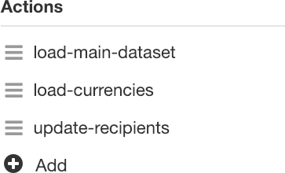
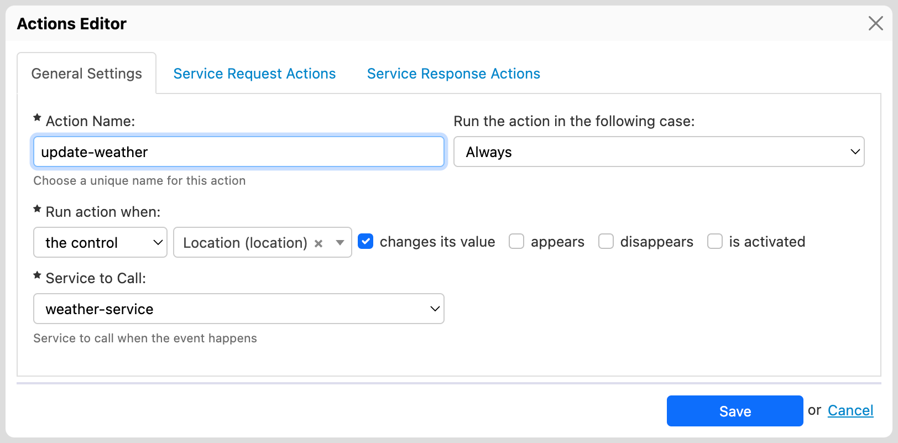
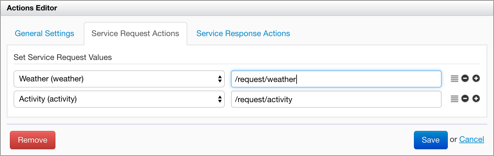
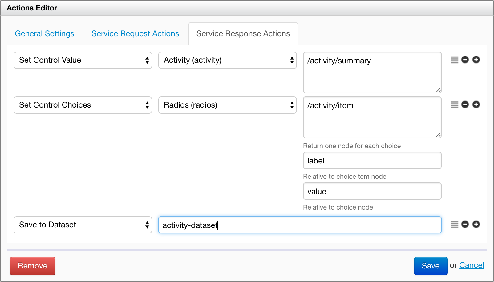

# Actions

## Introduction

The Form Builder Actions Editor is an [Orbeon Forms PE](https://www.orbeon.com/download) feature and allows you to implement simple actions in your form. The basic philosophy goes as follows:

1. React to an event occurring on the form, such as the form being loaded or a user action.
2. Call an HTTP or database service:
    - passing in parameters from the form,
    - receiving parameters back from the service.
3. Use the returned parameters to update the form

Actions are tightly coupled with services. In the future, support might be added for actions which do not require services.

## Basic action configuration

### Creating or updating an action

You create a new action or update an existing action in the "Advanced" tab of the toolbox. This opens the Actions Editor.

### Reordering actions

[SINCE Orbeon Forms 2018.2]

You can reorder actions by drag and drop in the toolbox. Sometimes, the specific order of actions is important, or you might just want to organize them in a way that makes sense for your form.



### With Orbeon Forms 2017.1 or newer

[SINCE Orbeon Forms 2017.1]



This is the meaning of the fields of the dialog:

- __Action Name__
    - This is the name of the action, as seen by Form Builder.
    - Must start with a letter, and may not contain spaces.
- __Run condition__
    - __Always__: Run the action independently from the form mode.
    - __In "new" mode only__: Run the action only in creation mode, that is when the user creates new data, as opposed to editing, viewing, emailing, or generating a PDF.
    - __When formula evaluates to true__: [SINCE Orbeon Forms 2021.1] Allows you to enter your own condition using XPath, which, if it evaluates to `false`, will prevent the service from running (see [video](https://www.youtube.com/watch?v=_3mIk0OS6G8&)).
- __Run action when__
    - Specifies a phrase built of the following parts:
        - "the control"
            - label / name of the control
                - "changes its value"
                - or "appears or changes its value"
                - or "is activated" (a button is activated or the "Enter" key is pressed in a text line)
        - or "the form loads"
            - "after the controls are ready"
                - This is the default.
                - The action runs when controls are "live", which means you can set their values and list of choices.
            - "after the data is ready"
                - The action runs when the data is ready:
                    - It has been loaded from the database if needed.
                    - Its initial values and calculations are up to date.
                - You cannot set control values and list of choices as a result.
                - You can store datasets as a result.
            - "before the data's initial values are calculated"
                - The action runs before the data is ready.
                - You cannot set control values and list of choices as a result.
                - You can store datasets as a result.
- __Service to Call.__
    - The service to call as once the action is triggered.

Like for services, once your action is defined, the Save buttons saves it to the form. You can come back to it and modify it later by clicking on the Edit icon next to the action name. You can also delete the action using the Remove button.

### With Orbeon Forms 2016.3 or earlier

[UNTIL Orbeon Forms 2016.3]


This is the meaning of the fields of the dialog:

- __Action Name.__ This is the name of the action, as seen by Form Builder. Must start with a letter, and may not contain spaces.
- __React to.__ The event which starts the action. Can be one of the following:
    - __Value Change.__ The control's value has changed.
    - __Value Change or Form Load.__ The control's value has changed OR the control has just become visible.
        - *NOTE: The field description in the user interface does not accurately describe the behavior, which is that the action will run upon the control becoming visible, whether upon form load or at a later time. The action can happen multiple times for the control if the control hides and shows multiple times.*  
    - __Activation.__ The button has been clicked, or the "Enter" key has been pressed in a text line.
    - __Form Load.__ The form just finished loading.
- __Condition.__
    - __Run always.__ Run the action independently from the form mode.
    - __Run on creation only.__ Run the action only in creation mode, that is when the user creates new data, as opposed to editing, viewing, emailing, or generating a PDF.
- __Control.__ Except for the Form Load event which does not depend on a particular control, this specifies which control the action reacts to.
- __Service to Call.__ The service to call as a response to the action.

Like for services, once your action is defined, the Save buttons saves it to the form. You can come back to it and modify it later by clicking on the Edit icon next to the action name. You can also delete the action using the Remove button.

## Handling the service request

Each row instructs the action to take value and pass it to the service, and you can add as many such rows as needed using the "+" button, and remove existing entries with the dropdown menu.



- The value can come from
    - A control value, which you select in the dropdown. If the control is repeated, because it occurs in a repeated grid or repeated section, then the value of the first "instance" of that control is used and passed to the service.
    - [SINCE Orbeon Forms 2021.1] Selecting "Formula" in the first column's dropdown, and enter your formula in the text field showing the second column.
- How the value is provided to the service
    - With HTTP services doing POST – The XPath expression, which must point to an element or attribute node of the request body defined in the HTTP service under "XML Request Body".
    - With HTTP services doing GET or DELETE – The HTTP Service Editor [allows you to define URL parameters](http-services.md#url-parameters)  when using the `GET` and `DELETE` HTTP methods. In this case, the HTTP Service Editor implicitly creates an XML document representing these parameters, as in the following example. The Actions Editor doesn't yet support specifying URL parameters directly by name in this case. Instead, you use XPath expressions under "Set Service Request Values", like `//userId` or `//userName`.

    ```xml
    <params>
        <userId>1</userId>
        <userName>test</userName>
    </params>
    ```
    - With Database services – To set the first query parameter, use the value "1" (without the quotes), the second, "2", etc.

## Handling the service response

### User interface

[SINCE Orbeon Forms 2017.1]

You access the response in the Service Response Actions tab. This allows adding, removing, and moving response actions:



### Setting the value of a control

As a result of running an action, you can set a form control's value from data returned by a service using:
 
- [SINCE Orbeon Forms 2017.1] the "Set Control Value" action
- [UNTIL Orbeon Forms 2016.3] the "Set Response Control Values" section 

Parameters:

- __Destination Control.__
    - Specifies the control whose value must be set.
    - A single "closest" control will be selected.
        - If the destination selection control is not within a repeated grid or section, then the single destination control is updated.
        - Otherwise the control which is the closest by following repeat iterations and repeat indexes is chosen.
- __Source XPath Expression.__
    - The expression is evaluated in the context of root element of the XML data returned by the service.
    - The expression can point to an element or attribute node of the response body, but can also be a more complex expression. Its result is converted to a string.

### Setting the choices of a selection control

#### Basics

As a result of running an action, you can set a selection control's set of items (AKA "itemset") using:

- [SINCE Orbeon Forms 2017.1] the "Set Control Choices" action
- [UNTIL Orbeon Forms 2016.3] the "Set response Selection Control Items" section

Selection controls include dropdown menus, checkboxes, and more.

- __Destination Selection Control.__
    - Specifies the selection control whose items must be set. Only selection controls appear in this list.
    - Depending on the relative position of the source of the action and the target selection controls, one or more "closest" controls can be selected (see the detailed explanation of the behavior below).
- __Choices XPath expression.__
    - The XPath expression must point to a set of element or attribute nodes of the response body returned by the service.
    - For each node returned, an item is created.
- __Label XPath expression.__ The XPath expression must return the text of the label for an item. It is relative to the current item node.
- __Value XPath expression.__ The XPath expression must return the text of the value for an item. It is relative to the current item node.

<!-- TODO: show example with screenshot -->

#### Adjustment of control values

[SINCE Orbeon Forms 4.3]

Each selection control's selected value(s) are updated to be in range following the new itemset:

- For single-selection controls: if the item value currently stored in the instance data is not part of the returned set of items, the value is cleared.
- For multiple-selection controls: any of the space-separated values currently stored in the instance data that are not part of the returned set of item values are removed.

#### Behavior starting with Orbeon Forms 2016.1

In the presence of repeated grids or sections, the destination selection control can resolve to zero, one or more concrete controls.

The way this works is that the "closest" controls are searched. This means:

- If the destination selection control is not within a repeated grid or section, then the single destination control is updated.
- If the source of the action is *within the same repeated iteration* as the destination selection control, then that single destination control is updated. Occurrences of the selection control on other repeat iterations are not updated.
- If the source of the action is at a higher level compared to the destination selection control, then all iterations of the selection control are updated, and subsequent new iterations added will also use the new itemset.

#### Behavior up to Orbeon Forms 4.10 included

All the previously available items of the selection control(s) identified are replaced with the items specified. In other words, the itemset for the given control is global. This is the case even in the presence of repeated grids or sections.

#### Internationalization

[SINCE Orbeon Forms 4.7]

Your service should return localized labels for all the languages supported by your form. For instance, if your form is available in English and French, a service you use to populate a dropdown with a list of countries might return:

```xml
<response>
    <row>
        <value>us</value>
        <lang>en</lang>
        <label>United States</label>
    </row>
    <row>
        <value>us</value>
        <lang>fr</lang>
        <label>États-Unis</label>
    </row>
    <row>
        <value>ch</value>
        <lang>en</lang>
        <label>Switzerland</label>
    </row>
    <row>
        <value>ch</value>
        <lang>fr</lang>
        <label>Suisse</label>
    </row>
</response>
```

After the service is called, the *items*, *label*, and *value* XPath expressions you wrote when defining the action are executed once per language supported by the form, and for each execution the `$fr-lang` variable is set to current language. So in the case of our hypothetical service returning a list of countries, you will define the *items* as `/response/row[lang = $fr-lang]`, the *value* simply as `value`, and *label* as `label`.

While in theory this allows you to have the *values* depend on the language, to avoid unexpected behavior when users switch languages or different users look at the same data using a different language, you should make sure that values are the same for all languages, and only the *labels* differ between languages.

### Storing the response to a dataset

[SINCE Orbeon Forms 2017.1]

As a result of running an action, you can store the entire set of data returned by the service into a [dataset](../form-runner/feature/datasets.md):
 
- use the "Save to Dataset" action
- enter a dataset name

Each dataset name identifies a unique dataset for the form. Depending on the use case, dataset names can be reused or be unique.

A dataset name must: 

- start with a letter or `_`
- continue with letters, digits, `.`, `-` or `_` (if the name has more than one character)

You access data from a dataset using the [`fr:dataset()`](../xforms/xpath/extension-form-runner.md#frdataset) function.

For more on datasets, see [Datasets](../form-runner/feature/datasets.md).
 
_NOTE: Section templates keep their own local datasets, separate from the main form._

## Namespace handling

At this point, you can't declare custom namespace mappings in the Actions Editor. So say you have a response looking like this:

```xml
<soap:Envelope xmlns:soap="http://schemas.xmlsoap.org/soap/envelope/">
    <soap:Body>
        <my:items xmlns:my="http://example.org/my">
            <my:item>
                <my:label>Cat</my:label>
                <my:value>cat</my:value>
            </my:item>
            <my:item>
                <my:label>Dog</my:label>
                <my:value>dog</my:value>
            </my:item>
            <my:item>
                <my:label>Bird</my:label>
                <my:value>bird</my:value>
            </my:item>
        </my:items>
    </soap:Body>
</soap:Envelope>
```

or, using the default namespace mechanism:

```xml
<soap:Envelope xmlns:soap="http://schemas.xmlsoap.org/soap/envelope/">
    <soap:Body>
        <items xmlns="http://example.org/my">
            <item>
                <label>Cat</label>
                <value>cat</value>
            </item>
            <item>
                <label>Dog</label>
                <value>dog</value>
            </item>
            <item>
                <label>Bird</label>
                <value>bird</value>
            </item>
        </items>
    </soap:Body>
</soap:Envelope>
```

In both these cases, `<my:item>` (or `<item>`) and nested elements are in the `http://example.org/my` namespace. This means that your XPath expression must match elements in a namespace and that, in theory, you need a custom namespace mapping in form builder. Since this is not supported yet, you can work around the issue by using XPath expressions with wildcards:

- Items: `/soap:Envelope/soap:Body/*:items/*:item`
- Label: `*:label`
- Value: `*:value`

You can even use shorter variations if element names are use consistently, for example:

- Items: `//*:item`
- Label: `*:label`
- Value: `*:value`

These expressions with wildcards ignore namespace information completely, so you have to be careful if your XML document contains elements with the same name but in different namespaces.

## See also

- [HTTP services](http-services.md)
- [Database services](database-services.md)
- [Synchronizing repeated content](synchronize-repeated-content.md)
