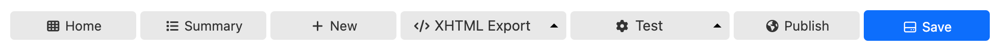
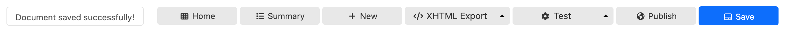

# Buttons bar

## Introduction

The buttons bar sits at the bottom of the Form Builder screen.



By default, the bar includes the following buttons:

- __"Home"__:
    - Go back to the Form Runner landing page.
    - If the current form is not saved, you will be prompted to save it.
- __Summary"__:
    - Go back to the [Form Builder Summary page](summary-page.md).
    - If the current form is not saved, you will be prompted to save it.
- __New"__:
    - Close the current form and create a new one.
    - If the current form is not saved, you will be prompted to save it.
- __Export buttons"__: 
    - Excel Export: export the form in Excel format
        - This is an Orbeon Forms PE feature.
    - XML Export: export the form in "XML with metadata" format
        - This is an Orbeon Forms PE feature. 
    - XHTML Export
        - export the form definition in XHTML+XForms format
        - [SINCE Orbeon Forms 2023.1] 
- __Test functions"__: 
    - Test: open the form in test mode
    - Test PDF: open the "Test PDF" dialog for testing PDF output
        - This is an Orbeon Forms PE feature. 
    - Test Offline: open the form in test mode, but using the "offline" (JavaScript) runtime (experimental)
        - This is an Orbeon Forms PE feature. 
    - Formula Inspector: observe formulas and their dependencies (experimental)
- __Publish"__: 
    - Open the "Publish" dialog to publish the form definition
    - This automatically saves the form definition as well.
- __Save"__:
    - Save, but don't publish, the form definition 

The buttons are configurable with the `oxf.fr.detail.buttons.orbeon.builder` property. The default value is, for Orbeon Forms 2023.1 PE:

```xml
<property as="xs:string" name="oxf.fr.detail.buttons.orbeon.builder">
    home
    summary
    new
    form-definition-xhtml-export|excel-export|xml-export|form-definition-xhtml-export
    test|test-pdf|test-offline|test-formulas
    publish
    save
</property>
```

Buttons combined with the `|` character show as a combined "drop-up" button.

## Messages area

The buttons bar also includes transient messages, which appear in the messages area. Here is an example:



## See also 

- [Form editor](form-editor.md)
- [Form area](form-area.md)
- [Toolbox](toolbox.md)
