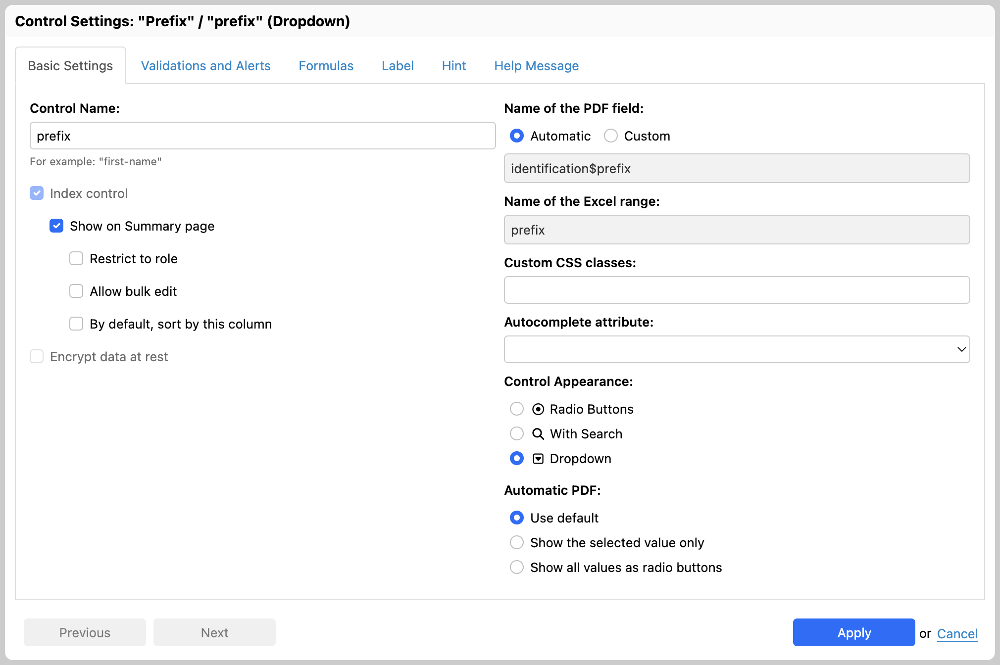
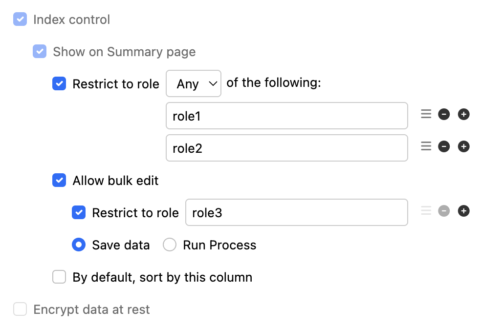
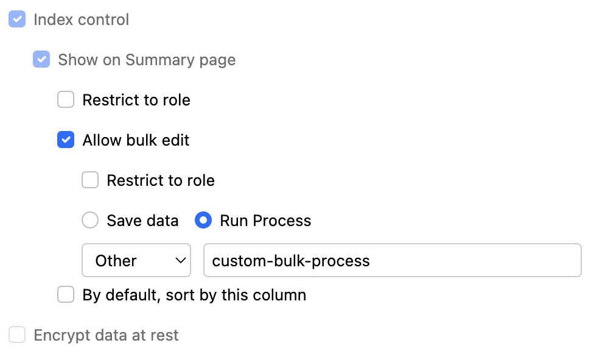
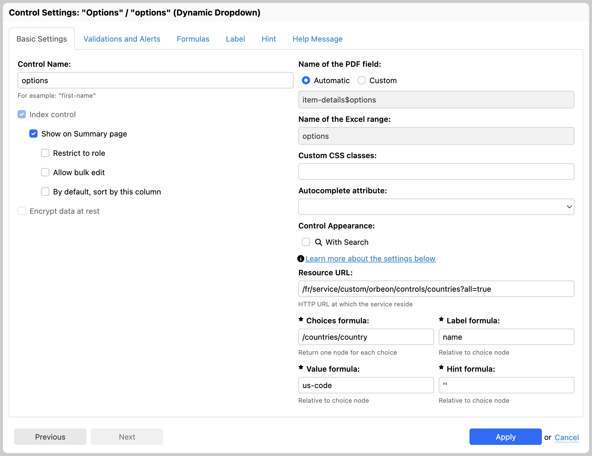

# Control settings

## Introduction

The Control Settings dialog allows controlling all the aspects the a control besides its label and hint. The dialog
has several tabs, detailed below.

### Basic Settings



#### Basic options

The control *name* specifies a identifier for the control, unique in the entire form (except [Section Templates](section-templates.md)). The
identifier is used for the following:

- to refer to the control value from formulas, using the variable notation `$foo` where `foo` is the control name
- to determine an XML element name when the form data is represented as XML

If a control name is not explicitly specified, Form Builder assigns a default name, such as `control-42`.

A control name can be changed, provided it doesn't collide with another control name (an error will show otherwise).

[SINCE Orbeon Forms 2019.1]

See [Renaming of controls and formulas](/form-builder/formulas.md#renaming-of-controls-and-formulas).

##### Main options

The following options are available:

- __Show on Summary page:__
    - When selected, the control value is visible as a Summary page column and searchable.
- __Allow bulk edit:__
    - When selected, the control value can be bulk edited from the Summary page.
- __Index control:__
    - SINCE Orbeon Forms 2021.1
    - Index the value of this control even if it's not shown or searchable from the Summary page, or bulk editable. This makes the control accessible from the [search API](../form-runner/api/persistence/search.md).
- __Encrypt data at rest:__
    - SINCE Orbeon Forms 2018.1
    - This is an Orbeon Forms PE feature.
    - See [Field-level encryption](/form-builder/field-level-encryption.md) for details.

##### Role restriction

[\[SINCE Orbeon Forms 2023.1\]](/release-notes/orbeon-forms-2023.1.md)

It is possible to restrict the "Show on Summary page" and "Allow bulk edit" options to one or more specific roles (i.e. group of users). When multiple roles are specified, the logic that applies can be chosen as well. If "All" is selected, then all specified roles must be present. If "Any" is selected, just one of the specified roles must be present.

<figure>
    
    <figcaption>Role restriction</figcaption>
</figure>

##### Bulk action

[\[SINCE Orbeon Forms 2024.1\]](/release-notes/orbeon-forms-2024.1.md)

By default, bulk edition of form data on the Summary Page will simply save the updated form data. You can also specify a custom process to run by selecting "Run process" instead of "Save data".

<figure>
    
    <figcaption>Bulk process</figcaption>
</figure>

The selected process is responsible for saving the data.

It's possible to specify a list of processes available for selection in the Control Settings dialog. This is done by specifying the following property:

```xml
<property
    as="xs:string"
    name="oxf.fr.summary.bulk-processes.*.*"
    value="process1 process2"/>
```

The value is a space-separated list of process names. By default, this property is empty.

##### Email options
    
The following email options are available:

*NOTE: SINCE Orbeon Forms 2018.2, these options are in a separate list.*
    
- __Email recipient:__
    - When selected, the control is used to determine an email recipient ("To:") when the form data is sent by email.
    - If more than one non-blank email addresses is found, they are all included as email recipients. In addition, the `oxf.fr.email.to` property is used.
    - A single control value can contain more than one email address, separated by commas (`,`) or spaces.
- __Email carbon copy recipient:__
    - SINCE Orbeon Forms 2017.1
    - When selected, the control is used to determine a carbon copy email recipient ("Cc:") when the form data is sent by email.
    - If more than one non-blank email addresses is found, they are all included as email recipients. In addition, the `oxf.fr.email.cc` property is used.
    - A single control value can contain more than one email address, separated by commas (`,`) or spaces.
- __Email blind carbon copy recipient:__
    - SINCE Orbeon Forms 2017.1
    - When selected, the control is used to determine a blind carbon copy email recipient ("Bcc:") when the form data is sent by email.
    - If more than one non-blank email addresses is found, they are all included as email recipients. In addition, the `oxf.fr.email.bcc` property is used.
    - A single control value can contain more than one email address, separated by commas (`,`) or spaces.
- __Email sender:__
    - SINCE Orbeon Forms 2017.1
    - When selected, the control is used to determine an email sender ("From:") when the form data is sent by email.
    - Only *one* "From:" email address is used, specifically the first non-blank address selected in the form. If no such address is found the `oxf.fr.email.from` property is used.
- __Email reply-to:__
    - SINCE Orbeon Forms 2020.1
    - When selected, the control is used to determine a reply-to address ("Reply-To:") when the form data is sent by email.
    - Only *one* "Reply-To:" email address is used, specifically the first non-blank address selected in the form. If no such address is found the `oxf.fr.email.reply-to` property is used.
- __Exclude from email body:__
    - SINCE Orbeon Forms 2018.1
    - When using "All Control Values" in an [email body template](email-settings.md), controls selected with this checkbox will be
      *excluded* and omitted from the email body.
- __Include as email attachment__:
    - SINCE Orbeon Forms 2016.1
    - this option only shows for file and image attachments
    - when the property `oxf.fr.email.attach-files` is set to `selected`, only file and image attachments with this option checked are attached to the email
- __Show in email subject:__
    - DEPRECATED SINCE Orbeon Forms 2018.1: Use a [template for the subject](email-settings.md) instead.
    - When selected, the control value is used as part of the subject of the email when the form data is sent by email.
    - If more than one non-blank values are found, they are all included in the email subject, comma-separated.

[SINCE Orbeon Forms 2021.1.4]

Email addresses can now contain a name, following the standard syntax:

```
John Smith <john@example.org>
```

Or:

```
"John Smith" <john@example.org>
```

When more than one email is present, if you specify names, you must use commas exclusively as a separator (with whitespace allowed around commas):

```
John Smith <john@example.org>, Alice <alice@acme.org>
```

Or:

```
"John Smith" <john@example.org>, "Alice" <alice@acme.org>
```

#### Name of the PDF field

[SINCE Orbeon Forms 2018.2]

This informational field shows the name of the field to use when using a PDF template.

See also [PDF templates](/form-runner/feature/pdf-templates.md).

#### Custom CSS classes

The "Custom CSS Classes" field allows you to add CSS classes that will be applied to the control in the resulting HTML. This is useful for applying custom styling. Note that CSS classes themselves do not directly define styles; instead, they serve as space-separated tokens that you can reference in [your own CSS files](/form-runner/styling/css.md).  

For example, you might specify:  

```
my-name-field my-highlight
```  

In this example, the `my-` prefix is used as a best practice to prevent conflicts with other CSS classes on the page. In your custom CSS file, you can target these classes using a selector, such as:  

```css
.orbeon .my-name-field.my-highlight input {
  border-color: blue;
}
```

#### Autocomplete attribute

[\[SINCE Orbeon Forms 2023.1\]](/release-notes/orbeon-forms-2023.1.md)

The "Autocomplete attribute" dropdown allows specifying an [HTML autocomplete value](https://developer.mozilla.org/en-US/docs/Web/HTML/Attributes/autocomplete) for controls for which it makes sense to do so. Such a value tells the browser that it can suggest values for the field or, in the case of the `off` value, that it shouldn't suggest any value.

#### Control appearance

[SINCE Orbeon Forms 4.10]

Some controls support more than one appearance. For example, a single selection control can appear as a dropdown menu,
or as radio buttons. When available, the "Control Appearance" selector allows selecting and changing the appearance of
the control.

See also [How the new Form Builder Appearance Selector Works](https://blog.orbeon.com/2015/06/how-new-form-builder-appearance.html).

#### Custom control settings

Some controls have custom settings. For example:



The following controls have custom settings:

- [Number](/form-runner/component/number.md#form-builder-customer-settings)
- [Currency](/form-runner/component/currency.md#form-builder-customer-settings)
- [US Phone Number](/form-runner/component/us-phone.md#form-builder-customer-settings)
- Date
- Time
- Date and Time
- [Dropdown Date](/form-runner/component/dropdown-date.md#form-builder-customer-settings)
- Dropdown
- Dropdown with Search
- [File Attachment](/form-runner/component/attachment.md#form-builder-customer-settings)
- [Image Attachment](/form-runner/component/image-attachment.md#form-builder-customer-settings) [SINCE Orbeon Forms 2022.1]

See also [Control metadata for the Control Settings dialog](metadata.md#control-metadata-for-the-control-settings-dialog)

#### Automatic PDF options

[SINCE Orbeon Forms 2021.1]

When producing a PDF file, single-selection controls like the "Static Dropdown" normally just output the selected value. However, in some cases, it is useful for the user to see all the available options.

You can achieve this with the "Automatic PDF" options in the "Control Settings" dialog for single-selection controls. This option is hierarchical: you can set it at the field level, form level, or globally. They are:

- __Use default__: use the form settings, and if they also have "Use default" use the property (see below)
- __Show the selected value only__: the label for the selected value shows
- __Show all values as radio buttons__: all possible values show as radio buttons and the selected value, if any, shows selected 

<figure>
    
    <figcaption>Automatic PDF options</figcaption>
</figure>

The supported properties are:

- `oxf.xforms.xbl.fr.dropdown-select1.pdf-appearance.*.*`
- `oxf.xforms.xbl.fr.dropdown-select1-search.pdf-appearance.*.*`

The possible values for each property are:

- empty: show the selected value only (default)
- `full`: show all values as radio buttons

Example to change the default the "Static Dropdown" control to showing all values in the automatic PDF:

```xml
<property 
    as="xs:string" 
    name="oxf.xforms.xbl.fr.dropdown-select1.pdf-appearance.*.*"
    value="full"/>
```

The global default is "Show the selected value only".

### Validations and alerts


See [Form Builder Validation](validation.md) for details.

### Formulas


See [Formulas](formulas.md) for details.

[SINCE Orbeon Forms 2018.2]

The "Yes" and "No" options have their own radio button. Select "Formula" to enter a dynamic "Visibility" or "Read-Only" formula.

### Explanatory Text

[SINCE Orbeon Forms 2019.1]

For the Explanatory Text control only, you can modify the text in this location, including making the text dynamic using templates as is the case for the Label, Hint and Help Message.


### Label and Hint

[SINCE Orbeon Forms 2017.2]

In addition to setting a control's label and hint in place in the form area, you can also set and update them in this tab. You can switch between plain text and HTML text as well. The "Previous" and "Next" buttons allow quick navigation between controls.


#### Automatic hints

[\[SINCE Orbeon Forms 2023.1\]](/release-notes/orbeon-forms-2023.1.md)

For attachment controls, in addition to the hint you provide for the control, Orbeon Forms can add an automatic hint informing the user about the maximum allowed file size and the accepted file types, if you have specified such validations in the Validations and Alerts tab.

Automatic hints are disabled by default, and you can enable them for a specific control in the Control Settings dialog, for all controls in a form in the Form Settings dialog, or globally using the property below. A setting other than "Default" in the Control Settings dialog box overrides a setting other than "Use property" in the Form Settings dialog box, which overrides the value of the property below.

```xml
<property 
    as="xs:boolean"
    name="oxf.fr.detail.hint.automatic.*.*"                           
    value="true"/>
```

### Help Message


This allows specifying some help text, which can be plain text or rich text when the "Use HTML" checkbox is selected.

The help message is available at runtime through a help icon positioned next to the control. By default, the icon opens a pop-up containing the help text. In *noscript* mode (removed since Orbeon Forms 2018.1), the icon links to a help section at the bottom of the form.

The help text is localizable.

See also [Improving how we show help messages](https://blog.orbeon.com/2014/01/improving-how-we-show-help-messages.html).

### Dynamic labels, hints and help messages

[SINCE Orbeon Forms 2018.1]

Controls support *dynamic* labels, hints, and help messages. This means that, instead of being specified once and for all at form design time, labels, hints and help messages can incorporate dynamic parts such as control values and other custom expressions.

For more, see [Template syntax](template-syntax.md).

### Language selector

[\[SINCE Orbeon Forms 2023.1\]](/release-notes/orbeon-forms-2023.1.md)

When multiple languages are available for the form, a language selector allows selecting the language for which localizable texts are being edited (e.g. Validations and Alerts, Label, Hint, and Help Message) directly from the Control Settings dialog.


## Keyboard shortcuts

See [Keyboard shortcuts](keyboard-shortcuts.md).

## See also

- [Control metadata for the Control Settings dialog](metadata.md#control-metadata-for-the-control-settings-dialog)
- [Form Builder Validation](validation.md)
- [Formulas](formulas.md)
- [Template syntax](template-syntax.md)
- Blog posts
    - [Enhanced validation in Form Builder and Form Runner](https://blog.orbeon.com/2013/07/enhanced-validation-in-form-builder-and.html)
    - [Improving how we show help messages](https://blog.orbeon.com/2014/01/improving-how-we-show-help-messages.html)
    - [How the new Form Builder Appearance Selector Works](https://blog.orbeon.com/2015/06/how-new-form-builder-appearance.html)
    - [Improved constraints on attachments uploads](https://blog.orbeon.com/2017/04/improved-constraints-on-attachments.html)
    - [More flexible email senders and recipients](https://blog.orbeon.com/2017/05/more-flexible-email-senders-and.html)
