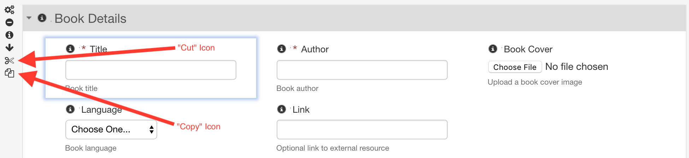

# Cut, copy and paste

<!-- toc -->

## Introduction

## Cut, copy and paste from the toolbox

The top of the toolbox has the usual cut, copy, and paste icons: 

They allow performing the usual cut/copy/paste operations on form controls.

- **Cut:**
    - Copies the control in the currently selected grid cell to the Form Builder clipboard. 
    - Then removes the control from the current grid cell.
    - If the cell is empty, nothing happens.
- **Copy:** 
    - Copies the control in the currently selected grid cell to the Form Builder clipboard.
    - The copied control is left as is in its cell.
    - If the cell is empty, nothing happens.
- **Paste:** 
    - Pastes the contents of the Form Builder clipboard.
    - If the clipboard contains a control, it is inserted in the next available grid cell.
    - If the clipboard contains a grid or section (see below), it is inserted in the next available position.
    - If the clipboard is empty, nothing happens.

_NOTE: These operations are restricted to the currently running instance of Form Builder. They do not apply between different Form Builder windows or tabs, or between edition sessions._

The following control information is copied and pasted:

- type and appearance
- name
- label, hint, and help
- default value
- itemset
- validations, including datatype, constraints, and alerts
- formulas
- any associated localized resources

When a control is pasted, if the control name of the clipboard control is currently not in use in the form, it is used. Otherwise, a new automatically-generated name is chosen by Form Builder.

## Cut, copy and paste of grids and sections

[SINCE Orbeon Forms 2017.2]

When hovering over a grid or section, "Cut" and "Copy" icons are available:

*NOTE: The "Cut" icon is not available if the section or grid is the last one in its container.*

- **Cut:**
    - Copies the given grid or section to the Form Builder clipboard. 
    - Then removes the grid or section from the form.
- **Copy:** 
    - Copies the grid or section to the Form Builder clipboard.
    - The copied grid or section is left as is in the form.
    - If the cell is empty, nothing happens.

You paste a cut or copied grid or section using the toolbox's "Paste" icon (see above).

If pasting the grid or section can cause name conflicts, a dialog shows:

The dialog shows a list of all control names within the grid or section and how they will be changed after pasting.
Since control names are unique within a form definition, two controls cannot have the same name. Names that are available
show in green. Names that conflict show in yellow and an automatic name is generated.

You can optionally set a prefix and/or a suffix for all names. This can help prevent automatic generation of names. For 
example, you could paste a US Address twice:

- first, with all control names prefixed by `shipping-` 
- second, with all control names prefixed by `billing-`

## Undoing and redoing cut and paste operations

[SINCE Orbeon Forms 2017.2]

The "Cut" and "Paste" operations are undoable in the following way:

- Undoing a "cut" of a control, grid or section puts the item back to its original location. However, the clipboard retains
  the item.
- Undoing a "paste" of a control, grid or section removes the newly-inserted item from the form. The clipboard remains
  untouched.

## See also 

- [Undo and redo](undo-redo.md)
- [Section templates](section-templates.md)