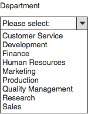
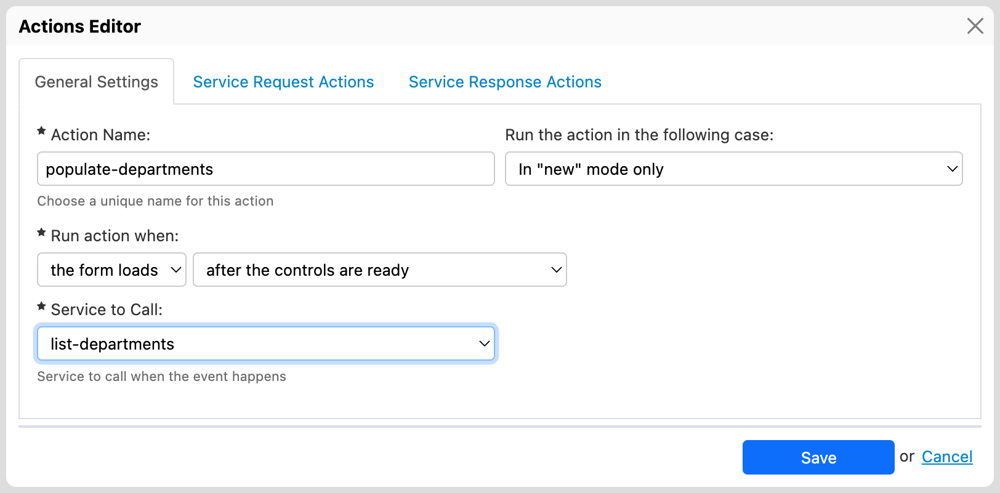

# Database services

## Overview

By using _database services_, a [PE feature](https://www.orbeon.com/pricing), you can use data stored in any table of a relational database, for instance to dynamically populate a dropdown, or to pre-populate fields based on a value entered by users.

## Format of database query responses

A SQL query, when successful, returns an XML document with the following format:

* A root element which is always `<response>`.
* It contains one nested `<row>` element per row.
* Each such element in turn contains one element per selected column, derived from the column name:
  * The name is converted to lowercase.
  * Underscores (`_`) replaced by dashes (`-`).

For example, values for the `dept_no` column end up in `<dept-no>`.

See below for concrete examples.

## Populating a dropdown

In what follows, we'll see how you can populate a _Department_ dropdown in your form using values stored in an `departments` table of your relational database.



### 1. Connect with the database

You start, in Form Builder, by creating a new database service, clicking _Add_ in the left sidebar under _Database Services_. This opens the _Database Service Editor_.

Under _Datasource_ you type the name of a datasource you setup in your application server. This is the the JNDI name of the datasource, without the `jdbc/` part. If you type `employees`, Orbeon Forms will look for `java:comp/env/jdbc/employees`.

If you're using Tomcat, the simplest way of setting up a datasource is to edit Tomcat's `server.xml`, there add a `<Context>` for Orbeon Forms if you don't have one already, and inside it add a `<Resource>` pointing to your database. On Tomcat, you also need to put the database JDBC driver in Tomcat's `lib` directory.


### 2. Write the SQL query

Still in the _Database Service Editor_, you write the SQL query to run in the database. When that query runs, Orbeon Forms creates an XML document with the returned data, and you'll be referring to parts of that document when linking the database service to a specific dropdown.

The user interface in Form Builder looks like this:


Example response:

```xml
<response>
    <row>
        <dept-no>d009</dept-no>
        <dept-name>Customer Service</dept-name>
    </row>
    <row>
        <dept-no>d005</dept-no>
        <dept-name>Development</dept-name>
    </row>
</response>
```

This diagram summarizes the mapping:


### 3. Link the dropdown

To "link" the service to the dropdown, you create a new action, set it to run on _Form Load_, call the service you earlier named `list-departments`. Here is how the user interface looks like:



With the result of the service you want to set the list of possible values of an a _Department_ dropdown you have in the form. This is where you extract data from the XML document seen earlier, and you do this with 3 XPath expressions. The first points to the "rows", and will almost always be `/response/row`. Next, you need to tell Orbeon Forms where it can find, inside the `<row>`, the label (the text shown to users) and the value (what is stored in data when users make a selection).

Here is how the user interface looks like:


This diagram summarizes the mapping:


### 4. Select a value

Finally, when your form runs and users make a selection in the dropdown, the _value_, here the content of the `<dept-no>` element, is used to populate the element corresponding to the field in the form data.

## Populating fields using another field value

Say that when users enter a value in _employee number_, you want to lookup the corresponding employee in your database and populate other fields, _First name_ and _Last name_, based on the information you find about that employee. We've already know how to establish a [connection with the database](database-services.md#1-connect-with-the-database), so let's start by seeing how we can use the value of a field in a SQL query.


### 1. Set a service parameter

Your SQL query can contain _parameters_. Those look like: `<sql:param type="xs:string" select=""/>`. The `type` attribute corresponds to the SQL type to use (e.g. `xs:string`, `xs:decimal`, …). The `select` attribute must be left blank; it is filled-out by the Actions Editor when the service is called.

When the query runs, the value of each parameter is set to the current value of a form field, and you define the mapping between parameter in the SQL query and form field when you create an action. That mapping is done by position; e.g. in the above query, you'll want to set parameter 1 to the control containing an employee id.


### 2. Set control values

Finally, you use the _Set Response Control Values_ section of the _Actions Editor_ dialog to extract the information you're interested in from the XML produced based on the result from the query, and populate fields in the form.


## Example: fields pre-population

Say you will be passing a request parameter `employee-id=100` to your form, and want to load data from a relational database about the employee with specified id, this to pre-populate some fields, such their first name, last name, hire data, and department, as shown in the screenshot below.


You can do this as follows, in Form Builder:

1. Create a field to hold the employee id passed through the request parameter. You might want to put this field in another section, for instance named "(Internal)", that you hide from end users by setting in its Section Settings dialog, the Visibility to No. For the field, you can use a Hidden Field, or a Calculated Value if you'd like to see its value at runtime when debugging the form.
2. In the Control Settings for that field, name it `employee-id`, and in the Formulas tab, set its Initial Value to `xxf:get-request-parameter('employee-id')`.
3. Create a database service that retrieves the information about the employee, with a statement like the one below.
4. Create an action that, on form load, runs the database service, passing the value of the `employee-id` field, and setting the value of the first name, last name, hire data, and department fields to values returned by the SQL query.

```sql
SELECT *
  FROM employees
 WHERE employee_id = <sql:param type="xs:string" select=""/>
```

You can get the [source of the form described above](https://gist.github.com/orbeon/1e25851b7219f765a2cde373a72e9dea), and run it for yourself on the instance of Orbeon Forms deployed on demo.orbeon.orbeon, which has the `employees` table used by the above query. After you publish the form, try opening its `/new` page, passing the request parameter `?employee-id=100`.

## See also

* Blog post: [Making sense of Form Runner Actions](https://www.orbeon.com/2024/09/making-sense-form-runner-actions)
* [HTTP services](http-services.md)
* [Simple Actions](/broken/pages/-LEkBr90Nq9hbV8krZWy)
* [Synchronizing repeated content](synchronize-repeated-content.md)
