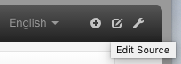
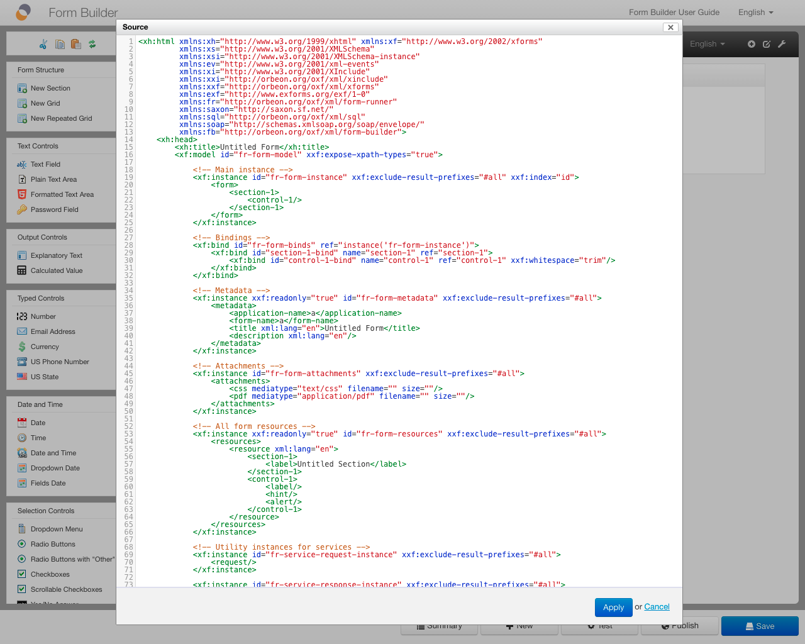

# Editing the source code of the form definition

## With Orbeon Forms 2017.2 and newer

The "Edit Source" button under the "Advanced" tab in the toolbox opens the "Edit Source" dialog.

## With Orbeon Forms 2017.1 and earlier

The "Edit Source" icon in the top right corner of the form area opens the "Edit Source" dialog.

## Functionality

This is an advanced feature and it must be used very carefully.

Form Builder uses XHTML+XForms as form definition representation. The format must be well-formed XML. The dialog shows a text editor containing that representation.

It is possible to edit the XML representation in the dialog, or to copy/paste it to an external editor for further changes. After saving changes from the dialog, those are immediately taken into account by Form Builder.

_NOTE: You have to be cautious when doing so because it is possible to break the form by making changes! We recommend that you learn about XForms before making such changes._
