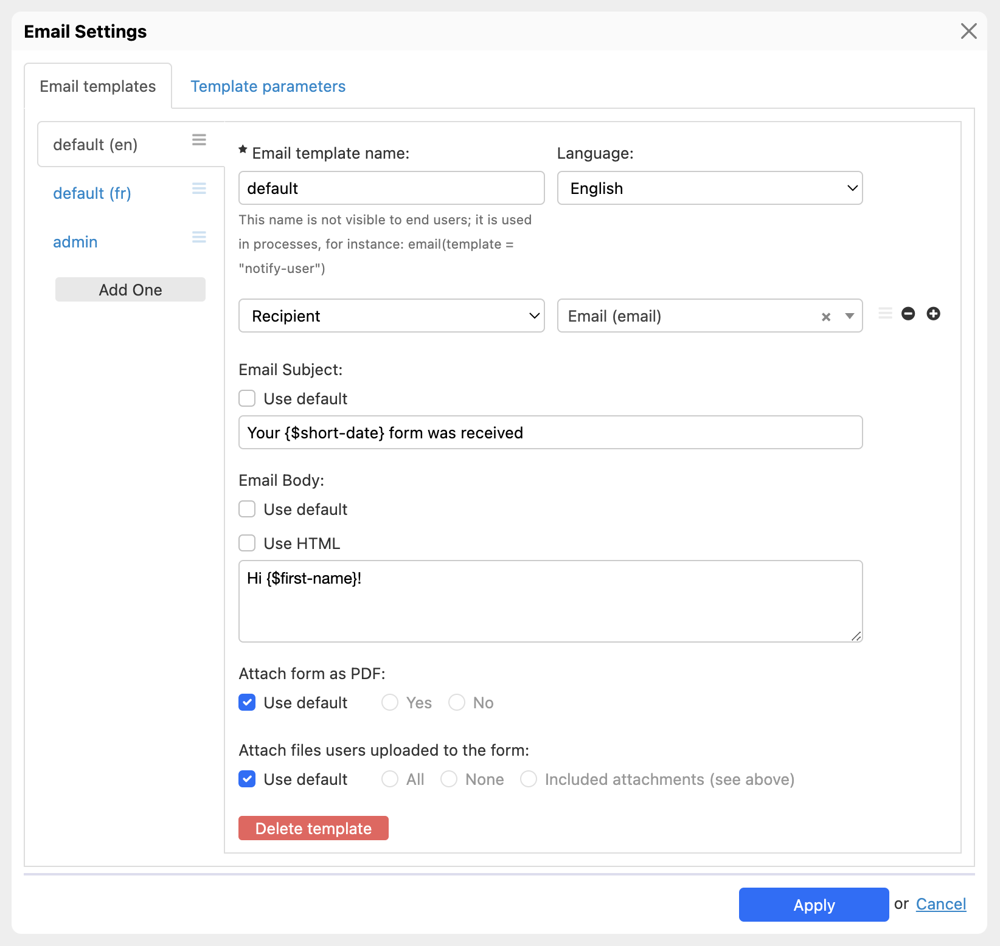

# Email settings

## Availability

- [SINCE Orbeon Forms 2018.1] Email Settings dialog in the Form Builder enabling form authors to configure an email template for the current form.
- [SINCE Orbeon Forms 2022.1] Enhanced Email Settings dialog, with support for multiple email templates, as shown in the screenshots below.
- This is an Orbeon Forms PE feature.

## Purpose

The dialog allows you to configure the content of emails sent by Orbeon Forms. You can use this emailing capability to send a confirmation message to users who submitted the data, or to inform someone within your organization that new data has been submitted and requires processing. The Email Settings dialog allows you to define what the subject and the body of those emails are, and to whom they are sent to using an *email template*. As the name suggests, the email template can have placeholders that get filled when the email is sent, for instance with values entered by users in the form.

## Multiple email templates

[SINCE Orbeon Forms 2022.1] You can have as many email templates per form as you'd like. This enables you to create different templates, for various languages, or have a template to inform users their data has been received and another template to email the person who needs to process the data. Additionally, if your form is used to implement a workflow, you can have different templates: for example, to notify a user that their request has been accepted or rejected. This opens up numerous possibilities for implementing workflows with Orbeon Forms.

## Usage

You can open the "Email Settings" by clicking on the "Email Settings" button, under the "Advanced" tab, in the toolbox.

- Template name – Each email template must have a *name*. This name is not exposed to end users; it is only for your own use, to understand what each template is for, and to be able to refer to a specific template in the [`email(template = "my-template")` action](/form-runner/advanced/buttons-and-processes/actions-form-runner.md#email).
- Dynamic email subject and body – An email subject or body can be dynamic and include the value of form controls or formulas, as shown in the examples above. For more, see [Template syntax](template-syntax.md).
- Localization – If your form is available in multiple languages, a "Language" dropdown shows next to the template name, allowing you to select which language this template is for. When an email is sent, the template that corresponds to the user's language is automatically used.

## See also

- Blog post: [Support for multiple email templates in Form Builder](https://blog.orbeon.com/2023/04/support-for-multiple-email-templates-in.html)
- [Template syntax](template-syntax.md)
