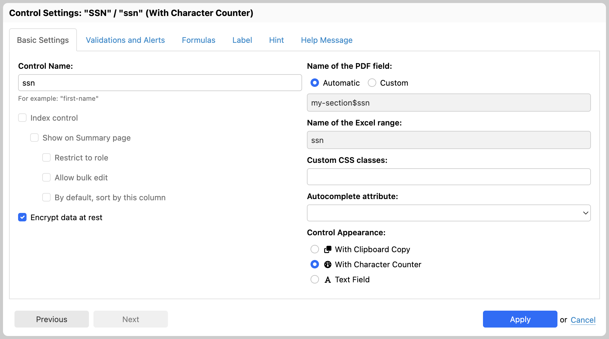

[SINCE Orbeon Forms PE 2018.1]

## Overview

This feature allows form authors to mark certain fields so any data entered by users in the field is encrypted at rest. This is typically useful for fields used to capture personal information, also referred to as "personally identifiable information" (PII), "sensitive personal information" (SPI), or "personal information," depending on the context. Encrypting such information can help you with compliance with privacy laws, such as GDPR.

## Marking fields for encryption

In Form Builder, to mark a field for encryption, open the "Control Settings" dialog for that field, and click on the "Encrypt data at rest" checkbox, as done in the screenshot below.

## When encryption happens

When storing form data, encryption is done before it is sent to the implementation of persistence API. When retrieving form data, decryption is done after it is received from the implementation of the persistence API. This means that implementations of the persistence API don't need to worry about encrypting or decrypting data when storing or reading form data. Also, it means that values of fields marked for encryption will be encrypted on the wire on the way to and from your database, even further increasing the security of your solution.

## Making changes to what needs to be encrypted

Say you edit an existing form definition in Form Builder and change the fields to be encrypted:

- If you publish the form as a new version, then changes apply to new data captured with the form. Existing data tied to other versions will continue to encrypt the fields as marked in those versions.
- If you publish the form overwriting an existing version:
    - When retrieving form data form the persistence API, fields that were encrypted at the time the form data was stored will be decrypted (even if the list of fields to encrypt has changed in current form definition).
    - When storing form data, fields marked for encryption in the form definition will be encrypted.

This means that, from the perspective of fields encryption, overwriting an existing form definition at publication time doesn't cause any problem. This is because encrypted fields are marked as such in the form data, so Orbeon Forms can decrypt them even if the list of fields to be encrypted has changed since the last time the form data was saved.

However, overwriting an existing form definition at publication time won't re-encrypt existing data. For this to happen, you need to [trigger a re-encryption](../form-runner/feature/home-page.md#re-encrypting) from the Form Runner home page.