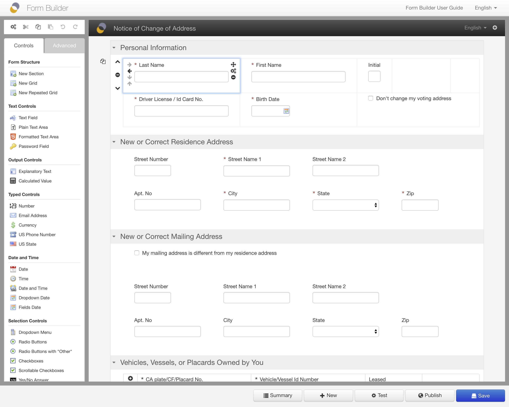
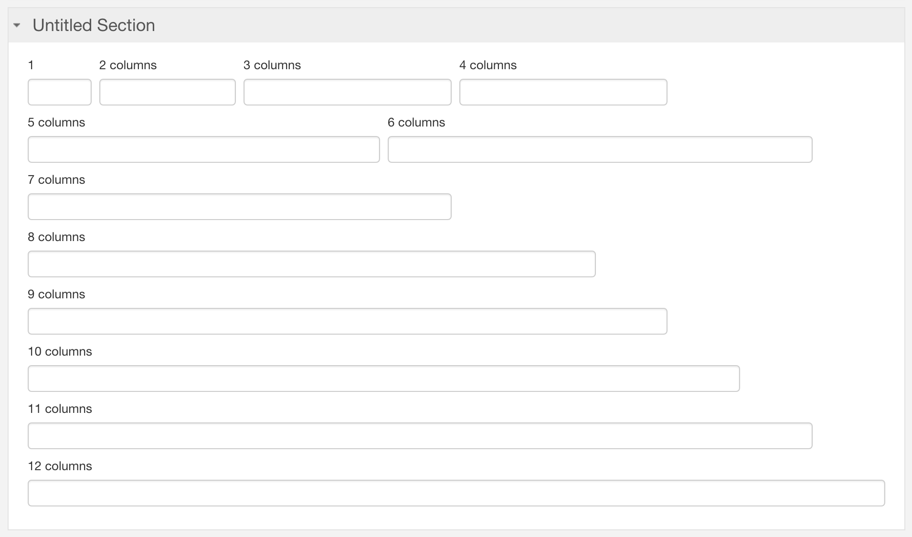
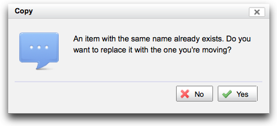

# Form area

## Introduction

The Form Builder form area is meant to looks as much as possible like the published form. [^1] 

Form Builder is built around as simple layout concept: _sections_ and _grids_. This is a good alternative to:

- absolute positioning, which is rarely appropriate for web forms
- complex dynamic layouts, which often confuse form authors

Starting with Orbeon Forms 2017.2, Form Builder grids are more flexible then with earlier versions and follow a 12-column
layout.

## Sections

Form Builder represents every form as a series of _sections_. A section is a logical grouping of form controls which has a *title* and an optional *help*. For example, your form may have an "Address" section, and a "Personal Details" section.

Sections are by default presented in order, on top of each other in the page. But when using the [wizard view](../form-runner/feature/wizard-view.md), each top-level section, and optionally the next level of subsections, becomes a wizard page at runtime.

In addition:

- Every form has at least one section.
- There is no maximum number of sections within a form.
- Sections can have *subsections*, which are sections nested within other sections.

You can perform the following operations on sections.

- Set the section's localizable title by clicking on it. To select a different language, use the language
  selector at the top right of the form area.
- Delete the section by clicking on the Trashcan icon. If the section contains controls, a confirmation dialog appears.
- Set an optional help message for the section by clicking on the help icon. The help is localizable.
- Set other [section settings](section-settings.md).
- Open or collapse the section by clicking on the arrow to the left of the section title.
- Move the section up or down by clicking on the up/down arrows. These appear as needed if there is more than one section.
- Move the section left or right by clicking on the left/right arrows. These appear as needed if there is more than one section and if
  it is possible to move a section *into* another section ("right"), or out of its container section ("left"). This allows making
  sections *subsections* of other sections. 

## Grids

Each section contains one or more _grids_. A grid is a logical grouping of form controls organized in rows and columns of cells. Unlike sections, a grid doesn't have a title or help.

A grid may be a regular grid or a [repeated grid](repeated-grids.md), which repeats a group of one or more rows. A repeated grid may have from no iteration (or repetition) to any number of iterations. A repeated grid also has settings, but regular grids do not have settings as of Orbeon Forms 2017.2.

In addition:

- A grid may have any number of rows (but at least one).
- Each grid cell may contain a single form control, or remain empty.
- A grid cell might span multiple rows.
- Unlike a section, a grid does not have a title or properties, except for *repeated grids* which do have properties.

When your mouse pointer hovers over a grid, the grid boundaries, cells and icons are highlighted.

### The 12-column layout

[SINCE Orbeon Forms 2017.2]

A grid always has 12 columns when shown on a wide display. Note that on narrower displays, grids still collapse to a vertical
layout (see [Responsive design](../form-runner/feature/responsive-design.md)).
 
You can perform the following operations on grids:

- Add grid rows by clicking on the up and down arrows on the left of each row.
- Delete a row by clicking on the "minus" icon on the left of a row.
- Delete the entire grid by clicking on the "minus" icon to the left of the grid.
- Expand/shrink grid cells horizontally or vertically.

Expanding/shrinking cells horizontally makes grid cells span *columns*. This allows grid cells to have a width of 1, 2,
and up to 12 columns.

Expanding/shrinking cells vertically makes grid cells span *rows*. This allows making some cells taller when next to
other cells, for example to allow for taller radio buttons lists.

At runtime, controls have a little more space within grid cells as the Form Builder icons are absent: 

Destructive operations do not ask for confirmation but add the operation to the Undo stack, allowing you to
undo the operation from the toolbox. See [Undo and redo](undo-redo.md).

See also [the blog post](https://blog.orbeon.com/2018/05/the-12-column-layout.html).

### Until Orbeon Forms 2017.1

A grid has between 1 and 4 columns, but it is possible to make Form Builder support more than 4 via a configuration
property.
  
You can perform the following operations on grids:

- Add grid columns by clicking on the left and right arrows at the top of each column.
- Add grid rows by clicking on the up and down arrows on the left of each row.
- Delete a column by clicking on the trashcan icon at the top of a column.
- Delete a row by clicking on the trashcan icon on the left of a row.
- Delete the entire grid by clicking on the trashcan icon on the top left corner of the grid.
- Expand/shrink grid cells vertically only.  

For delete operations, a warning dialog shows if controls will be deleted as a result.

## Grid cells and controls

Each grid cell can contain a single form control, or no control at all. Some controls, by default, take the entire width
of the cell. This includes text fields and text areas. In such cases, to size the control, you can make the cell wider
or narrower.

If a control is present, the following actions related to the control are possible:

- **Set control label:**
    - Click on the label.
    - A control's label appears on top of the control. It is intended to provide a descriptive label for  the form control.
    - Examples: "First Name", "Street", "Phone Number".
- **Set control hint:**
    - Click on the hint.
    - A control's hint usually appears under the control. It is intended to provide a short indication to the form user of how to fill-out the form control.
    - Examples: "Your first name", "Date in mm/dd/yyyy format".
- **Set control default value:**
    - Simply enter text or select a value.
    - You can also set a calculated initial value from the ["Control Settings" dialog](control-settings.md).
- **Edit the control's items:**
    - Click on the "Edit Items" icon or test to open the [Itemset Editor dialog](itemset-editor.md) (for selection controls only).

When your mouse pointer hovers over a grid cell containing a control, some icons allowing for further actions appear:

- **Move or Copy Control icon:**
    - [SINCE Orbeon Forms 2017.2]
    - This handle lets you drag and drop the control to another grid cell. Press the *shift* key before you start the
      drag & drop motion to create a copy of the current control in the target cell, instead of moving it there.
- **Delete Control icon:**
    - This deletes the control, removing all the information associated with the control including validation properties.
- **Control Settings icon:**
    - This opens the ["Control Settings" dialog](control-settings.md).
- **Expand/shrink icons:**
    - These expand and shrink the cell horizontally or vertically if possible.

## In-place editing

Form Builder allows you to edit certain text information in-place. This just means that text appears as it would in the
published form, and is editable when you click on it.

To edit such text:

- Click on the text (or placeholder text).
- A text field appears.
- Enter the text.
- Use the "Enter" key or click outside the text field to commit the change.

To indicate that the text is editable, it highlights when the mouse hovers over it.

This mechanism is how you edit:

- section titles
- control labels
- control hints
- explanation texts

## See also 

- Blog post: [The 12-column layout](https://blog.orbeon.com/2018/05/the-12-column-layout.html)
- [Section settings](section-settings.md)
- [Repeated grids](repeated-grids.md)
- [Responsive design](../form-runner/feature/responsive-design.md)

[^1]: What was known in the old days as "What You See is What You Get" or "WYSIWYG".
