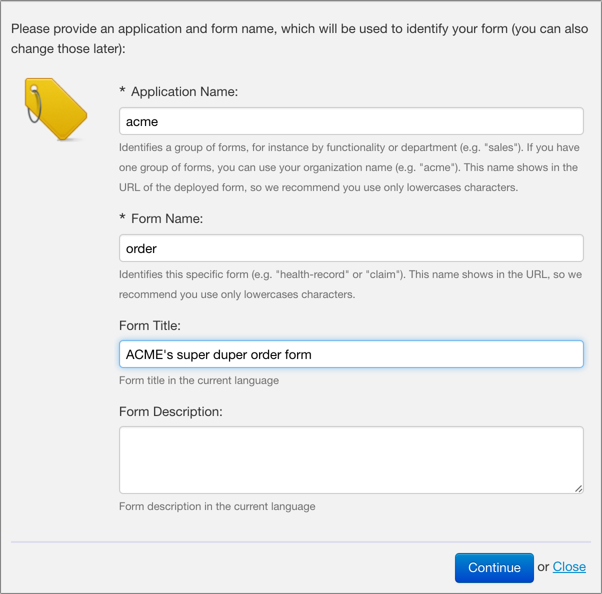
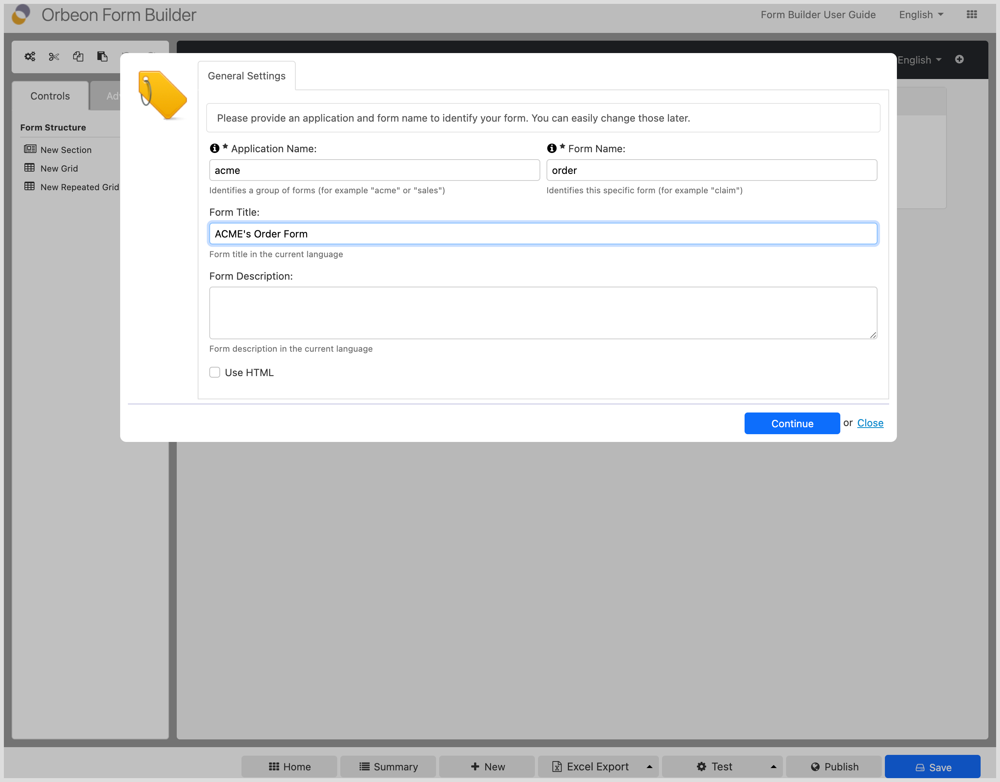
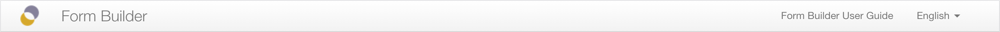

# The form editor

## Creating your first form definition

After pressing the "New" button on the [summary page](../form-builder/summary-page.md), you reach the form editor (also known as form designer) proper. Form Builder requires that you provide two small pieces of information before starting:

* **Application Name.** Each form definition has an _application name_ which identifies a group of forms that belong together. In practice, an application name might correspond to a project, or a department, or a company. For example, all forms built by Orbeon have the "orbeon" application name.
_NOTE: Depending on your permissions, the application name might have been picked for you already, or you might have the choice of a restricted set of application names._
* **Form Name.** Each form definition also has a _form name_, which identifies a unique form name within a particular application.

Both application name and form name must respect a certain format:

* Use letters and optionally numbers and separators like "-" and "_"
* Start with a letter
* Do not use spaces

_NOTE: One reason for these restrictions is that the names will eventually appear in your browser's URL bar when the form is deployed and it is better to have clean-looking URLs._

For your first form, don't worry too much about those: just enter any name! You can always change these settings later!

You also may enter at this time a form title and description.

## General Form Builder layout

Form Builder's form editor is organized in 4 areas:

* **Top:** title area with status information and selection of the Form Builder user interface language.
* **Left:** the [toolbox](../form-builder/toolbox.md), which might scroll vertically depending on your browser or monitor size.
* **Bottom:** status icons and buttons.
* **Center:** WYSIWYG [form area](../form-builder/form-area.md) where you actually edit your form definition. This area might scroll vertically depending on your browser or monitor size or the size of the form you are editing.

## The top bar

On the top right corner of the top bar, you can change the Form Builder user interface language by clicking on one of the languages available. Currently, English and French are available. More languages may be added in the future.

Changing the language immediately updates the Form Builder user interface: you do not even need to save your form prior to using this feature.

_NOTE: This feature controls the language of the Form Builder user interface only. For localization of the form definition you are currently editing, see documentation below._

## The buttons bar

See [Buttons bar](buttons-bar.md).

## Keyboard shortcuts

See [Keyboard shortcuts](keyboard-shortcuts.md).

### Other functions

In addition, the bottom bar displays status information, such as whether the current form definition was successfully saved.

## See also

- [Form area](form-area.md)
- [Toolbox](toolbox.md)
- [Buttons bar](buttons-bar.md)
