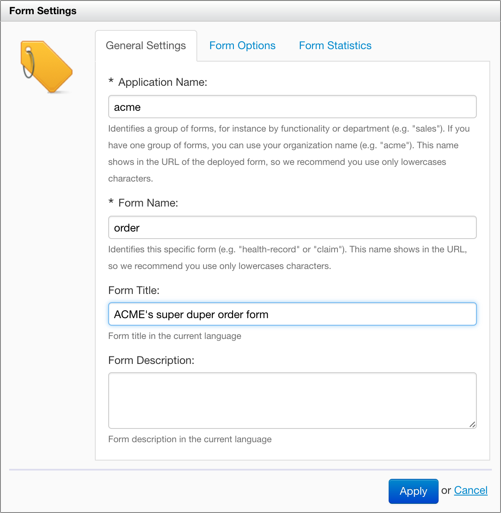
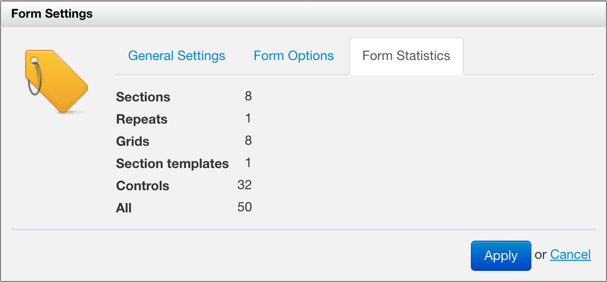

# Form Settings

<!-- toc -->

## Introduction

Some settings apply to the entire form definition. You access these settings with the "Form Settings" wrench icon on the top right of Form Builder. The General Settings also show initially when creating a new form definition.

## General Settings

General settings allow you to set:

- the Application Name
- the Form Name
- the form title in the current language
- the form description in the current language

## Form Options

[SINCE Orbeon Forms 2016.2]

Form options include options which apply to the entire form definition.

## Form Statistics

Form statistics show various counts of form elements.

