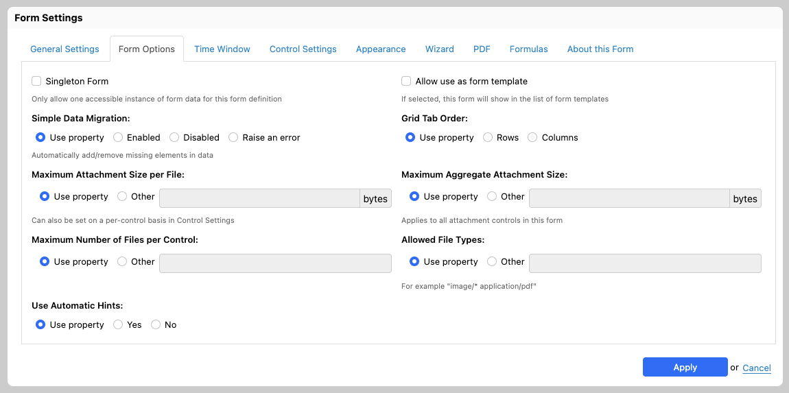

# Form Settings

## Introduction

Some settings apply to the entire form definition. You access these settings with the "Form Settings" wrench icon on the top right of Form Builder. The General Settings also show initially when creating a new form definition.

## General Settings

General settings allow you to set the following form definition metadata:

- Application name
- Form name
- Form title in the current language
- Form description in the current language

[SINCE Orbeon Forms 2020.1]

The description can optionally use rich text.

## Form Options

[SINCE Orbeon Forms 2016.2]

Form options include options which apply to the entire form definition.

- Singleton Form
  - Enable or disable singleton form behavior. 
  - See [Singleton Form](/form-runner/advanced/singleton-form.md)
- Allow use as form template
- Simple Data Migration
  - [SINCE Orbeon Forms 2018.2]
  - For details, see [Simple data migration](/form-runner/feature/simple-data-migration.md).
- Grid Tab Order
  - [\[SINCE Orbeon Forms 2023.1\]](/release-notes/orbeon-forms-2023.1.md)
  - Use property: use the [`oxf.xforms.xbl.fr.grid.tab-order` property](/configuration/properties/form-runner-detail-page.md#grid-tab-order)
  - For details, see [Grid Tab Order](/form-builder/grid-settings.md#grid-tab-order) in the Grid Settings dialog.
- Maximum Attachment Size per File
  - [SINCE Orbeon Forms 2017.1]
  - Use property: use the [`oxf.fr.detail.attachment.max-size-per-file` property](/configuration/properties/form-runner-attachments.md#maximum-attachment-size)
  - Other: the maximum size allowed in bytes
- Maximum Aggregate Attachment Size
  - [SINCE Orbeon Forms 2017.1]
  - Use property: use the [`oxf.fr.detail.attachment.max-size-aggregate-per-form` property](/configuration/properties/form-runner-attachments.md#maximum-aggregate-attachment-size-forms)
  - Other: the maximum size allowed in bytes
- Allowed File Types
  - [SINCE Orbeon Forms 2017.1]
  - Use property: use the [`oxf.fr.detail.attachment.mediatypes` property](/configuration/properties/form-runner-attachments.md#allowed-file-types)
  - Other: a space-separated list of mediatypes or wildcard mediatypes
- Use Automatic Hints
  - [\[SINCE Orbeon Forms 2023.1\]](/release-notes/orbeon-forms-2023.1.md)
  - Use property: use the `oxf.fr.detail.hint.automatic.*.*` property
  - Yes/No: show or don't show the automatic hints for all controls on this form
  - For details, see [Automatic hints](control-settings.md#automatic-hints)

Here is how hints appear depending on the type of control they are associated with:

## Time Window

See [Time Window](/form-builder/form-settings/time-window.md).

## Control Settings

[SINCE Orbeon Forms 2018.2]

This tab shows settings for specific controls. Those settings apply to all control on the form except when they are overridden by individual settings in the "Control Settings" dialog.

For example, you can set a "Digits After Decimal" setting global to the form, and then override it on specific number controls as needed. 

 

See also the [blog post](https://blog.orbeon.com/2019/03/form-level-and-control-level-settings.html).

## Appearance

[SINCE Orbeon Forms 2018.1] These options are now in a separate tab.

- Browser page layout
  - [SINCE Orbeon Forms 2019.2]
  - Use property: use the [`oxf.fr.detail.html-page-layout` property](/configuration/properties/form-runner-detail-page.md#html-page-layout)
  - Fixed width: the form sections and grids take a fixed and predefined width of approximately 940px for large displays (the layout becomes responsive for smaller displays sizes).
  - Fluid width: the form sections and grids take the entire web browser's viewport size.
- Density
  - [SINCE Orbeon Forms 2024.1]
  - Use property: use the [`oxf.fr.detail.density` property](/configuration/properties/form-runner-detail-page.md#density)
  - Sets the spacing between elements in the interface, `Compact` being the most compact (default) and `Roomy` being the most spacious.
- Appearance of Control Labels
  - Use property: use the [`oxf.xforms.label.appearance` property](/xforms/controls/input.md#per-form-properties)
  - Inline: labels show inline above the control
- Use Placeholder for Text Fields and Text Areas
  - Labels show inline above the control for most fields.
  - For text, date, and time input fields, labels show as an HTML *placeholder* within the field when the field is empty.
  - For text areas, labels show as an HTML *placeholder* within the field when the field is empty. [SINCE Orbeon Forms 2017.1]
- Appearance of Control Hints
  - Use property: use the `oxf.xforms.hint.appearance` property
  - Inline: hints show inline below the control
  - Tooltips: hints show as tooltips upon mouseover
- Use Placeholder for Text Fields and Text Areas
  - Hints show inline or as tooltips upon mouseover.
  - For text, date, and time input fields, hints show as an HTML *placeholder* within the field when the field is empty.
  - For text areas, hints show as an HTML *placeholder* within the field when the field is empty. [SINCE Orbeon Forms 2017.1]

See also the [blog post](https://blog.orbeon.com/2019/11/new-layout-choices-for-pdf-and-browser.html).

## Wizard

For details, see [Wizard View](/form-runner/feature/wizard-view.md).
 
- Wizard View:
    - Use property: use the [`oxf.fr.detail.view.appearance` property](/form-runner/feature/wizard-view.md#using-a-property)
    - Always or Never: enable or disable the wizard view for this form definition, no matter how the property is configured.
- Wizard Navigation Validation Mode
    - Form Builder setting [SINCE Orbeon Forms 2018.1]
    - Use property: use the [`oxf.xforms.xbl.fr.wizard.validate` property](/form-runner/feature/wizard-view.md#lax-validated-mode)
    - Free, Lax or Strict: use the given validation mode for this form definition, no matter how the property is configured.
- Wizard Subsections Navigation
    - Form Builder setting [SINCE Orbeon Forms 2018.1]
    - Use property: use the [`oxf.xforms.xbl.fr.wizard.subsections-nav` property](/form-runner/feature/wizard-view.md#subsections-navigation)
    - Always or Never: enable or disable subsection navigation for this form definition, no matter how the property is configured.
- Wizard Subsections Table of Contents
    - Form Builder setting [SINCE Orbeon Forms 2018.1]
    - Use property: use the [`oxf.xforms.xbl.fr.wizard.subsections-toc` property](/form-runner/feature/wizard-view.md#visibility-in-the-table-of-contents)
    - "Show subsections for the active section only", "Show subsections for all sections", "Don't show subsections": use the given setting for this form definition, no matter how the property is configured.
- Wizard Separate Table of Contents
- Always Show Wizard Section Status

See also the [blog post](https://blog.orbeon.com/2019/11/new-layout-choices-for-pdf-and-browser.html).

## PDF

[SINCE Orbeon Forms 2019.2]

- PDF page orientation
    - Use property: use the [`oxf.fr.detail.rendered-page-orientation` property](/configuration/properties/form-runner-pdf.md#automatic-pdf-page-size-and-orientation)
    - Portrait: use the portrait (vertical) orientation.
    - Landscape: use the landscape (horizontal) orientation.
- PDF page size
    - Use property: use the [`oxf.fr.detail.rendered-page-size` property](/configuration/properties/form-runner-pdf.md#automatic-pdf-page-size-and-orientation)
    - Letter: US letter size.
    - A4: standard A4 size.
    - Legal: US legal size.
    
See also the [blog post](https://blog.orbeon.com/2019/11/new-layout-choices-for-pdf-and-browser.html).

## Formulas

- Calculations in Read-Only Modes (Review, PDF)
  - [SINCE Orbeon Forms 2021.1]
  - Use property: use the [`oxf.fr.detail.readonly.disable-calculate` property](/configuration/properties/form-runner-detail-page.md#calculations-in-readonly-modes)
    - the property defaults to `false`, which means that Calculated Value formulas run in readonly modes
  - Enable: Calculated Value formulas run in readonly modes.
  - Disable: Calculated Value formulas do not run in readonly modes.
  - Sometimes calculations should not run in readonly modes, such as the View page. This can now be configured at the form level.
- Read-Only
  - [SINCE Orbeon Forms 2020.1]
  - Boolean expression specifying whether the entire form is read-only (not editable).
  - If this field is left blank, then the form is editable.
  - Otherwise, it is editable only if the result of the Boolean expression is `false()`.
- Automatic Calculations Dependencies
  - [SINCE Orbeon Forms 2018.1]
  - For details, see [Automatic calculations dependencies](/form-runner/feature/automatic-calculations-dependencies.md).

## About this Form

### Versions

[SINCE Orbeon Forms 2018.2]

This area shows relevant Orbeon Forms versions:

- "Created with Version": version with which this form definition was created.
    - *NOTE: This is blank for forms created prior to Orbeon Forms 2018.1.*
- "Updated with Versions": versions with which this form definition was updated This is updated:
    - when saving the form definition
    - when upgrading the form definition from the Form Runner Home page.
- "Current Version": the current Orbeon Forms version.

### Form Statistics

Form statistics show counts of various form elements.

## See also

- [Wizard View](/form-runner/feature/wizard-view.md)
- [Simple data migration](/form-runner/feature/simple-data-migration.md)
- [Automatic calculations dependencies](/form-runner/feature/automatic-calculations-dependencies.md)
- Blog posts
    - [New layout choices for PDF and browser views](https://blog.orbeon.com/2019/11/new-layout-choices-for-pdf-and-browser.html)
    - [Improved constraints on attachments uploads](https://blog.orbeon.com/2017/04/improved-constraints-on-attachments.html)
    - [Form-level and control-level settings](https://blog.orbeon.com/2019/03/form-level-and-control-level-settings.html)
