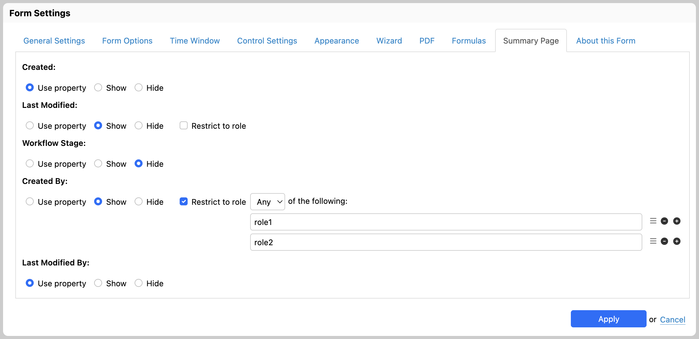

# Summary Page

\[SINCE Orbeon Forms 2026.1]

<figure><figcaption>
Summary Page tab of the Form Settings dialog
</figcaption></figure>

## Introduction

The Summary Page tab of the Form Settings dialog allows you to configure the visibility of form metadata columns on the [Summary page](../../form-runner/feature/summary-page.md). This provides a per-form alternative to using global [properties](../../configuration/properties/form-runner-summary-page.md), and adds the ability to restrict column visibility by user role.

The following form metadata columns can be configured:

| Metadata column  | Related property                                                                                                                                |
|------------------|-------------------------------------------------------------------------------------------------------------------------------------------------|
| Created          | [`oxf.fr.summary.show-created`](../../configuration/properties/form-runner-summary-page.md#created-and-last-modified-columns)                   |
| Last Modified    | [`oxf.fr.summary.show-last-modified`](../../configuration/properties/form-runner-summary-page.md#created-and-last-modified-columns)             |
| Workflow Stage   | [`oxf.fr.summary.show-workflow-stage`](../../configuration/properties/form-runner-summary-page.md#show-the-workflow-stage)                      |
| Created By       | [`oxf.fr.summary.show-created-by`](../../configuration/properties/form-runner-summary-page.md#show-created-by-and-last-modified-by-users)       |
| Last Modified By | [`oxf.fr.summary.show-last-modified-by`](../../configuration/properties/form-runner-summary-page.md#show-created-by-and-last-modified-by-users) |

## Display options

For each metadata column, you can choose one of the following options:

- **Use property** (default): the column's visibility is determined by the corresponding global property.
- **Show**: the column is always shown on the Summary page (subject to an optional role restriction, see below).
- **Hide**: the column is never shown on the Summary page.

## Role restriction

When "Show" is selected for a metadata column, a "Restrict to role" checkbox appears. When checked, an input field allows you to enter a role name. You can add multiple roles by using the "+" button.

When two or more roles are specified, a dropdown allows you to choose between:

- **All**: all specified roles must be present for the column to be shown.
- **Any**: at least one of the specified roles must be present for the column to be shown.

This is the same mechanism as the [role restriction in the Control Settings dialog](../control-settings.md#basic-options).

## Interaction with properties

The form-level settings in this tab take precedence over the corresponding global properties. If a metadata column is set to "Use property" (the default), the global property is used as a fallback.

## See also

- [Summary page](../../form-runner/feature/summary-page.md)
- [Summary page configuration properties](../../configuration/properties/form-runner-summary-page.md)
- [Role restriction in Control Settings](../control-settings.md#basic-options)
- [Workflow stage](../../form-runner/feature/workflow-stage.md)
