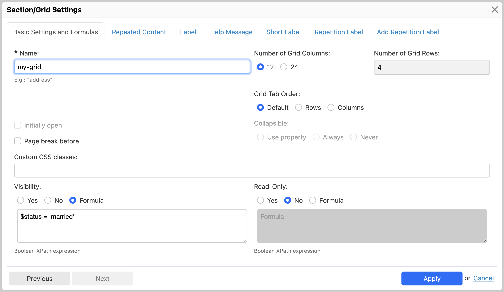

# Grid settings

## Settings shared with grids

See [Section and grid settings](container-settings.md).

## Basic settings

### Overview

### Number of grid columns

\[SINCE Orbeon Forms 2020.1\]

Orbeon Forms introduced a [12-column layout](/form-builder/form-area.md#the-12-column-layout) with Orbeon Forms 2017.2.

It is now possible to control whether an individual grid has 24 columns instead of 12. This is useful in particular when using a fluid form layout, which can be wider and accommodate more form controls on a given line. 

The default remains 12 columns. To change to 24 columns, choose the "24" option. The grid then allows moving cell boundaries on a 24-column resolution.

 

When going from 12 to 24 columns, the grid cells positions and widths are adjusted so that the grid looks the same. Similarly, when going from 24 to 12 columns, the grid cells positions and widths are adjusted so that the grid looks the same. However, if the grid contains controls whose position or width does not allow migrating the grid back to 12 columns, the "12" option is disabled.

## See also

- [Section and grid settings](container-settings.md)
- [Section settings](section-settings.md)
- [Repeat settings](repeat-settings.md)
- [Repeated grids](repeated-grids.md)
- [Formulas](formulas.md)
- [Section component](/form-runner/component/section.md)
- [Template syntax](template-syntax.md)
- [Wizard view](/form-runner/feature/wizard-view.md)
