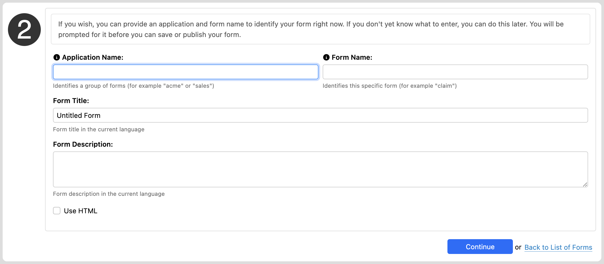
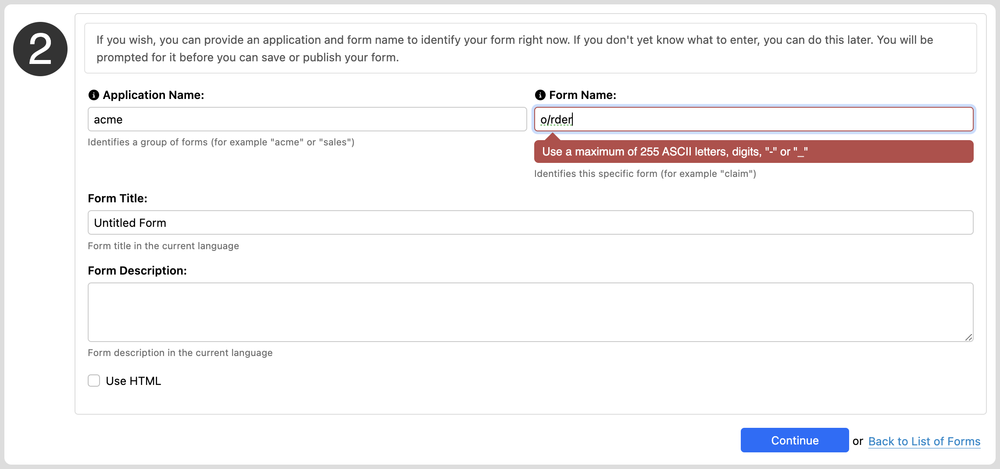

# Integration

## Form Builder URLs

### URL formats

The following URL patterns are followed:

- Summary page:
    `/fr/orbeon/builder/summary`
- New empty form definition:
    `/fr/orbeon/builder/new`
- Edit existing form definition:
    `/fr/orbeon/builder/edit/$id`
- [SINCE Orbeon Forms 2025.1] Review existing form definition in read-only mode:
    `/fr/orbeon/builder/view/$id` (see also [Reviewing a form definition](summary-page.md#reviewing-a-form-definition))

### Specifying the initial language of the form

[SINCE Orbeon Forms 4.10]

When navigating to `/fr/orbeon/builder/new`, Form Builder picks as default form language the language of the Form Builder
user interface. For example, if the Form Builder language is English, by default the new form's language is set to
English as well.

You can override this default by specifying the `fb-language` URL parameter (not to be confused with `fr-language`). For
example this sets the language of the form to Italian:

```
/fr/orbeon/builder/new?fb-language=it
``` 

### Bypassing the New Form dialog

[SINCE Orbeon Forms 4.10]

When navigating to `/fr/orbeon/builder/new`, Form Builder usually presents the user with the New Form dialog, which asks for at least an app and form name.



It is possible to bypass that dialog by providing the following URL parameters:

- `fr-app`: requested app name
- `fr-form`: requested form name
- `fr-title`: requested form title
- `fr-description`: requested form description

The dialog is actually bypassed only if the values passed are valid, specifically:

- `fr-app`
  - must be non-blank and only contain ASCII letters, digits, "-" or "_"
  - if Form Builder permission are enabled, the app name must be allowed by those permissions (see [Form Builder Permissions](../form-runner/access-control/editing-forms.md#form-builder-permissions))
- `fr-form`
  - must be non-blank and only contain ASCII letters, digits, "-" or "_"

In case the app and/or form name are missing or invalid, Form Builder presents the user with the New Form dialog. For example, with the following path:

```
/fr/orbeon/builder/new?fr-app=acme&fr-form=o/rder&fr-title=This+is+a+wonderful+form!
```



## See also

- [Form Runner Integration](../form-runner/overview/integration.md)
- [Form Builder Permissions](../form-runner/access-control/editing-forms.md)
