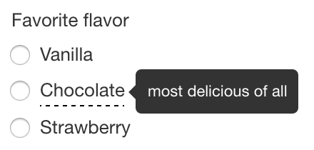
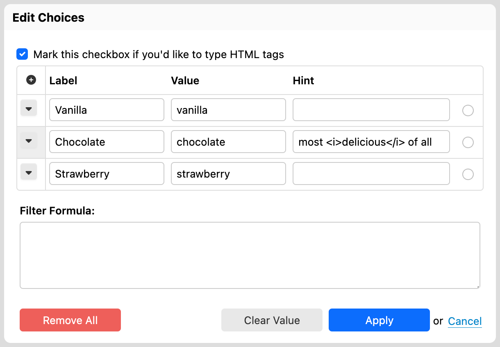
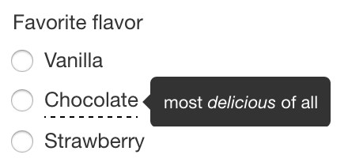
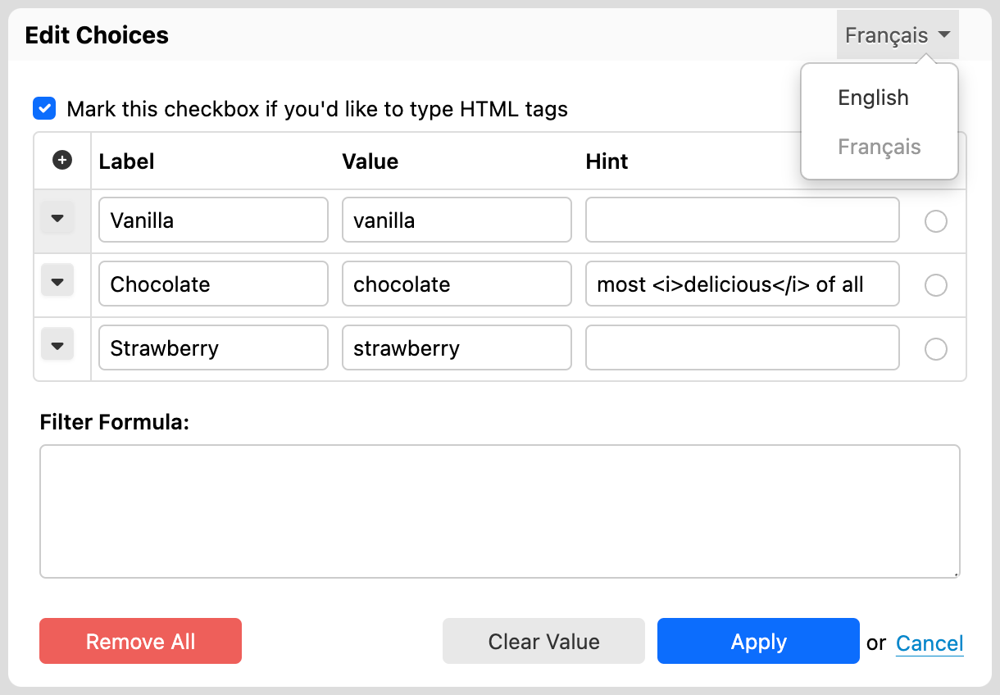

# Choices editor

## Introduction

You can edit the possible choices for selection controls by clicking on the icon that shows to the right of a control. When doing so, a dialog, like the one shown in the following screenshot, will appear.


For each choice, you can enter:

* **Label**: This is what users see when they fill out the form.
* **Value**: This is what is stored as part of the data when users select this choice.
* **Hint**: The third column only shows for radio buttons and checkboxes.
* **Selection**: For radio buttons and checkboxes, whether the item is selected by default.

If you provide a hint for a choice, that choice will be highlighted and the hint you provided will show when users move the mouse pointer over the label, as shown in the following screenshot:



For radio buttons and checkboxes, the "Mark this checkbox if you'd like to type HTML tags" option shows. If you check the HTML checkbox, all the hints and labels you type in dialog are interpreted as HTML, allowing you to use HTML tags in label and hints, say to make text bold or italic:



This results in the following hint:



You add items using the "+" button.

You move, insert and remove items using the menu to the left of each row. For example to remove an item entirely, use the "Remove Line" menu item:


## Selected items

You can select a default value for a radio button directly in the Form Builder editor simply by clicking the desired radio button or checkbox. You can also do this in the choices editor by clicking the radio button or checkbox associated with an item.

For radio buttons, the choices editor allows you to clear the selected value with the "Clear Value" button.

## Internationalization

When the form has more than one language, the choices editor opens in the language selected in Form Builder. You can switch between languages directly in the choices editor. Switching the language allow you to localize labels and hints. However, values are shared between all languages.



Item values are not localizable: they remain the same for each language. On the other hand, item labels can be localized. For example:

* English
  * Name: "Strawberry"
  * Value: "strawberry"
* French
  * Name: "Fraise"
  * Value: "strawberry"

This ensures that the data captured is machine-readable even if the user interface language changes.


## Removing all items

\[SINCE Orbeon Forms 2016.3]

The "Remove All" button removes all the items in the itemset. This is particularly useful when opening the choices editor for the first time for a given control, since by default itemsets contain default values.

## Filtering items

[\[SINCE Orbeon Forms 2024.1.1\]](../release-notes/orbeon-forms-2024.1.1.md)

The "Filter" field allows filtering items by label or value by entering a formula:

* the formula's context is an individual `<item>` element, which contains
  * a `<label>` child element
  * a `<value>` child element
  * a `<hint>` child element
* the formula must return a boolean value

In the following example, the following formula will filter out the item with `strawberry` as a value if the form control named `allow-fruits` is set to `false`:

```xpath
$allow-fruits/string() = 'true' or value != 'strawberry'
```


## Usability notes

* When in a label field, pressing the "tab" key into an empty value field automatically creates a default value. For example:
  * "Apple" becomes "apple"
  * "Wax Apple" becomes "wax-apple"
* When in a value field, pressing the "enter" key automatically adds a new item after the current item.

## Constraints on multiple selection controls values

While for _single selection controls_ (e.g. radio buttons), the value can be any string of characters, for _multiple selection controls_ (e.g. checkboxes), the value must **not contain spaces**.

The reason for this restriction is that, in the data, the values of checkboxes are stored as _space-separated tokens_. So if you have values `chocolate` and `strawberry` selected, you'll have in the data:

```
chocolate strawberry
```

If the value has a space in it, say `chocolate chip`, then the result would be:

```
chocolate chip strawberry
```

and it would be unclear which values are selected.

## See also

* Blog post: [Hints for checkboxes and radio buttons](https://blog.orbeon.com/2014/02/hints-for-checkboxes-and-radio-buttons.html)
