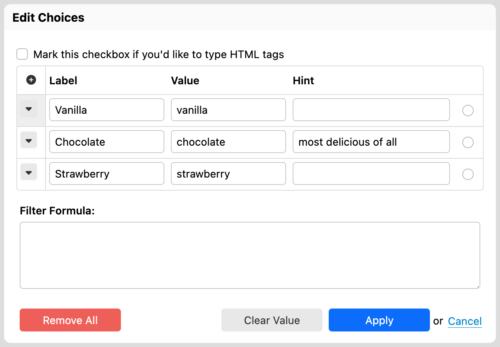
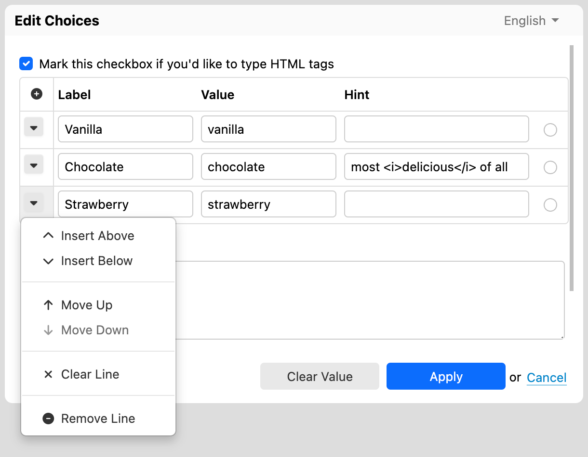

# Itemset editor

<!-- toc -->

## Introduction

You can edit the possible choices for selection controls by clicking on the icon that shows to the right of a control. When doing so, a dialog, like the one shown in the following screenshot, will appear.

For each choice, you can enter:

- __Label__: This is what users see when they fill out the form.
- __Value__: This is what is stored as part of the data when users select this choice.
- __Hint__: The third column only shows for radio buttons and checkboxes.
- __Selection__: For radio buttons and checkboxes, whether the item is selected by default.

If you provide a hint for a choice, that choice will be highlighted and the hint you provided will show when users move the mouse pointer over the label, as shown in the following screenshot:

For radio buttons and checkboxes, the "Mark this checkbox if you'd like to type HTML tags" option shows.  If you check the HTML checkbox, all the hints and labels you type in dialog are interpreted as HTML, allowing you to use HTML tags in label and hints, say to make text bold or italic:

This results in the following hint:

You add items using the "+" button.

You move, insert and remove items using the menu to the left of each row. For example to remove an item entirely:

## Selected items

You can select a default value for a radio button directly in the Form Builder editor simply by clicking the desired radio button or checkbox. You can also do this in the itemset editor by clicking the radio button or checkbox associated with an item.

For radio buttons, the itemset editor allows you to clear the  selected value with the "Clear Value" button.
 
## Internationalization

When the form has more than one language, the itemset editor opens in the language selected in Form Builder. You can switch between languages directly in the itemset editor. Switching the language allow you to localize labels and hints. However, values are shared between all languages. 

## Removing all items

[SINCE Orbeon Forms 2016.3]

The "Remove All" button removes all the items in the itemset. This is particularly useful when opening the itemset editor for the first time for a given control, since by default itemsets contain default values.

## Usability notes

- When in a label field, pressing the "tab" key into an empty value field automatically creates a default value. For example:
    - "Apple" becomes "apple"
    - "Wax Apple" becomes "wax-apple"
- When in a value field, pressing the "enter" key automatically adds a new item after the current item.

## Constraints

A value has constraints:

- For single selection controls (e.g. radio buttons), the value can be any string of characters.
- For multiple selection controls (e.g. checkboxes), the value must not contain spaces.

Item values are not localizable: they remain the same for each language. On the other hand, item labels can be localized. For example:

- English
    - Name: "Apple"
    - Value: "apple"
- French
    - Name: "Pomme"
    - Value: apple

This ensures that the data captured is machine-readable even if the user interface language changes.

## See also

- Blog post: [Hints for checkboxes and radio buttons](http://blog.orbeon.com/2014/02/hints-for-checkboxes-and-radio-buttons.html)
