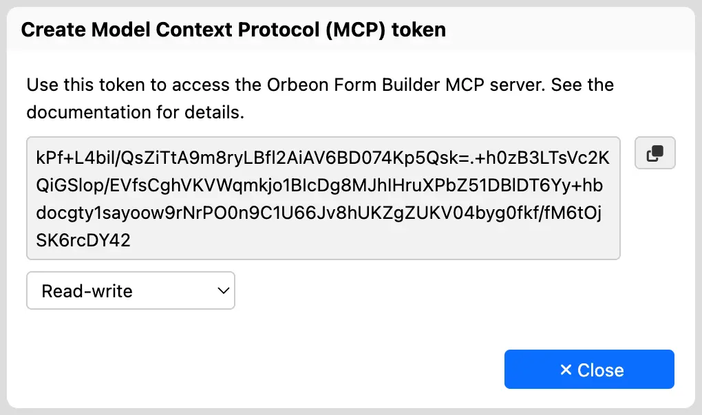
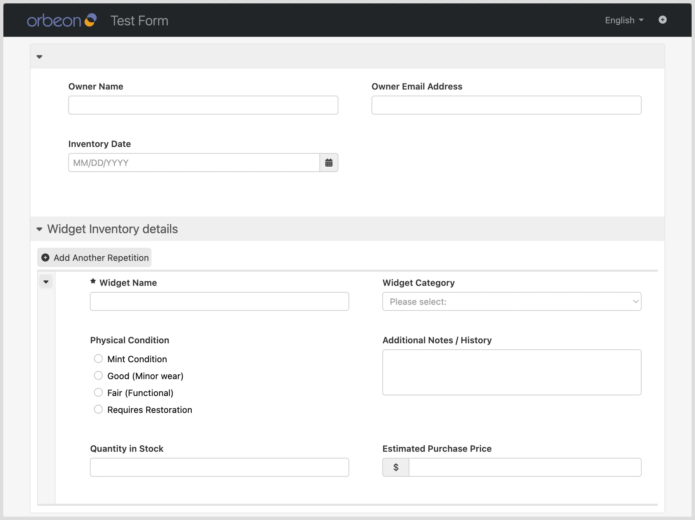

# Form Builder MCP

## Availability

[\[SINCE Orbeon Forms 2025.1.2\]](/release-notes/orbeon-forms-2025.1.2.md)

This is an experimental feature, which means that it is not yet fully documented and may change in the future. If you are interested in using or contributing to this feature, please contact us.

## What it does

The Form Builder MCP server exposes Form Builder functionality to AI agents, such as Claude Code, Claude Cowork, OpenAI Codex, and Google Antigravity via the [Model Context Protocol (MCP)](https://modelcontextprotocol.io/docs/getting-started/intro), a standard protocol supported by most AI agents. This allows AI agents to interact with Form Builder, for example to:

- create forms based on user instructions
- modify existing forms based on user instructions
- retrieve information about forms, such as their structure and metadata

## Configuration

### Orbeon Forms configuration

By default, the MCP server is disabled. To enable it, set the following property:

```xml
<property 
    as="xs:boolean" 
    name="oxf.fb.mcp.enable" 
    value="true"/>
```

By default, the MCP server requires a token, which is signed with a password. Set the token password with the following property:

```xml
<property 
    as="xs:string"  
    name="oxf.fb.mcp.token.password" 
    value="This is not a very safe password!"/>
```

In order to revoke all tokens issued, simply change the token password.

Once you have those two properties in place, you can generate a token from Form Builder, using the "Create Model Context Protocol (MCP) token" dialog.

<figure><figcaption>Creating an MCP token in Form Builder</figcaption></figure>

If choosing "Readonly" access, only read-only operations will be allowed, such as listing forms and retrieving form metadata. If choosing "Read/Write" access, all operations will be allowed, including creating and modifying forms.

By default, the token validity is one day. You can change this by setting the following property:

```xml
<property 
    as="xs:integer" 
    name="oxf.fb.mcp.token.validity" 
    value="1440"/>
```

The duration is in minutes, so:

- `1440` means 24 hours (1 day)
- `10080` means 7 days (1 week)
- `44640` means 31 days (1 month)


### AI agent configuration

Command-line AI agents usually have a configuration file:

- Copilot CLI: `~/.copilot/mcp-config.json`
- Antigravity CLI: `~/.gemini/antigravity-cli/mcp_config.json`

Here is a Copilot example:

```json
{
  "mcpServers": {
    "orbeon": {
      "type": "http",
      "url": "URL_TO_FORM_BUILDER_MCP_SERVER",
        "headers": {
            "Authorization": "AUTHORIZATION_TOKEN"
      }
    }
  }
}
```

Here is an Antigravity example:

```json
{
  "mcpServers": {
    "orbeon": {
        "serverUrl": "URL_TO_FORM_BUILDER_MCP_SERVER",
        "headers": {
          "Authorization": "AUTHORIZATION_TOKEN"
        }
    }
  }
}


```

Where:

- `URL_TO_FORM_BUILDER_MCP_SERVER` is the URL of the Form Builder MCP server, for example `https://example.org/orbeon/fr/mcp/builder`
    - An important part is `/fr/mcp/builder`, which is the path to the MCP server in Form Builder.
    - The domain, port, and prefix (here `/orbeon`) should be those of your Orbeon Forms instance.
- `AUTHORIZATION` is the value of the `Authorization` header to use when making requests to the MCP server.
    - If token support is enabled, this should be in the format `Bearer 12345678`, where `12345678` is the token generated from Form Builder.

You can also add to your AI agent a skill file. The latest version of the skill file can be found [in the Orbeon Forms GitHub repository here](https://github.com/orbeon/orbeon-forms/blob/master/.agents/skills/orbeon/SKILL.md). You place such as file in the appropriate location for your AI agent, for example:

```
.agents/skills/orbeon/SKILL.md
```

Once the MCP server and skill configuration is done, you can start using the AI agent to interact with Form Builder.

## List of tools available

### Form Lifecycle

| Tool                   | Description                                                |
|------------------------|------------------------------------------------------------|
| `form_new`             | Create a new form and return a session ID                  |
| `form_edit`            | Open an existing form for editing and return a session ID  |
| `form_view`            | Open an existing form in view mode and return a session ID |
| `form_save`            | Save the current form                                      |
| `form_close`           | Close the current form                                     |
| `form_set_title`       | Set the title of the current form                          |
| `form_set_description` | Set the description of the current form                    |

### Structure

| Tool                          | Description                                                           |
|-------------------------------|-----------------------------------------------------------------------|
| `form_get_structure`          | Get the structure of the current form (sections, grids, and controls) |
| `section_insert`              | Insert a new section into the form                                    |
| `grid_insert`                 | Insert a new grid into a section                                      |
| `container_move`              | Move a section or grid to a different location in the form            |
| `section_grid_control_rename` | Rename a section, grid, or control by its current name                |
| `section_grid_control_delete` | Delete a section, grid, or control by its name                        |
| `section_control_set_label`   | Set the visible label of a section or control by its name             |

### Controls

| Tool                                   | Description                                                                                |
|----------------------------------------|--------------------------------------------------------------------------------------------|
| `control_insert`                       | Insert a new control into a grid                                                           |
| `control_move`                         | Move a control into a different grid                                                       |
| `control_set_items`                    | Set the static items (choices) for a selection control (dropdown, radio, checkboxes, etc.) |
| `control_get_validation`               | Get validation settings (required, datatype, constraints) for a control                    |
| `control_set_validation`               | Set validation settings (required, datatype, constraints) for a control                    |
| `list_available_toolbox_form_controls` | List all available toolbox form controls with their types and details                      |

### Languages

| Tool                               | Description                                                                              |
|------------------------------------|------------------------------------------------------------------------------------------|
| `form_list_languages`              | List the languages currently configured in the form                                      |
| `form_add_language`                | Add a new language to the form (copies existing resource structure for the new language) |
| `form_remove_language`             | Remove a language and all its resource entries from the form                             |
| `list_available_toolbox_languages` | List all languages available in Orbeon that can be added to the form                     |

## Usage patterns

With MCP support, you can use your AI agent to interact with Form Builder in various ways using prompts such as:

> Using Orbeon, create a new demo form for a personal collection of widgets. Split the form into sections, and use appropriate form controls. Then save and close the form.

The result might look like this:



Further prompts can be used to update the form layout, for example:

> Using Orbeon, edit form 33e71949140e1282b9428770176994bdb24c702a and modify the size of control widget-quantity to half its current width. 

Or add validation rules:

> Using Orbeon, update form 33e71949140e1282b9428770176994bdb24c702a to make the type of the widget-quantity field a non-negative integer.

## Using WebMCP

You can also use Orbeon Forms's AI agent support using WebMCP, an interface directly available in Form Builder.

As of Summer 2026, you can use it with:

- [WebMCP - Model Context Tool Inspector](https://chromewebstore.google.com/detail/webmcp-model-context-tool/gbpdfapgefenggkahomfgkhfehlcenpd)
    - This is a Chrome extension which allows you to interact with the MCP server directly from the browser.
    - In order to run prompts, you need a Google Gemini API key.
    - You need to enable this with a flag in Chrome. 
- [Chrome DevTools for agents](https://github.com/ChromeDevTools/chrome-devtools-mcp)
    - This is a tool which allows you to use MCP to interact with Chrome DevTools.
    - This includes WebMCP support, which allows AI agents to use this extension to access WebMCP.
    - You need to enable this with a flag in Chrome.

It is expected that support for WebMCP will grow quickly, and that more tools will become available directly in the browser in the future.
