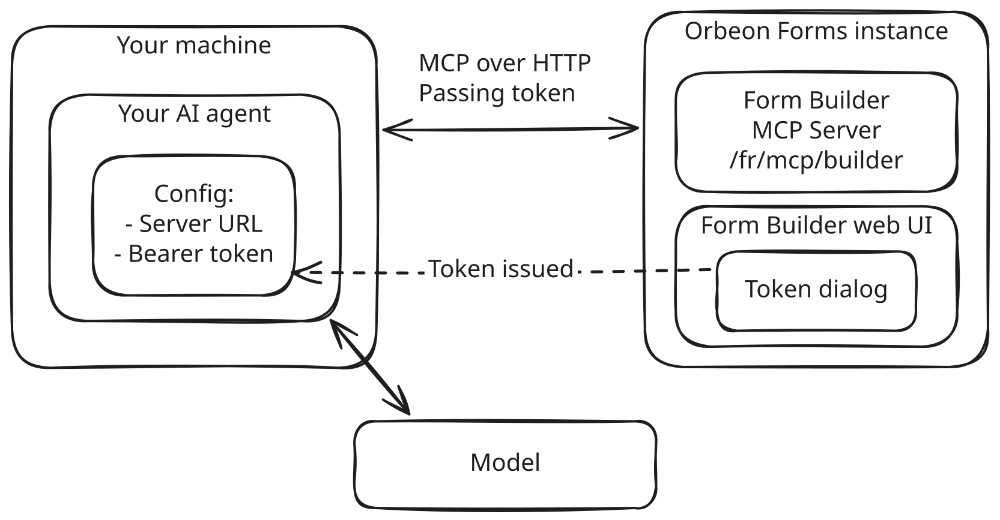
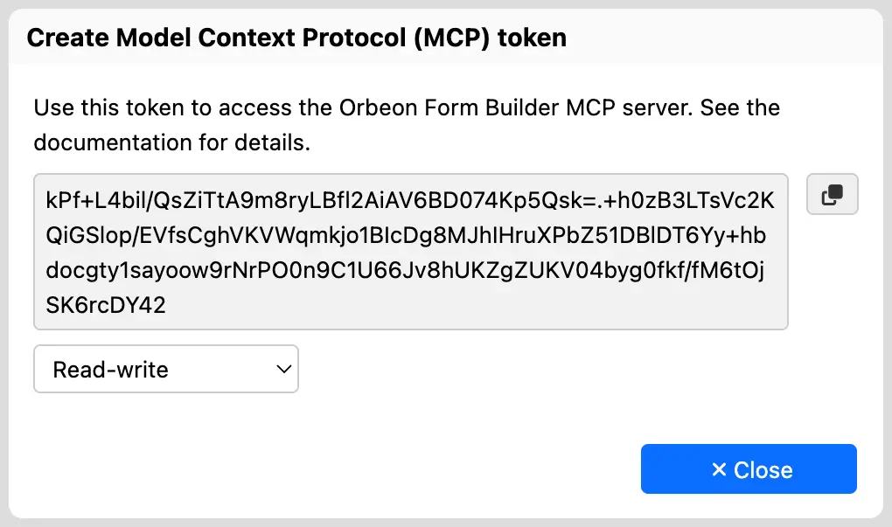
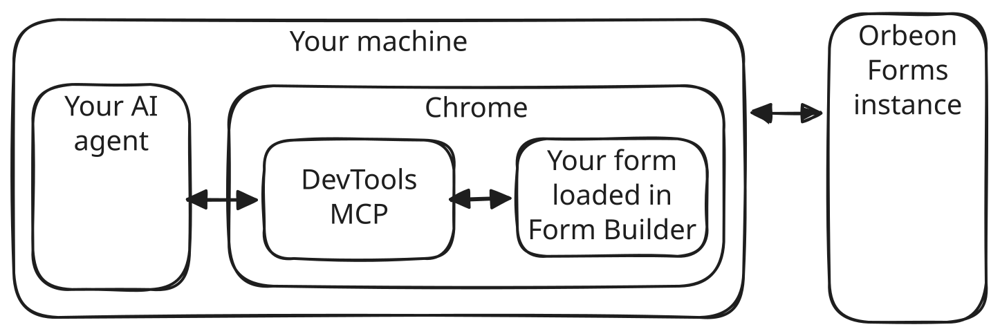
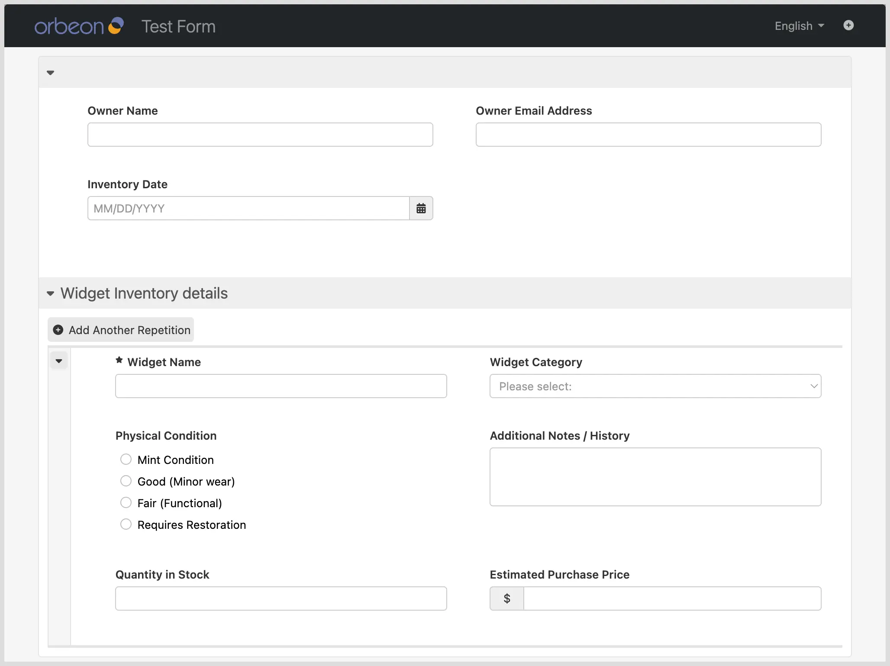

# Form Builder MCP

## Availability

[\[SINCE Orbeon Forms 2025.1.2\]](/release-notes/orbeon-forms-2025.1.2.md)

This is an early access feature. We're actively working to improve it by creating more tools that expose additional Form Builder functionality to AI agents and by improving the documentation and ergonomics. We believe it is already very useful, which is why we want to make it available to you early. Please let us know if you have any feedback.

Watch the video which shows Form Builder MCP support in the browser:



## What it does

The Form Builder MCP server makes Form Builder's features available to AI agents through the MCP (Model Context Protocol), which is a standard protocol supported by most AI agents. This allows AI agents to interact with Form Builder to:

- create forms based on user instructions
- modify existing forms based on user instructions
- retrieve information about forms, such as their structure and metadata.

Orbeon Forms provides both:

- A Form Builder MCP Server; this is covered in the first section below.  
- Support for WebMCP in Form Builder loaded in your browser; this is covered in the second section below.

## MCP Server

Using any MCP server (not just Orbeon Forms'), involves 3 parts, illustrated in the diagram below:

- On the right, the MCP server itself. In our case, the MCP server is part of Orbeon Forms, which you already have.
- On the left, an AI agent. This is a software that you install on your own laptop or workstation. It provides the chat interface.
- At the bottom, an AI model. Typically, the AI model runs in the cloud. Local model can also be used, but this isn't something we cover on this page. 

<figure><figcaption>AI agent connected to Form Builder MCP</figcaption></figure>

To use the MCP server:

1. Follow the first section below, *Orbeon Forms*.
2. Then jump to the section that corresponds to your agent of choice (*Claude Code*, *Codex CLI*, *GitHub Copilot CLI*, or *Antigravity*). If you have an OpenRouter key or account, instead jump to the *OpenRouter* section.
3. Finally, optionally set up a skill as mentioned in the *Skill* section.

### Orbeon Forms

Set the following property 3 properties in your `properties-local.xml`:

1. The first enables the MCP server (it is disabled by default).
2. The second sets the password used to sign the token. You need to set the value of this property to a secure password. Should you, in the future, want to revoke all tokens issued, simply change this password.
3. The third sets the token validity to one year (the duration is in minutes).

```xml
<property 
    as="xs:boolean" 
    name="oxf.fb.mcp.enable" 
    value="true"/>
<property 
    as="xs:string"  
    name="oxf.fb.mcp.token.password" 
    value=""/>
<property 
    as="xs:integer" 
    name="oxf.fb.mcp.token.validity" 
    value="525600"/>
```

Once you have those properties in place, you can generate a token. Open any form in Form Builder and click on the key icon that shows at the top right of the page to reveal the token dialog. If you'd like your agent to be able to create and edit forms, in the dropdown choose "Read/Write", then click on the button to the right of the token to copy its value. 

<figure><figcaption>Creating an MCP token in Form Builder</figcaption></figure>

Then continue in the below section that corresponds to your configuration. In what follows:

- Change `YOUR_TOKEN` with the value of the token you just copied in Form Builder.
- If needed, change the `http://localhost:8080/orbeon/fr/mcp/builder` URL:
    - Keep the `/fr/mcp/builder` part, which is the path to the MCP server in Form Builder.
    - The domain, port, and prefix (here `/orbeon`) should be those of your Orbeon Forms instance.

### Claude Code

Add the MCP server with:

```
claude mcp add orbeon http://localhost:8080/orbeon/fr/mcp/builder \
    --scope user \
    --transport http \
    --header "Authorization: Bearer YOUR_TOKEN"
```

You can then run `claude mcp list` to check it was correctly added and that Claude is able to connect. 

### Codex CLI

Declare an `ORBEON_MCP_TOKEN` environment variable with the value of your token value (`YOUR_TOKEN`), then run:

```
codex mcp add orbeon \
    --url http://localhost:8080/orbeon/fr/mcp/builder \ 
    --bearer-token-env-var ORBEON_MCP_TOKEN
```

You can then run `codex mcp list` to check it was correctly properly added.

### GitHub Copilot CLI

Add the MCP server with:

```
copilot mcp add orbeon \
    --url http://localhost:8080/orbeon/fr/mcp/builder \
    --type http \
    --header "Authorization=Bearer YOUR_TOKEN"
```

### Antigravity

Whether you're using Antigravity 2.0 or Antigravity CLI, edit your `~/.gemini/config/mcp_config.json` to add the `orbeon` MCP server, for example:

```json
{
  "mcpServers": {
    "orbeon": {
      "serverUrl": "http://localhost:8080/orbeon/fr/mcp/builder",
      "headers": {
        "Authorization": "Bearer YOUR_TOKEN"
      }
    }
  }
}
```

### OpenRouter

1. Follow the steps in [Use Claude Code with OpenRouter](https://openrouter.ai/docs/cookbook/coding-agents/claude-code-integration).
2. Set up the MCP server as described in above section for *Claude Code*.
3. Run `claude`.
4. Pick a [model](https://openrouter.ai/models), say with `/model z-ai/glm-5.3`.
5. Tell the agent what you'd like it to do, say `Using Orbeon, create a new demo form with just a First name field`.
6. In your browser, load the Form Builder summary page, and check the form got created.

### Skill

Optionally, you can provide your AI agent with a skill file. The latest version of the skill file can be found [in the Orbeon Forms GitHub repository here](https://github.com/orbeon/orbeon-forms/blob/master/.agents/skills/orbeon/SKILL.md). You place such as file in the appropriate location for your AI agent, for example:

```
.agents/skills/orbeon/SKILL.md
```

## WebMCP

<figure><figcaption>AI agent connected to Form Builder through WebMCP</figcaption></figure>

As of Summer 2026, WebMCP is a nascent, but very promising standard. The idea is that users will load a WebMCP page in their browser, open an agent in a sidebar, either built in the browser or provided by a browser extension, and the agent in the sidebar will be able to use tools provided by that page. Gemini in Chrome would be a prime candidate to support this, and other vendors like Anthropic or OpenAI could provide similar support through a browser extensions. This could provide a very seamless experience for users.

Today, we get a taste for what using WebMCP will feel like by using a regular external agent, such as Claude or Codex. To set this up:   

1. In Chrome, open `chrome://flags/`, search for "MCP", enable both "WebMCP support in DevTools" and "WebMCP for testing", then restart the browser.
2. Set up your agent to add [Chrome DevTools for agents](https://github.com/ChromeDevTools/chrome-devtools-mcp). Make sure to use the `--autoConnect` parameter so your agent can connect to a live browser (for instance, with Claude Code, use `claude mcp add chrome-devtools -s user -- npx chrome-devtools-mcp@latest --autoConnect`).
3. In Chrome, open a form in Form Builder, and ask your agent "with Chrome DevTools, through WebMCP, give me a list of the control in the form I have open in Form Builder".

This set up quite convenient:

- It doesn't require users to generate a token in Form Builder and set up their agent with that token.
- Users can see changes made to the form in real time in the browser. They can also make their own changes, and use both the agent and the Form Builder UI in the same session to update a form.
- In the future, when agents built in the browser, such as Gemini in Chrome, support WebMCP, users will be able to do all of the above directly from their browser, without even having to install an external agent.

## Usage patterns

With MCP support, you can use your AI agent to interact with Form Builder in various ways using prompts such as:

> Using Orbeon, create a new demo form for a personal collection of widgets. Split the form into sections, and use appropriate form controls. Then save and close the form.

The result might look like this:



Further prompts can be used to update the form layout, for example:

> Using Orbeon, edit form 33e71949140e1282b9428770176994bdb24c702a and modify the size of control widget-quantity to half its current width. 

Or add validation rules:

> Using Orbeon, update form 33e71949140e1282b9428770176994bdb24c702a to make the type of the widget-quantity field a non-negative integer.
