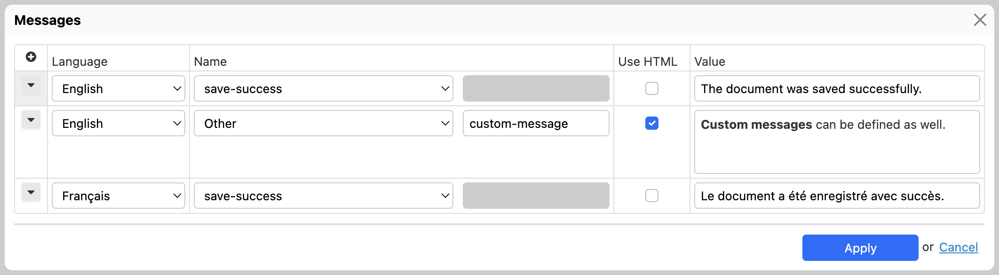

# Messages

[SINCE Orbeon Forms 2023.1]

## Purpose

Some of the [Form Runner actions](/form-runner/advanced/buttons-and-processes/actions-form-runner.md) display messages to users. For instance, when a form is saved, a message is displayed to confirm that the form was saved successfully. The Messages dialog allows you to customize those messages directly in Form Builder, instead of using properties such as `oxf.fr.resource.*.*.en.detail.messages.save-success`.

## Usage

You can open the Messages dialog by clicking on the "Messages" button, under the "Advanced" tab, in the toolbox.

Each message must have a language, a name, and a value.

The message name can be one of the pre-defined names present in [Form Runner's `resources.xml`](https://github.com/orbeon/orbeon-forms/blob/master/form-runner/jvm/src/main/resources/apps/fr/i18n/resources.xml) (e.g. `save-success` or `upload-error`) or a custom name, which can be entered by selecting "Other".

When a message is defined in the Messages dialog, it overrides any message defined in a property.

## See also

- [`success-message()` and `error-message()` actions](/form-runner/advanced/buttons-and-processes/actions-form-runner.md#success-message-and-error-message)
- Blog post: [Customizing Form Runner messages directly from Form Builder](khttps://blog.orbeon.com/2023/10/customizing-form-runner-messages.html)