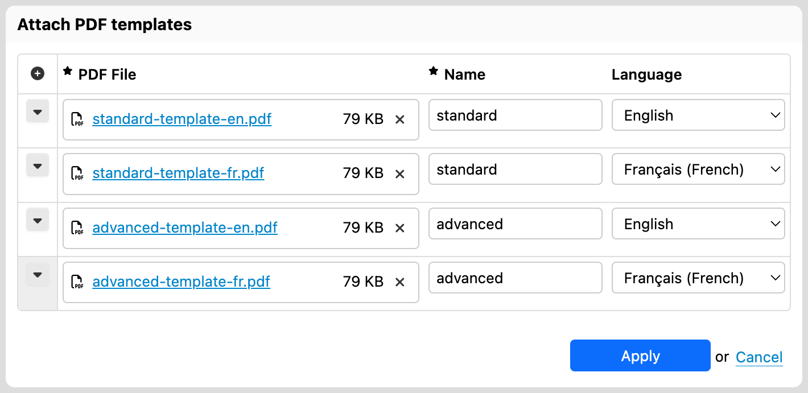

# PDF templates

## How PDF templates work

The purpose of this feature is to allow using existing PDF forms and using Form Runner to fill them out. This has the benefit that your organization can reuse existing forms, which might have been designed carefully for printing or archival purposes.

A PDF template must include Acrobat form fields. You can create these with Acrobat Professional. At runtime, when producing a filled-out PDF, Form Runner performs the following operations:

- read the PDF template
- read the filled-out form data
- fill out the fields in the PDF template based on the data

## Attaching a PDF template

You attach one or more PDF templates to a form definition in Form Builder using the "PDF Templates" button in the "Advanced" tab of the toolbox.



[SINCE Orbeon Forms 2018.1]

You can attach more than one PDF template. Templates are differentiated by name and/or language. It is not possible to have duplicate name/language combinations. The idea is that you can create separate PDF templates:

- per language
- and/or per a given name, selected when creating the PDF

The rules that govern which of the available PDF templates is selected when sending a PDF document are documented [here](../form-runner/advanced/buttons-and-processes/actions-form-runner-send.md).

## Creating a PDF template for use with Form Builder

### Steps

In order to create a template, you need Acrobat Professional or a similar tool to edit PDF fields. Here we assume Acrobat Professional.

1. Open an existing PDF document
2. Perform automatic field detection
3. Remove incorrectly detected areas
4. Set all field names, as per the `my-section$my-field` explained below

*NOTE: For languages like French, make sure that fields in the form have an Arial font, not Helvetica. Not using Arial can cause issue with accents.*


### Naming fields

Form Runner identifies the PDF fields to fill-out based on their name. Those names must follow the following convention:

- Let's assume you the name of a field to `my-field` and the name of the section in which that field is to `my-section`.
- The name of the PDF field must be: `my-section$my-field`.

[LIMITATION] It has been [reported](http://discuss.orbeon.com/Creating-a-PDF-template-for-use-with-Form-Builder-td931856.html) that Adobe LiveCycle Designer does not support the `$` character in field names.

[SINCE Orbeon Forms 2018.2]

The PDF field name is shown in the ["Control Settings"](/form-builder/control-settings.md) dialog under "Name of the PDF field".

In the case of repeated fields, note that the name shows an example *suffix* containing the repeat iterations, such as `$1` or `$1-1`. To target individual iterations, use the appropriate repetition number, for example:

- `section-1$location$1`
- `section-1$location$2`

or, for a control in a nested repeated section or grid:

- `section-1$location$1-1`
- `section-1$location$1-2`
- `section-1$location$1-3`
- `section-1$location$2-1`
- `section-1$location$2-2`

etc.


## Controls

### Multi-line text

- Enable multi-line in Acrobat form field
- Set a white background if necessary to hide dotted lines from the original form

### Exclusive checkboxes or radio buttons

In the PDF, create multiple fields of type radio button (which can visually appear like checkboxes or radio buttons - the defining feature is that they are exclusive), all with the same name: `my-section$my-field`, but each with an _Export value_ matching the corresponding value in your form. In summary:

- Use PDF radio buttons with the desired appearance.
- Use the *same name* for all controls.
- Use *different export values* for each control.
- The checkbox value (and *not* the label) is used by Form Runner to match on the export value.

### Non-exclusive checkboxes

- Create multiple PDF checkboxes.
- Each checkbox must have a different name of the form `my-section$my-field$value`, where `value` corresponds to the item value in your form.
- Set an *export value* for all the checkboxes of `true`.

### Boolean checkboxes

For a boolean checkbox:

- Create a single non-exclusive PDF checkbox.
- Name it `my-section$my-field` or `my-section$my-field$true`.
- Set an *export value* of `true`.

### Image attachments

To place an image attachment on your PDF, simply add a placeholder Acrobat form field.

- This field will be used by the PDF engine to determine the image location and dimensions.
- Name the field using the `my-section$my-field` format, where `my-field` is the name of the image attachment field in Form Builder.

When the resulting PDF is generated by Form Runner, the field will not contain text, but the image attachment will be placed within the space defined by the field.

### Repeats

When a control is within a repeat:

- the identifier of the repeat must be included in the acrobat field name
- the repeat iteration must be appended to the acrobat field name

So for example, if you have the hierarchy:

- `my-section`
- `my-repeat`
- `my-input`

The field names must look like:

- `my-section$my-repeat$my-input$1` for the first iteration
- `my-section$my-repeat$my-input$2` for the second iteration
- etc.

When using a PDF template, Orbeon Forms can only fill out fields that are already present in the PDF template. It cannot add new iterations. This means that the maximum number of allowed iterations in the form must match the number of iterations present in the PDF template.


## Font configuration and embedding

In template mode, fonts can be specified to provide glyphs which are not present in the PDF's original font(s). Several fonts can be specified, separated by spaces:

```xml
<property
    as="xs:string"
    name="oxf.fr.pdf.template.font.paths"
    value="/path/to/font1.ttf /path/to/font2.ttf"/>
```

## See also

- [PDF Production](pdf-production.md)
- [Automatic PDF](pdf-automatic.md)
- [Testing PDF production](pdf-test.md)
- [TIFF Production](../form-runner/feature/tiff-production.md)
- [Sending PDF and TIFF content: Controlling the format](../form-runner/advanced/buttons-and-processes/actions-form-runner-send.md)
