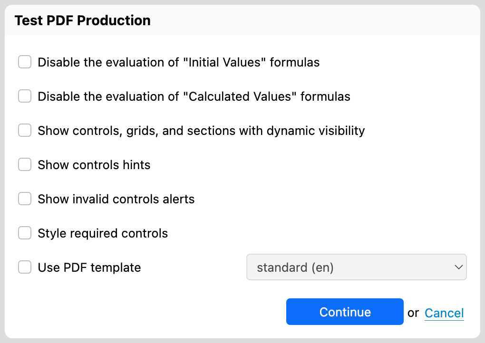
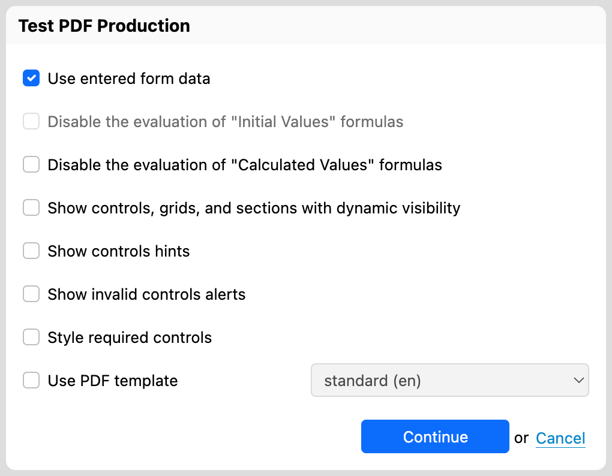
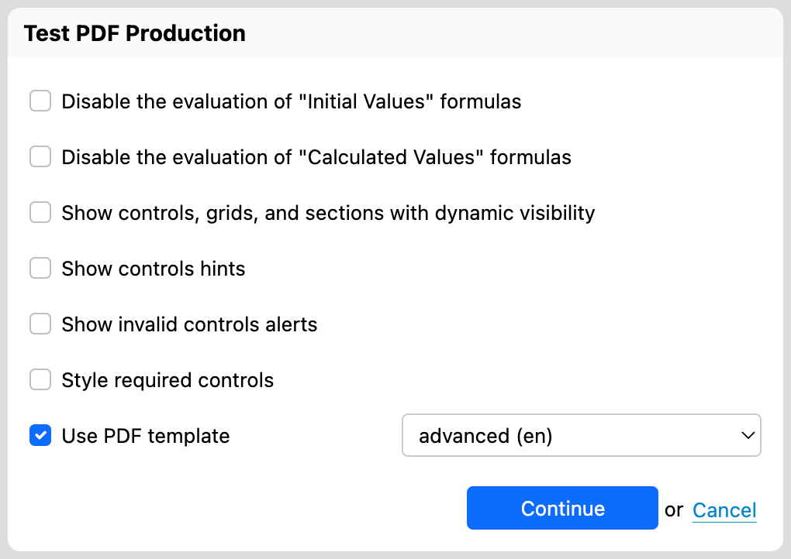

# Testing PDF production

## Availability

[SINCE Orbeon Forms 2021.1]

## How to test PDF production

There are two ways to access the "Test PDF" function:

1. directly from the Form Builder's main window's "Test" menu 
2. from the "Test Form" window

When accessed directly, "Test PDF" shows the following dialog:

When accessed from the "Test Form" window, "Test PDF" shows the following dialog:

You have access to the following options: 

- __Use entered form data__
  - This option only shows when accessed from the "Test Form" window.
  - When selected, any data currently entered in the form will be used to produce the PDF.
- __Disable the evaluation of "Initial Values" formulas__
  - If "Use entered form data" is selected, this option is disabled as the form data takes precedence.
  - When selected, all "Initial Value" formulas are disabled, as if they were not present.
- __Disable the evaluation of "Initial Values" formulas__
  - When selected, all "Initial Value" formulas are disabled, as if they were not present.
- __Disable the evaluation of "Calculated Values" formulas__
  - When selected, all "Calculated Value" formulas are disabled, as if they were not present.
- __Show controls, grids, and sections with dynamic visibility__
  - When selected, all controls, grids, and sections that can be dynamically shown are shown.
  - This means that those with visibility "Yes" or "Formula" are always shown. Controls with visibility "No" remain not visible.
  - Use cases include:
    - Verifying that every control, grid, or section that can appear in the PDF appears correctly.
    - Exporting the PDF file for printing and manual filling.
- __Use PDF template__
  - This only shows if the form has attached PDF templates.
  - See below for details.

Selecting "Continue" opens the resulting PDF, which will show in your browser window.

## PDF templates

The "Test PDF" dialog lets you choose between the [automatic PDF](pdf-automatic.md) or one of the available [PDF templates](pdf-templates.md) when testing.

## Showing hints and alerts

[\[SINCE Orbeon Forms 2023.1\]](/release-notes/orbeon-forms-2023.1.md)

Two options allow you to show controls hints and alerts in the resulting PDF:

This is an example of the resulting PDF with hints and alerts:

See also [The `open-rendered-format()` action](/form-runner/advanced/buttons-and-processes/actions-form-runner.md#open-rendered-format).

## See also 

- Blog post: [Testing PDF production in Form Builder](https://blog.orbeon.com/2021/11/testing-pdf-production-in-form-builder.html)
- [PDF Production](pdf-production.md)
- [Automatic PDF](pdf-automatic.md)
- [PDF templates](pdf-templates.md)
- [The `open-rendered-format()` action](/form-runner/advanced/buttons-and-processes/actions-form-runner.md#open-rendered-format)
- [Testing in web mode](web-test.md)
- [Testing in offline mode](offline-test.md)