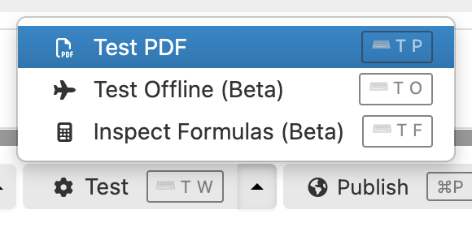

# Testing PDF production

## Availability

[SINCE Orbeon Forms 2021.1]

## How to test PDF production

There are two ways to access the "Test PDF" function:

1. directly from the Form Builder's main window's "Test" menu 
2. from the "Test Form" window

In either case, selecting "Test PDF" shows the following dialog:

You have access to the following options: 

- "Disable the evaluation of "Initial Values" formulas": when selected, all "Initial Value" formulas are disabled, as if they were not present.
- "Disable the evaluation of "Calculated Values" formulas": when selected, all "Calculated Value" formulas are disabled, as if they were not present.
- "Show controls, grids, and sections with dynamic visibility": when selected, all controls, grids, and sections that can be dynamically shown are shown. This means that those with visibility "Yes" or "Formula" are always shown. Controls with visibility "No" remain not visible.

Use cases for enabling the last option include:

- Verifying that every control, grid, or section that can appear in the PDF appears correctly.
- Exporting the PDF file for printing and manual filling.

Selecting "Continue" simply opens the resulting PDF, which will show in your browser window.

When you access the "Test PDF" feature from Form Builder's "Test Form" window, any data currently entered in the form will show in the PDF.

## PDF templates

The "Test PDF" dialog lets you choose between the [automatic PDF](pdf-automatic.md) or one of the available [PDF templates](pdf-templates.md) when testing.

## See also 

- Blog post: [Testing PDF production in Form Builder](https://blog.orbeon.com/2021/11/testing-pdf-production-in-form-builder.html)
- [PDF Production](pdf-production.md)
- [Automatic PDF](pdf-automatic.md)
- [PDF templates](pdf-templates.md)
