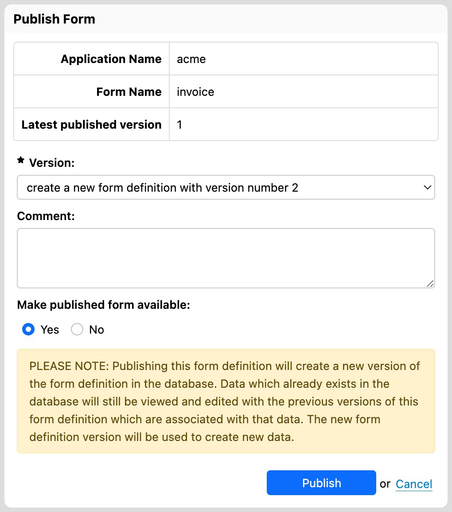
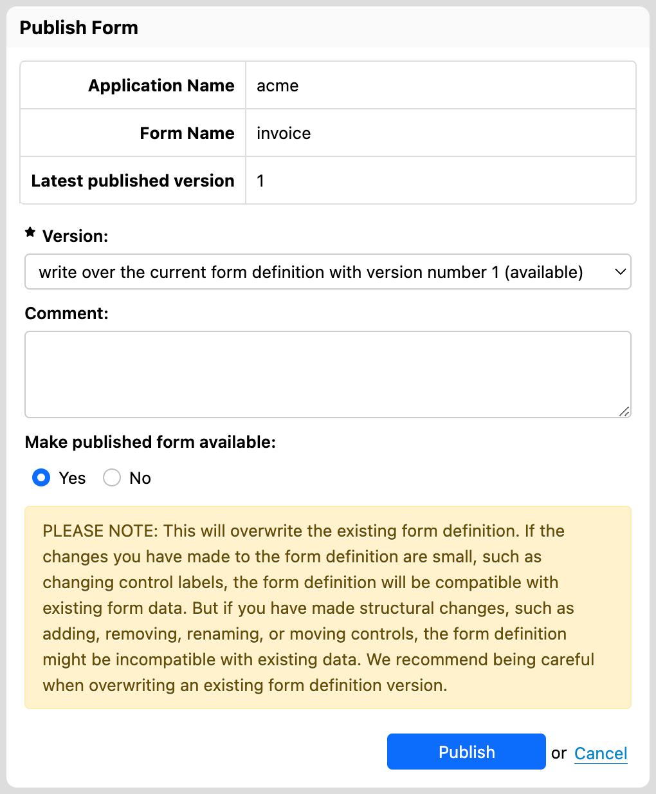

# Publishing

## Introduction

The notion of _publishing_ is central to Form Builder/Form Runner.

* As a form author, you first work on a form definition in a special space where the form can be modified, saved, and tested.
* Once the form definition is ready, you _publish it_ to Form Runner.
* After that moment:
    * the form becomes available by form users for data entry
    * Form Builder is no longer part of the equation

## First publish

When you start publishing a form with the Publish button at the bottom of Form Builder, a dialog opens to confirm the application name form name:

[SINCE Orbeon Forms 2017.2] You can decide whether the published form is available to end users. You can later change the availability of the published form either in Form Builder by re-publishing it, or from the [Form Runner runner home page](../form-runner/feature/home-page.md#controlling-form-definitions-availability).   

If you decide to go ahead with publishing, simply use the Publish button.

## Versioning

### New version or override 

When versioning is enabled, you have a choice, when publishing, of whether to create a new form version or to override an existing one.

[SINCE Orbeon Forms 2016.1]

You can overwrite not only the latest published version, but any previous version.

### Versioning comments

[SINCE Orbeon Forms 2016.2]

You can add or update a textual comment associated with the given published version. Adding a comment is not required, but setting a comment can help the form author understand what changes a given form version includes.

When creating a new version, the field is initially empty:

You can set an explanatory comment:
 

When overriding an existing form version, the existing comment, if any, is read back from the published form definition and you can update it before publishing:

## See also

- [Form versioning](https://blog.orbeon.com/2014/02/form-versioning.html) blog post
- [Choosing the best versioning option when publishing a form](https://blog.orbeon.com/2015/01/choosing-best-versioning-option-when.html) blog post
- [Versioning comments](https://blog.orbeon.com/2016/09/versioning-comments.html) blog post
