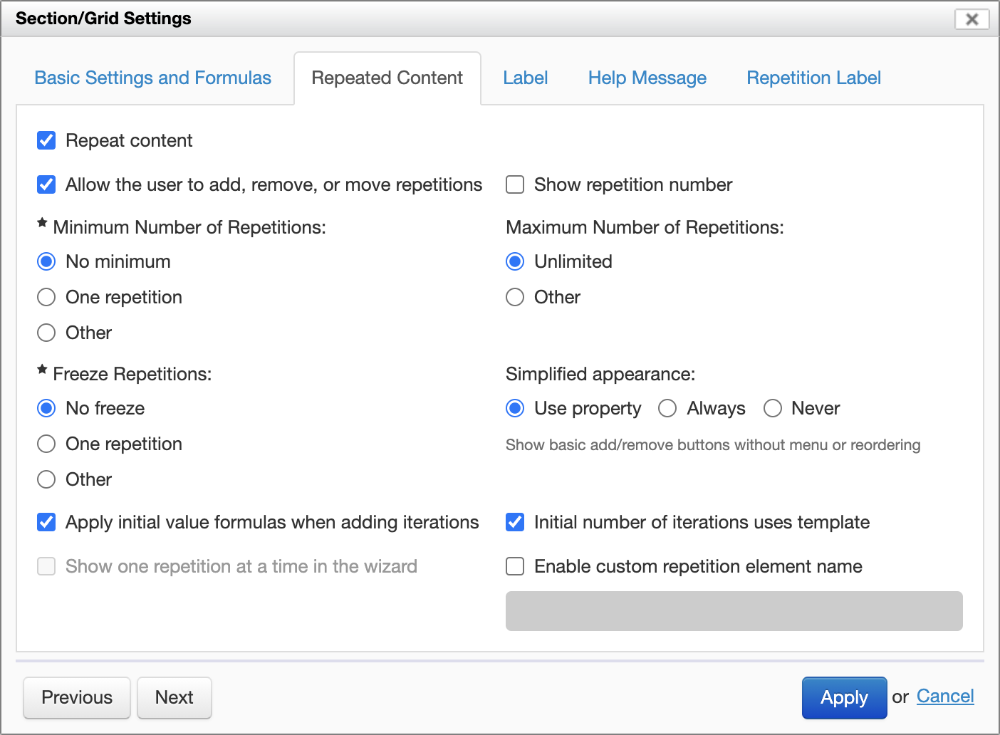
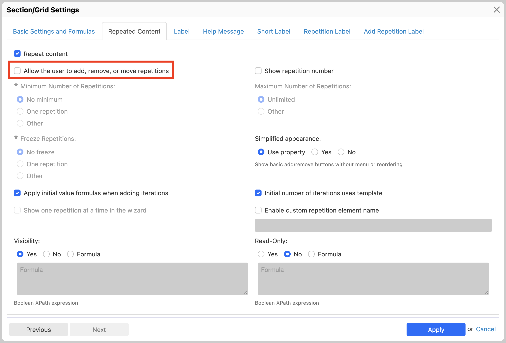
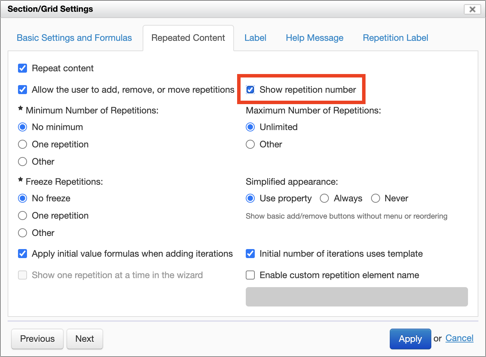
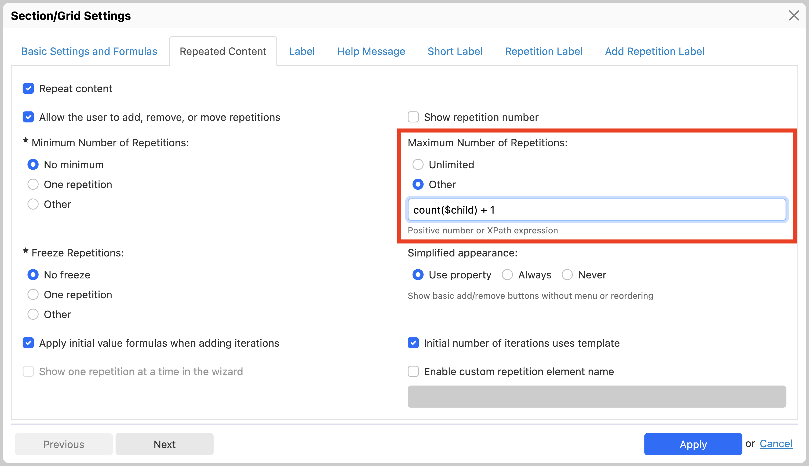

# Repeat settings

## Overview

Form Builder supports grids and sections with repeated content.

- With grids, you can repeat a single row (which is the most common case), or multiple heterogeneous rows (with different controls).
- With sections, you can repeat the entire content of the section a number of times.

Both repeated grids and repeated sections have *repeat settings* in the "Section/Grid Settings" dialog's "Repeated Content" tab.

## Repeat Content

Select this checkbox to enable repeated content. This enables a series of detailed options below in the same dialog.

## Allow the user to add, remove, or move repetitions

[SINCE Orbeon Forms 2019.1]

By default, the form user is allowed to add, remove, or move repetitions. To disable this behavior, deselect the "Allow the user to add, remove, or move repetitions" option. When the checkbox is deselected, the user does not have direct access to buttons, icons or menus to change repetitions.

When this option is deselected, the minimum, maximum and frozen repetitions settings do not apply.

Deselecting this option makes sense in particular when the number of repetitions:

- is defined at design-time,
- is controlled via [actions](/form-builder/actions-syntax.md),
- or is controlled via [synchronization](/form-builder/synchronize-repeated-content.md).

## Show repetition number

[SINCE Orbeon Forms 2021.1]

For grids only, selecting this option automatically shows a row number at the beginning of each grid repetition.

This is how the repetition number appears at runtime. 

## Minimum and maximum number of repetitions

These settings can be predefined numbers or formulas when selecting "Other". Here is an example of using a firmula for the maximum number of repetitions.

## Freeze repetitions

[SINCE Orbeon Forms 2018.2]

This setting can be a predefined number or a formula.

This allows *freezing* the first *N* iterations of a repeated grid or repeated section. Frozen iterations cannot be removed or moved by the user. The grid menus and buttons reflect that those operations are not possible.

The number of frozen iterations must be at most the minimal number of repetitions. If that's not the case, the number of frozen iterations will be reset to the minimal number of repetitions.

See also [Freezing rows in repeated grids or sections](https://blog.orbeon.com/2019/06/freezing-rows-in-repeated-grids-or.html).

## Simplified appearance

[SINCE Orbeon Forms 2019.1]

When selected, this enables a simplified appearance for a repeated grid or section.

The default is the "full" appearance, which features:

- visible borders
- menus for inserting, removing, and moving rows

When enabled, the simplified (or "minimal") appearance features:

- no visible borders
- no ability to insert a new row at a specific position
- no ability to reorder rows
- simple buttons/icons to add/remove rows

Before Orbeon Forms 2019.1, the simplified appearance was available but only controllable via a property. See [Appearance of repeated grids](/configuration/properties/form-runner.md#appearance-of-repeated-grids) and [Appearance of repeated sections](/configuration/properties/form-runner.md#appearance-of-repeated-sections).

## Initial value formulas

[SINCE Orbeon Forms 2016.1]

The "Apply initial value formulas when adding iterations" option specifies whether the "Initial Value" formulas for controls within the grid are evaluated for new iterations.

With the option enabled, new iterations can have dynamic initial values:

With Orbeon Forms 2016.1, the option is enabled by default for new forms and new repeated grids. The option is disabled by default for grids created with previous versions of Orbeon Forms.

## Initial number of iterations uses template

[SINCE Orbeon Forms 2016.1]

The "Initial Number of Iterations Uses Template" option specifies, when an *enclosing repeated section* creates a new iteration, how many iterations this repeated grid will contain:

- when enabled: the number of iterations shown in Form Builder (which can be no iterations at all, one iteration, two iterations, etc.)
- when disabled: exactly one iteration

The following screenshot shows a case with a repeated grid within nested repeated sections. At first, when the form shows, there are two iterations of the repeated grid.

With the option enabled on the grid, adding a new iteration of _Repeated section 2_ causes the new iteration to contain a new repeated grid with two iterations:

While, with the option disabled on the grid, adding a new iteration of _Repeated section 2_ causes the new iteration to contain a new repeated grid a single iterations:

<!--

Example:

-->

## Show one repetition at a time in the wizard

[SINCE Orbeon Forms 2019.1]

This option can be selected only when the "Allow the user to add, remove, or move repetitions" option is deselected.

For details, see [Paging large repeated sections](/form-runner/feature/wizard-view.md#paging-large-repeated-sections).

## Visibility and Read-Only formulas

[SINCE Orbeon Forms 2024.1]

- **Visibility:** Specifies whether the repetition is visible. This can be either "Yes" (default), "No", or an XPath formula, in which case the repetition is visible only if the formula evaluates to `true()`.
- **Read-Only:** Specifies whether the repetition is read-only (not editable). This can be either "Yes", "No" (default), or an XPath formula, in which case the repetition is editable only if the formula evaluates to `false()`.

For a repetition to be visible or editable, all enclosing sections/grids must be visible or editable as well.

XPath expressions are described in more details in [Formulas](formulas.md).

## See also

- [Repeated grids](repeated-grids.md)
- [Section settings](section-settings.md)
- [Grid component](/form-runner/component/grid.md)
- [Section component](/form-runner/component/section.md)
- [Paging large repeated sections](/form-runner/feature/wizard-view.md#paging-large-repeated-sections)
- Support for repeats lands in Form Builder: [older blog post](https://blog.orbeon.com/2012/04/support-for-repeats-lands-in-form.html)
- Inserting and reordering grid rows: [blog post](https://blog.orbeon.com/2013/11/inserting-and-reordering-grid-rows.html)
- Repeated sections: [blog post](https://blog.orbeon.com/2014/01/repeated-sections.html)
- Repeated grids and sections just got more subtle: [blog post](https://blog.orbeon.com/2015/10/repeated-grids-and-sections-just-got.html)
- Freezing rows in repeated grids or sections: [blog post](https://blog.orbeon.com/2019/06/freezing-rows-in-repeated-grids-or.html)
