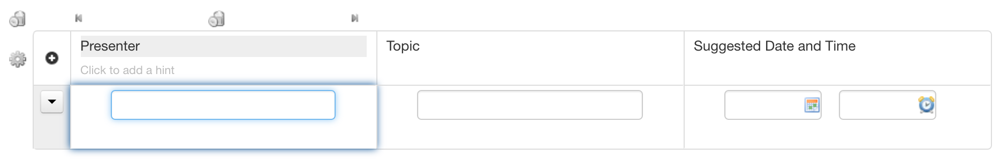
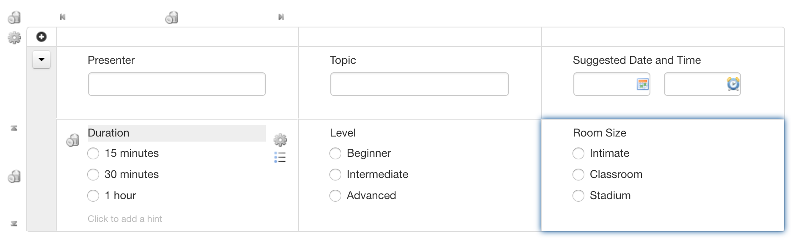
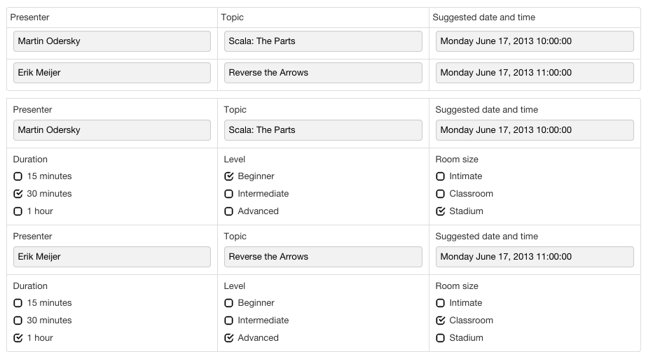
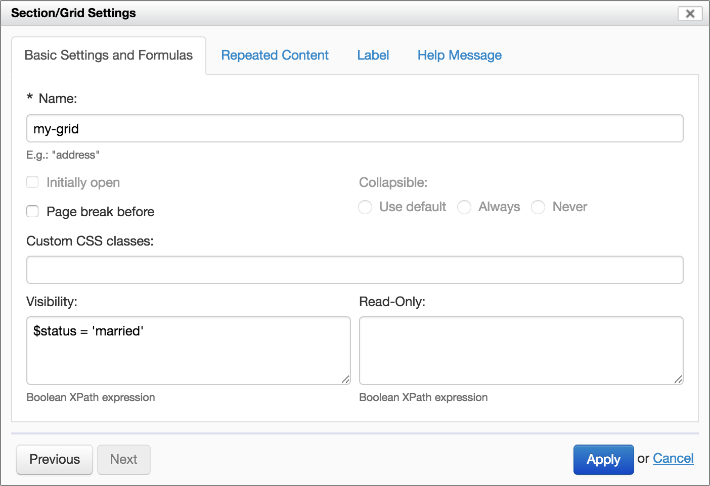

# Repeated grids

## Creating a repeated grid

You insert a new repeated grid with the "New Repeated Grid" toolbox button.

Once the grid is inserted, you can add and remove (using the grid arrow and trash icons which appear on mouseover) columns and rows, and add controls to grid cells as you would in a regular non-repeated grid.

With only one row, the control labels are used as column headers and are not repeated within the grid. If present, control hints are also added to the column headers. That single row is repeatable with the "plus" icon.

You can add multiple heterogeneous rows with the arrow icons. In this case the entire group of rows is repeatable. Control labels and hints do not appear in column headers, but appear alongside the controls in the grid.

Whether there is a single or multiple repeatable rows, you can add and remove repetitions (iterations) of those rows with the "plus" icon. You typically let the user add iterations at runtime, but it is possible to create iterations in advance at design time as well.

## How things look at runtime

At runtime, notice how in the first grid a single row is repeated, and in the second grid the two rows are repeated.

In review mode and PDF mode, icons and menus disappear and the grid appears entirely readonly.

## Grid settings

Once a grid is inserted, you can edit its properties with the "Grid Settings" icon.

*NOTE: Since Orbeon Forms 4.8, these settings (correctly) apply to the entire grid. Previously, the grid's repeat headers did not hide properly for example when the grid was hidden. See issue [#635](https://github.com/orbeon/orbeon-forms/issues/635).*

[SINCE Orbeon Forms 2019.1]

These settings also apply to non-repeated grids.

### Repeat settings

See [Repeat settings](repeat-settings.md).

## See also

- [Repeat settings](repeat-settings.md)
- [Section settings](section-settings.md)
- [Formulas](formulas.md)
- [Grid component](/form-runner/component/grid.md)
