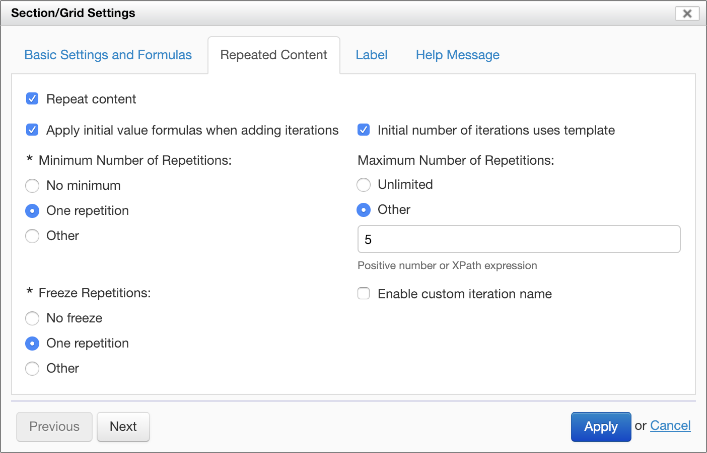
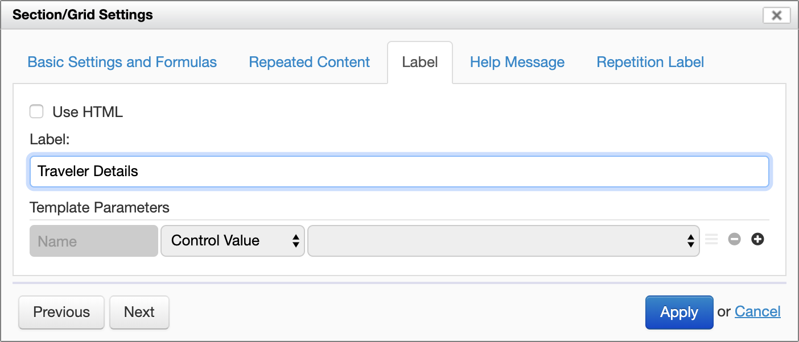
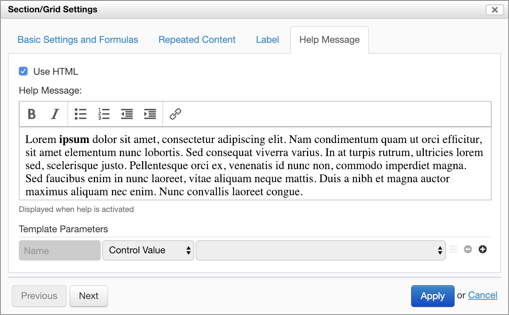

# Section settings

## Basic settings

### Section name

Each section has a _name_ or identifier, which determines how section data is represented in XML. The section name specifies an identifier for the section, unique in the entire form. If no section name is explicitly specified, Form Builder assigns a default name, such as "section-1".

### Section collapsing

\[SINCE Orbeon Forms 2016.1\]

The following only applies when the form doesn't use the [Wizard view](../form-runner/feature/wizard-view.md).

A section can be open or closed (collapsed). By default, sections are open when the form loads, unless the "Initially Open" checkbox is *deselected*.

The "Collapsible" radio buttons control whether the user can collapse sections:

- __Use Default:__ use  the configuration specified with the `oxf.xforms.xbl.fr.section.collapsible` property
- __Always:__ the section is collapsible no matter what the `oxf.xforms.xbl.fr.section.collapsible` property specifies
- __Never:__ the section is not collapsible no matter no matter what the `oxf.xforms.xbl.fr.section.collapsible` property specifies

### Page breaks

When producing PDF automatically, the "Page break before" checkbox, when enabled, ensures that the given section starts at the top of a new page. 

### Custom CSS classes

The "Custom CSS Classes" field allows adding CSS classes which will be placed on the control in the resulting HTML. This can be used for custom styling.

### Formulas

* **Visibility:** Boolean expression specifying whether the section is visible.
    * If this field is left blank, then the section is always visible, unless an enclosing section is not visible.
    * Otherwise, it is visible only if the result of the Boolean expression is `true()`.
* **Read-Only:** Boolean expression specifying whether the section is read-only (not editable).
    * If this field is left blank, then the section is editable unless an enclosing section is read-only.
    * Otherwise, it is editable only if the result of the Boolean expression is `false()`.

XPath expressions are described in more details in [Formulas](formulas.md).

## Repeated Content

Like [repeated grids](repeated-grids.md), section content can also be repeated. The section titles appears only once, but
the content of the section can have multiple repetitions. The same settings that apply to repeated grids apply to
repeated sections. See [repeated grids](repeated-grids.md) for details.

## Label and help message

The label can be configured directly in the form area, by clicking on the section title, or in the "Label" tab.

The help message is configured in the "Help Message" tab. Similarly, the help message can be in plain text or use rich text (HTML). 

### Dynamic label and help message

[SINCE Orbeon Forms 2018.1]

Sections support *dynamic* labels and help messages. This means that, instead of being specified once and for all at form design time, labels and help messages can incorporate dynamic parts such as control values and other custom expressions.

For more, see [Template syntax](template-syntax.md).

## See also

- [Repeated grids](repeated-grids.md)
- [Formulas](formulas.md)
- [Template syntax](template-syntax.md)
- [Wizard view](../form-runner/feature/wizard-view.md)
