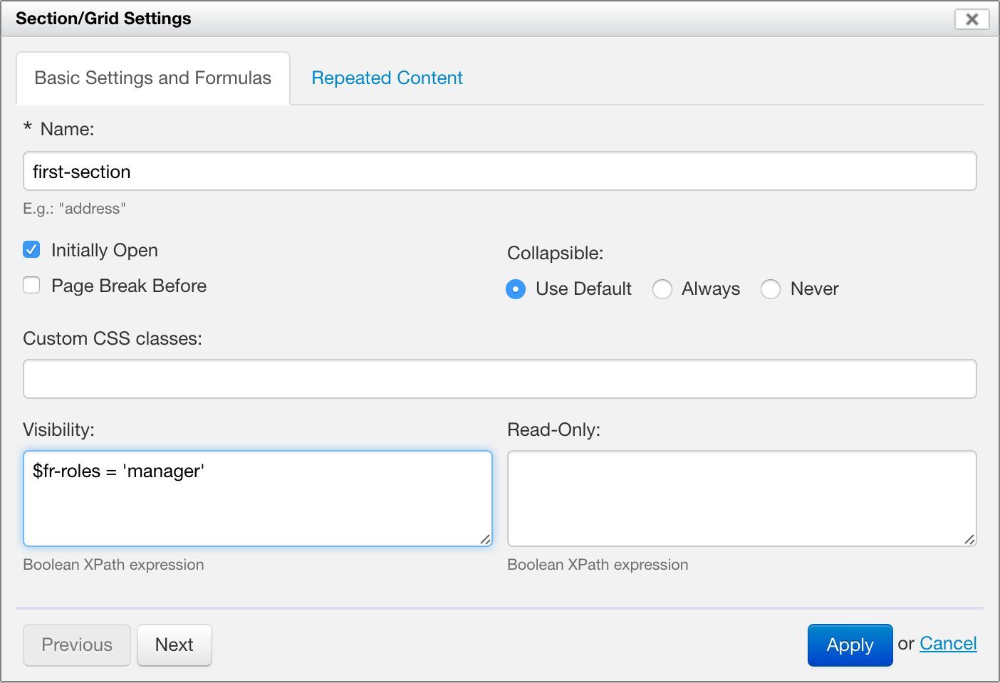

# Section settings

<!-- toc -->

## Basic settings

Each section has a _name_ or identifier, which determines how section data is represented in XML. The section name specifies an identifier for the section, unique in the entire form. If no section name is explicitly specified, Form Builder assigns a default name, such as "section-1".

## Section collapsing

\[SINCE Orbeon Forms 2016.1\]

When not in wizard mode, a section can be open or closed (collapsed). By default, sections are open, unless the Initially Open checkbox is deselected.

By default, when not in wizard mode, the user can open and close (collapse) a section. The default can be change via a property. It is also possible to specify that a section is always collapsible, or never collapsible.

## Custom CSS classes

The "Custom CSS Classes" field allows adding CSS classes which will be placed on the control in the resulting HTML. This can be used for custom styling.

## Formulas

* **Visibility:** Boolean expression specifying whether the section is visible.
    * If this field is left blank, then the section is always visible, unless an enclosing section is not visible.
    * Otherwise, it is visible only if the result of the Boolean expression is `true()`.
* **Read-Only:** Boolean expression specifying whether the section is read-only (not editable).
    * If this field is left blank, then the section is editable unless an enclosing section is read-only.
    * Otherwise, it is editable only if the result of the Boolean expression is `false()`.

XPath expressions are described in more details in [Formulas](formulas.md).

## See also

- [Formulas](formulas.md)
