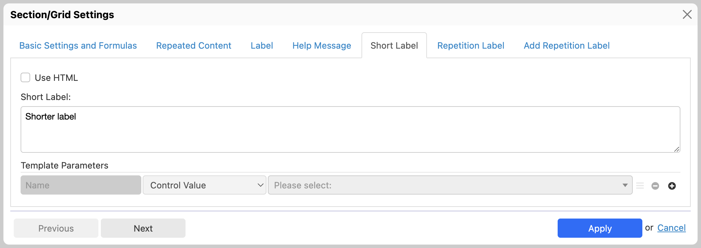
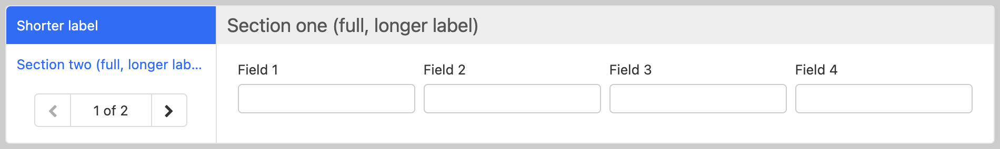
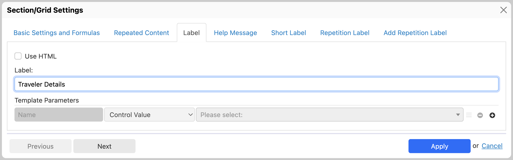

# Section settings

## Settings shared with grids

See [Section and grid settings](container-settings.md).

## Basic settings

### Overview

### Section collapsing

\[SINCE Orbeon Forms 2016.1]

The following only applies when the form doesn't use the [Wizard view](../form-runner/feature/wizard-view.md).

A section can be open/expanded or closed/collapsed. By default, sections are open when the form loads, unless the "Initially open" checkbox is _deselected_.

The "Collapsible" radio buttons control whether the user can collapse and expand sections:

* **Use property:** use the configuration specified with the `oxf.xforms.xbl.fr.section.collapsible` property
* **Always:** the section is collapsible no matter what the `oxf.xforms.xbl.fr.section.collapsible` property specifies
* **Never:** the section is not collapsible no matter no matter what the `oxf.xforms.xbl.fr.section.collapsible` property specifies

## Repeat settings

See [Repeat settings](repeat-settings.md).

## Label, help message, and short labels

The label can be configured directly in the form area, by clicking on the section title, or in the "Label" tab.

The help message is configured in the "Help Message" tab. Similarly, the help message can be in plain text or use rich text (HTML).

[\[SINCE Orbeon Forms 2023.1\]](../release-notes/orbeon-forms-2023.1.md)

A short label can be configured in the "Short Label" tab. This short label is used instead of the regular label in the table of contents when using the [wizard view](../form-runner/feature/wizard-view.md).

[\[SINCE Orbeon Forms 2023.1.3\]](../release-notes/orbeon-forms-2023.1.3.md)

Section labels are now optional. If you don't provide a label in any language, by leaving it blank, the section title will not be displayed.

For more, see [Optional Section Labels](https://www.orbeon.com/2024/05/optional-section-labels).

### Dynamic label and help message

\[SINCE Orbeon Forms 2018.1]

In most cases, labels and help messages are simply localized messages without dynamic parts.

However, sections also support _dynamic_ labels and help messages. This means that, instead of being specified once and for all at form design time, labels and help messages can incorporate dynamic parts such as control values and other custom expressions.

For more, see [Template syntax](template-syntax.md).

### Dynamic iteration label

\[SINCE Orbeon Forms 2019.1]

For sections with repeated content, the "Repetition Label" tab allows you to set a label that applies to individual repetitions. Typically, this label will use a template so that values from the repeated content can be used.

When using the [Wizard view](../form-runner/feature/wizard-view.md), repetition labels will show in the Wizard's table of contents.

### Custom "Add Repetition" label

\[SINCE Orbeon Forms 2022.1]

For sections with repeated content, the "Add Repetition Label" tab allows you to set a label that applies to the button used to add repetitions.

## See also

* [Section and grid settings](container-settings.md)
* [Grid settings](grid-settings.md)
* [Repeat settings](repeat-settings.md)
* [Repeated grids](repeated-grids.md)
* [Formulas](formulas.md)
* [Section component](../form-runner/component/section.md)
* [Template syntax](template-syntax.md)
* [Wizard view](../form-runner/feature/wizard-view.md)
* Blog post: [Optional Section Labels](https://www.orbeon.com/2024/05/optional-section-labels)
